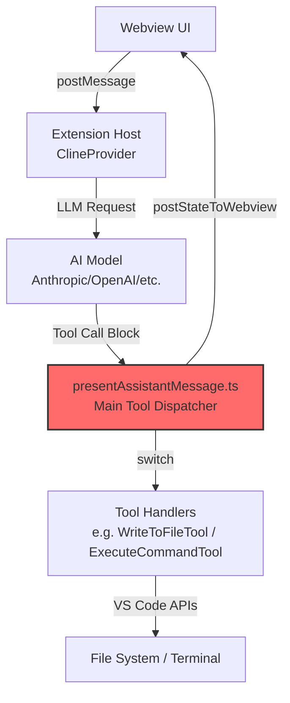
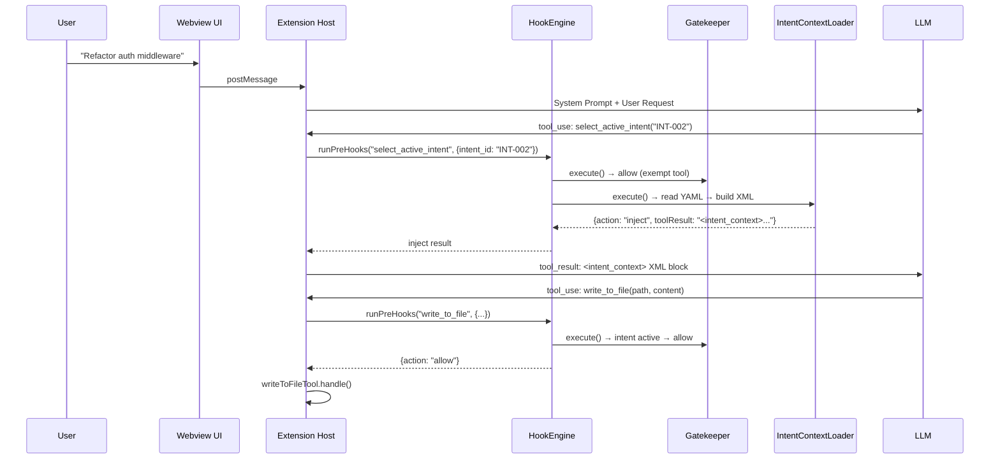

# ARCHITECTURE_NOTES.md – Phase 0: Archaeological Dig Results

**TRP1 Challenge Week 1 – Architecting the AI-Native IDE & Intent-Code Traceability**  
_Findings from Roo Code (fork: <https://github.com/Birkity/Roo-Code>)_  
_Date: February 18, 2026_

## Executive Summary – Phase 0 Status

**Objective achieved**: Successfully mapped the critical execution pathways of Roo Code (tool loop, prompt construction, Webview ↔ Extension Host communication, conversation pipeline).  
Identified precise hook injection points for Phase 1 (Handshake) and Phase 2 (Hook Engine).  
Roo Code demonstrates **production-grade architecture** — monorepo with Clean Architecture layers, strong type safety, event-driven design, and built-in approval gates — providing an excellent foundation for intent traceability and governance.

## 1. Core Extension Architecture

### Main Entry Points

- **Activation file**: `src/extension.ts`  
  Registers the sidebar provider and activation events.
- **Primary provider**: `src/core/webview/ClineProvider.ts`  
  Implements `vscode.WebviewViewProvider` — controls sidebar lifecycle and state.

### Activation Flow (simplified)

```typescript
// src/extension.ts (~line 323)
context.subscriptions.push(
	vscode.window.registerWebviewViewProvider(ClineProvider.sideBarId, provider, {
		webviewOptions: { retainContextWhenHidden: true },
	}),
)
```

## 2. Tool Execution System – Critical for Hooks

### Tool Definitions

Location: `src/shared/tools.ts`  
Defines strongly-typed tool interfaces (e.g., `write_to_file`, `execute_command`).

Example:

```typescript
export interface WriteToFileToolUse extends ToolUse<"write_to_file"> {
	name: "write_to_file"
	params: { path: string; content: string }
}
```

### Central Tool Dispatcher – MAIN HOOK TARGET

Location: `src/core/assistant-message/presentAssistantMessage.ts`  
This is **the primary tool execution loop**.

Key pattern:

```typescript
switch (block.name) {
	case "execute_command":
		await executeCommandTool.handle(cline, block, { askApproval, handleError, pushToolResult })
		break
	case "write_to_file":
		await writeToFileTool.handle(cline, block, { askApproval, handleError, pushToolResult })
		break
}
```

### Tool Handlers

- `src/core/tools/ExecuteCommandTool.ts` → runs shell commands via VS Code terminal
- `src/core/tools/WriteToFileTool.ts` → writes/modifies files (with diff preview + approval)

**Hook opportunities identified**:

- **Pre-hook**: Before `.handle()` call (validate intent, scope, HITL)
- **Post-hook**: After successful execution (log trace, compute hash, format/lint)

## 3. System Prompt Generation – Critical for Reasoning Enforcement

### Main Builder Locations

- Entry: `src/core/webview/generateSystemPrompt.ts`
- Core function: `src/core/prompts/system.ts` → `SYSTEM_PROMPT()`
- Modular sections: `src/core/prompts/sections/`

### Prompt Construction Flow

```typescript
export const generateSystemPrompt = async (provider: ClineProvider, message: WebviewMessage) => {
	const systemPrompt = await SYSTEM_PROMPT(
		provider.context,
		cwd,
		mcpEnabled ? provider.getMcpHub() : undefined,
		diffStrategy,
		mode,
		customModePrompts,
		customInstructions,
		// ... other dynamic parts
	)
}
```

**Injection points for Phase 1**:

- `customInstructions`
- `customModePrompts`
- Add new param `intentContext` → inject `<intent_context>` block

## 4. Webview ↔ Extension Host Communication

### Pattern

- **Frontend**: `webview-ui/` (React, no Node.js access)
- **Backend**: `src/core/webview/ClineProvider.ts`
- **IPC**: `postMessage` ↔ `onDidReceiveMessage`

### Central Handler

`src/core/webview/webviewMessageHandler.ts` — dispatches all incoming messages from UI.

**Phase 1 opportunity**: Add new message types (`analyzeIntent`, `selectActiveIntent`).

## 5. LLM Conversation Pipeline – Full Flow

1. User input → `webviewMessageHandler` → `Task.handleWebviewAskResponse()`
2. `Task.start()` → LLM request via provider
3. Response → `presentAssistantMessage()` → tool execution switch
4. Tool result → `postStateToWebview()` → UI update

Key class: `src/core/task/Task.ts` — manages state, history, tools.

Persistence: `.roo/tasks/{taskId}/` (we will extend to `.orchestration/`).

## 6. High-Level Execution Flow Diagram




**Highlighted**: `presentAssistantMessage.ts` — primary target for tool interception.

## 7. Key Findings Summary – Phase 0 Targets

| Requirement                                | Location Found                                                             | Notes / Hook Potential                   |
| ------------------------------------------ | -------------------------------------------------------------------------- | ---------------------------------------- |
| Tool loop (execute_command, write_to_file) | `src/core/assistant-message/presentAssistantMessage.ts`                    | Main switch → ideal Pre/Post hook points |
| Tool handlers                              | `src/core/tools/*.ts`                                                      | Individual `.handle()` methods           |
| System prompt builder                      | `src/core/webview/generateSystemPrompt.ts`<br>`src/core/prompts/system.ts` | Inject intent rules here                 |
| Webview ↔ Host communication              | `src/core/webview/webviewMessageHandler.ts`                                | Add intent selection messages            |
| Conversation / task management             | `src/core/task/Task.ts`                                                    | Extend with intent metadata              |

## 8. Strategic Observations

- Roo Code already has approval gates (`askApproval`) → perfect for HITL enforcement
- Existing event-driven design (EventEmitter) → ideal for HookEngine
- Strong type system (`@roo-code/types`) → extend for `IntentMetadata`
- Production-grade patterns → easy to add clean, maintainable hooks

---

## 9. Phase 1 Overview

Phase 1 implements the **Reasoning Loop** ("Handshake") — a two-stage state machine that forces the AI agent to declare a business intent before performing any mutating operations.

**The Problem Solved**: Without the Handshake, the AI agent can immediately modify files upon receiving a user request, with no traceability to business requirements ("vibe coding").

**The Solution**: A `select_active_intent(intent_id)` tool + HookEngine middleware that:

1. Blocks all mutating tools until an intent is declared
2. Reads `.orchestration/active_intents.yaml` for intent context
3. Injects constraints, scope, and acceptance criteria into the conversation
4. Enforces the protocol via system prompt + runtime gatekeeper

## 10. New Tool: `select_active_intent`

### Tool Registration

The tool was added across the full Roo Code tool registration pipeline:

| File Modified                                                 | Change                                                                                                     |
| ------------------------------------------------------------- | ---------------------------------------------------------------------------------------------------------- |
| `packages/types/src/tool.ts`                                  | Added `"select_active_intent"` to canonical `toolNames` array                                              |
| `src/shared/tools.ts`                                         | Added `NativeToolArgs`, `ToolUse` interface, param name `intent_id`, display name, ALWAYS_AVAILABLE status |
| `src/core/prompts/tools/native-tools/select_active_intent.ts` | New — JSON Schema (OpenAI format) for LLM tool calling                                                     |
| `src/core/prompts/tools/native-tools/index.ts`                | Registered in `getNativeTools()` array                                                                     |

### Tool Schema (sent to LLM)

```typescript
{
  type: "function",
  function: {
    name: "select_active_intent",
    description: "Declare which business intent you are working on...",
    strict: true,
    parameters: {
      type: "object",
      properties: {
        intent_id: { type: "string", description: "The unique identifier..." }
      },
      required: ["intent_id"],
      additionalProperties: false
    }
  }
}
```

## 11. Hook Engine Architecture (`src/hooks/`)

### Directory Structure

```
src/hooks/
├── index.ts                 # Public API re-exports
├── types.ts                 # Shared types (HookContext, PreHookResult, IntentEntry, etc.)
├── HookEngine.ts            # Central middleware orchestrator
├── IntentContextLoader.ts   # Pre-hook: handles select_active_intent
└── PreToolHook.ts           # Gatekeeper: blocks mutating tools without intent
```

### Design Principles

1. **Composable** — Hooks are registered as ordered arrays; new hooks can be added without modifying existing ones
2. **Non-intrusive** — The engine wraps existing tool execution; it does not replace or patch tool handlers
3. **Fail-safe** — If a hook throws, the error is captured and returned as a `tool_result` error

### The HookEngine Class

```typescript
class HookEngine {
  private readonly preHooks: Array<(ctx: HookContext) => Promise<PreHookResult>>
  private _activeIntentId: string | null = null
  private _intentContextXml: string | null = null

  constructor(cwd: string) {
    this.preHooks = [
      (ctx) => GatekeeperHook.execute(ctx, this),      // Priority 1: Validate intent
      (ctx) => IntentContextLoader.execute(ctx, this),   // Priority 2: Load context
    ]
  }

  async runPreHooks(toolName, params): Promise<PreHookResult> { ... }
}
```

**Instantiation**: Created in `Task.ts` constructor → `this.hookEngine = new HookEngine(this.cwd)`

### Integration Point — `presentAssistantMessage.ts`

The HookEngine is invoked **before** the tool dispatch `switch` statement:

```typescript
// Line ~678 in presentAssistantMessage.ts
if (!block.partial) {
  const hookResult = await cline.hookEngine.runPreHooks(
    block.name,
    (block.nativeArgs as Record<string, unknown>) ?? block.params ?? {},
  )

  if (hookResult.action === "block" || hookResult.action === "inject") {
    pushToolResult(
      hookResult.action === "block"
        ? formatResponse.toolError(hookResult.toolResult)
        : hookResult.toolResult,
    )
    break
  }
}

switch (block.name) { ... }  // Original switch — only reached if hooks allow
```

## 12. Pre-Hook 1: Gatekeeper (`PreToolHook.ts`)

### Decision Tree

```
Is tool exempt? (read_file, select_active_intent, etc.)
  → YES → Allow
  → NO → Is intent active?
           → YES → Allow
           → NO → BLOCK: "You must cite a valid active Intent ID before any tool use."
```

### Tool Classification

| Category      | Tools                                                              | Intent Required?                       |
| ------------- | ------------------------------------------------------------------ | -------------------------------------- |
| **Mutating**  | `write_to_file`, `apply_diff`, `edit`, `execute_command`, etc.     | YES                                    |
| **Read-only** | `read_file`, `list_files`, `search_files`, `codebase_search`       | NO                                     |
| **Meta**      | `ask_followup_question`, `attempt_completion`, `switch_mode`, etc. | NO                                     |
| **Handshake** | `select_active_intent`                                             | NO (exempt to avoid circular blocking) |

## 13. Pre-Hook 2: IntentContextLoader (`IntentContextLoader.ts`)

### Execution Flow

1. Only activates for `select_active_intent` tool calls
2. Reads `.orchestration/active_intents.yaml` using the `yaml` package
3. Finds matching intent by ID
4. Builds `<intent_context>` XML block with constraints, scope, and criteria
5. Returns XML as `tool_result` → AI sees it in next turn

### XML Context Block (example output)

```xml
<intent_context>
  <intent id="INT-001" name="JWT Authentication Migration" status="IN_PROGRESS">
    <constraints>
      <constraint>Must not use external auth providers</constraint>
      <constraint>Must maintain backward compatibility with Basic Auth</constraint>
    </constraints>
    <owned_scope>
      <path>src/auth/**</path>
      <path>src/middleware/jwt.ts</path>
    </owned_scope>
    <acceptance_criteria>
      <criterion>Unit tests in tests/auth/ pass</criterion>
    </acceptance_criteria>
  </intent>
  <instruction>
    You are now operating under Intent "INT-001: JWT Authentication Migration".
    You MUST respect all constraints. You may ONLY modify files matching owned_scope.
  </instruction>
</intent_context>
```

## 14. System Prompt Injection (`intent-protocol.ts`)

A new prompt section was added to `src/core/prompts/sections/intent-protocol.ts` and integrated into `system.ts` via `getIntentProtocolSection()`.

Key instruction injected:

> "You are an Intent-Driven Architect. You CANNOT write code or call any mutating tool immediately. Your first action MUST be to analyze the user request and call `select_active_intent(intent_id)` to load the necessary context."

This provides **probabilistic enforcement** (LLM follows instructions) while the Gatekeeper provides **deterministic enforcement** (runtime blocking).

## 15. Data Model: `.orchestration/active_intents.yaml`

Example file created at `.orchestration/active_intents.yaml` with three intents:

- `INT-001`: JWT Authentication Migration (IN_PROGRESS)
- `INT-002`: Refactor Auth Middleware (IN_PROGRESS)
- `INT-003`: Build Weather API Endpoint (DRAFT)

## 16. Phase 1 Execution Flow Diagram



## 17. How to Test Phase 1

### Manual Testing in Extension Host

1. **Launch the Extension Host** (`F5` in VS Code)
2. Ensure `.orchestration/active_intents.yaml` exists in the test workspace
3. Open the Roo Code sidebar chat panel

### Test Case 1: Happy Path (Handshake succeeds)

```
User: "Refactor the auth middleware"
Expected:
  → AI calls select_active_intent("INT-002")
  → Tool result returns <intent_context> XML
  → AI then uses mutating tools (write_to_file, etc.) within scope
```

### Test Case 2: Gatekeeper blocks (no intent declared)

```
User: "Write a hello world file"
Expected (if AI skips handshake):
  → AI calls write_to_file(...)
  → Gatekeeper BLOCKS with error:
    "You must cite a valid active Intent ID before any tool use."
  → AI self-corrects and calls select_active_intent first
```

### Test Case 3: Invalid intent ID

```
User triggers select_active_intent("INT-999")
Expected:
  → IntentContextLoader returns error with list of available intents
  → AI self-corrects with valid ID
```

### Test Case 4: Missing YAML file

```
Delete .orchestration/active_intents.yaml
User: "Do some work"
Expected:
  → IntentContextLoader returns error:
    "File not found: .orchestration/active_intents.yaml"
  → AI asks user to create the file
```
