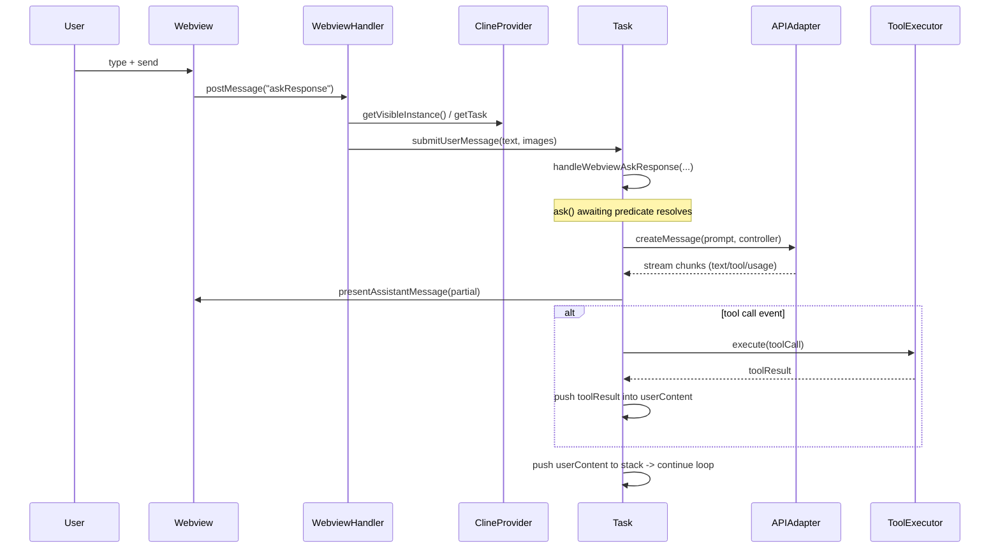
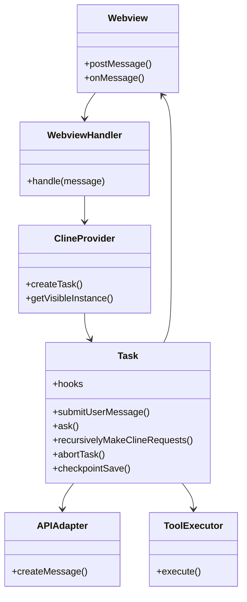

# ARCHITECTURE_NOTES

## 1. High-level overview — How the VS Code extension works

- Activation
    - VS Code activates the extension via `package.json` activation events.
    - Extension creates singletons: `ClineProvider`, API adapters, managers (ProviderSettingsManager, CustomModesManager), and registers webview providers / commands.
- UI
    - Sidebar/tab webview(s) host the chat UI.
    - Webview <-> extension comms use postMessage handlers implemented in `webviewMessageHandler`.
    - Settings views must bind inputs to a local `cachedState` (see AGENTS.md) and only persist on explicit Save.
- Task model
    - `Task` is the runtime unit for an agent conversation/workflow: orchestrates prompt building, streaming, tool execution, retries, checkpoints, and persistence.
    - A `ClineProvider` manages tasks and exposes methods for creating/finding the visible task.
- API & streaming
    - Provider-specific API adapters (Anthropic/OpenAI-like) implement `createMessage` returning a stream.
    - Task creates an `AbortController` per call, streams the response, parses events (text chunks, tool calls, usage), and renders partial assistant messages to the webview.
- Persistence & state
    - `contextProxy` is used for global state persistence (settings, stored messages, conversation history).
    - Checkpoints are created by the task on user sends / important state transitions.

---

## 2. Core components and responsibilities

- ClineProvider

    - Lifetime manager for tasks and UI provider for the webview.
    - Exposes contextProxy, settings managers, and task creation.

- Task

    - submitUserMessage(), handleWebviewAskResponse(), ask(), recursivelyMakeClineRequests(), abortTask(), checkpointSave(), saveClineMessages().
    - Maintains: clineMessages, assistantMessageContent, userMessageContent, currentRequest controller, abort flags, usage counters, autoApproval timers.

- API Adapter

    - Abstracted provider interface to make streaming requests and parse provider-specific events into a normalized internal event stream.

- MessageQueueService

    - Serializes transport of messages to UI / persistence to avoid races.

- Managers

    - ProviderSettingsManager, CustomModesManager — config and mode lifecycle.

- WebviewMessageHandler

    - Normalizes incoming UI messages and routes to provider or Task methods (e.g., askResponse → Task.submitUserMessage).

- Tool Executors
    - Execute tool calls (file read/write, shell, formatters) as requested by the model; results are injected back into the task loop.

---

## 3. The agent loop: recursivelyMakeClineRequests — conceptual steps

1. Build or pop a userContent stack item to process.
2. Check abort/paused/reset flags and backoff state.
3. Compose prompt: conversation messages, tool metadata, file details (optional), environment hints, mode-specific system content.
4. Create an `api_req_started` placeholder message in UI and start streaming via provider API with an AbortController.
5. Stream parse:
    - On text chunks: append to assistant buffer and present partial assistant message.
    - On tool-call events: execute tool immediately or schedule; push tool results to user content buffer.
    - On usage/grounding events: aggregate telemetry/usage.
6. When assistant completes:
    - Convert assistant output and tool results into user content blocks and push back to the stack.
    - If stack not empty → recurse (continue loop).
7. Handle error paths:
    - Rate limits → exponential backoff and retry.
    - Context window truncate → condense context and retry (MAX_CONTEXT_WINDOW_RETRIES).
    - Network/first-chunk failures → retry with exponential backoff.
    - Abort → update UI row with cancel reason and possibly call abortTask().
8. Persist checkpoints and telemetry periodically and on state transitions.

Return semantics:

- Returns false on normal termination (stack empty).
- Returns true/throws on unexpected error forcing outer stop.

---

## 4. Message flow (sequence diagram)



---

## 5. Hook system: purpose and architecture

Purpose: provide extension points for cross-cutting concerns without leaking internal Task implementation. Hooks enable logging, telemetry, testing, customization (modes/providers), and third-party integrations.

Design goals:

- Minimal surface area: well-defined hook types for Task lifecycle and stream events.
- Async-capable: hooks can be async and must not block the critical fast-path; use awaited or fire-and-forget based on hook type.
- Backpressure-safe: streaming hooks receive deltas; heavy processing should be offloaded.
- Idempotent & resilient: hooks must not mutate core state in ways that affect correctness; errors should be captured and logged, not crash the task.
- Observability-first: hooks expose granular events for debugging and telemetry.

Hook categories:

- Lifecycle hooks (synchronous optional await):
    - onTaskStart(taskMeta)
    - onTaskStop(taskMeta, reason)
    - onCheckpointSaved(checkpointMeta)
- Ask/Response hooks:
    - beforeAsk(promptContext) — may mutate promptContext copy
    - afterAsk(responseSummary)
- Streaming hooks (should be non-blocking):
    - onStreamChunk(chunk)
    - onStreamComplete(assistantMessage)
- Tool hooks:
    - onToolCall(toolRequest)
    - onToolResult(toolResult)
- Persistence hooks:
    - onSaveMessages(messages)
- Admin hooks:
    - onAbort(reason)

Hook registration API (concept):

- Task.hooks.register(name, fn, { priority = 0, awaitable = false })
- Task.hooks.unregister(id)
- Invocation: Task.hooks.invoke(name, payload) — wraps calls in try/catch and observes awaitable flag.

Decision: streaming hooks default to non-awaitable to avoid blocking the parse -> render loop. Lifecycle hooks default to awaitable.

---

## 6. Hook invocation schema (mermaid)

```mermaid
flowchart TD
  A[Task Event Occurs] --> B{Registered Hooks?}
  B -- Yes --> C[Sort by priority]
  C --> D{awaitable?}
  D -- true --> E[await hook(payload)]
  D -- false --> F[call hook(payload) in microtask / Promise.resolve()]
  E --> G[collect results / errors]
  F --> G
  G --> H[continue core logic]
  B -- No --> H
```

---

## 7. Component diagram (mermaid)



---

## 8. Architectural decisions & rationale

- Event-driven task loop: a streaming, event-based loop simplifies partial UI updates and tool interleaving; streaming allows progressive display and early tool execution.
- Isolation of UI -> Task pathway: UI writes are normalized through `webviewMessageHandler` → `Task.submitUserMessage()` → `Task.handleWebviewAskResponse()` to avoid races and ensure canonical state changes.
- Per-request AbortController: enables precise cancellation of single API calls; Task-level `abortTask()` sets task abort state and coordinates higher-level shutdown.
- Hooks with priority & await semantics: gives control to extensions/internals for synchronous lifecycle needs while protecting the stream path from blocking.
- Checkpointing on user sends: safety and reproducibility for long-running tasks and file operations.
- Separate managers for settings/modes: keep config, mode logic, and UI concerns decoupled from Task runtime.
- Use cachedState in SettingsView: prevents race conditions between UI edits and ContextProxy live state.

---

## 9. Implementation notes and best practices

- Always write hooks defensively: catch and log errors.
- Keep streaming hooks lightweight; delegate heavy processing to worker tasks or background jobs.
- Respect task abort and per-request AbortController to avoid leaking tool executions.
- When adding a UI input to SettingsView follow AGENTS.md: bind to `cachedState` and persist to `contextProxy` only on explicit Save.
- When modifying prompt composition, prefer creating a copy of `clineMessages` to avoid concurrent mutation issues.
- Use messageQueueService for UI and persistence writes to serialize state transitions.

---

## 10. Example hook registration (conceptual)

```ts
// Example (conceptual) — register a non-blocking stream logger
Task.hooks.register(
	"onStreamChunk",
	(chunk) => {
		// lightweight logging
		console.debug("stream chunk", chunk.type, chunk.length)
	},
	{ awaitable: false, priority: 10 },
)
```

---

## 11. Appendix — Recap of critical constants & limits

- MAX_CONTEXT_WINDOW_RETRIES = 3
- MAX_EXPONENTIAL_BACKOFF_SECONDS = 600
- FORCED_CONTEXT_REDUCTION_PERCENT = 75

---

End of ARCHITECTURE_NOTES.md
