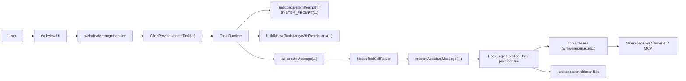
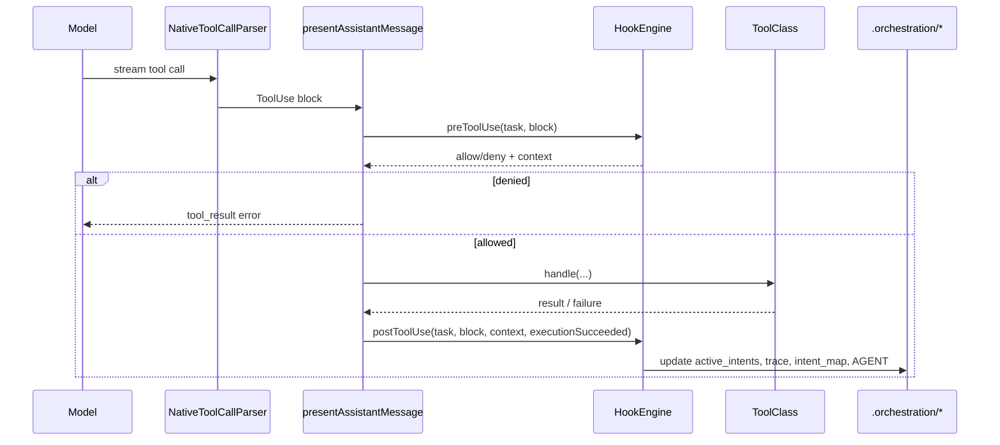
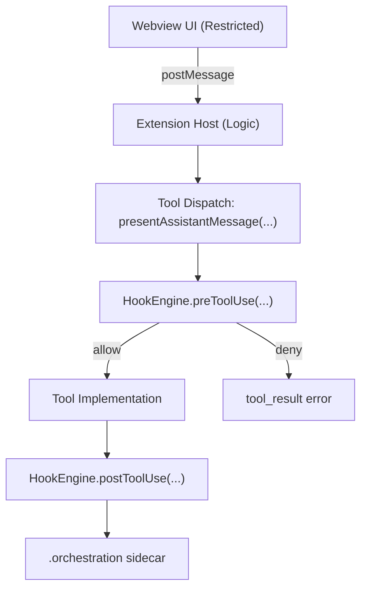
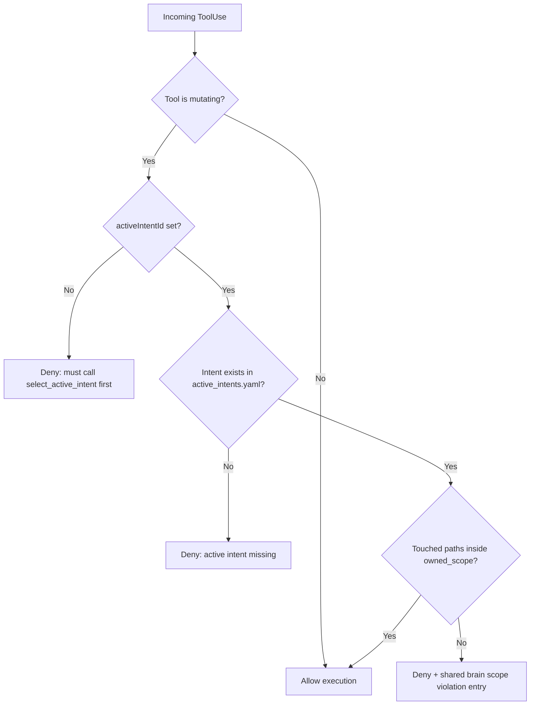
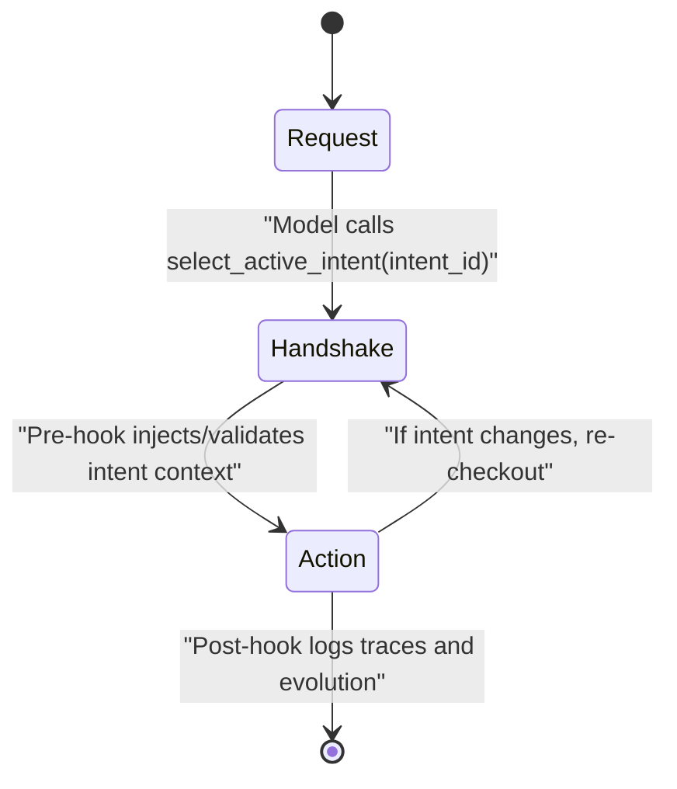

# Phase 0 - Archaeological Dig (Roo Code)

Date: 2026-02-16
Repository: `/Users/gersumasfaw/Roo-Code-10x`

This document maps the extension "nervous system" for:

- how the extension host starts,
- where task/tool execution loops run,
- where `execute_command` and `write_to_file` are handled,
- where the system prompt is built.

## 0. Single-Page Agent Architecture (Phase 0)



Runtime planes:

- UI plane: Webview rendering and event emission only.
- Logic plane: Extension Host orchestration, tool policy, API/MCP wiring.
- Execution plane: `Task` loop, stream parsing, centralized tool dispatch.
- Persistence plane: task history + sidecar orchestration files.

Key control points:

1. Activation and provider bootstrap:
    - `/Users/gersumasfaw/Roo-Code-10x/src/extension.ts:120`
    - `/Users/gersumasfaw/Roo-Code-10x/src/extension.ts:195`
2. Webview message boundary:
    - `/Users/gersumasfaw/Roo-Code-10x/src/core/webview/webviewMessageHandler.ts:570`
    - `/Users/gersumasfaw/Roo-Code-10x/src/core/webview/ClineProvider.ts:2914`
3. Task loop and API call:
    - `/Users/gersumasfaw/Roo-Code-10x/src/core/task/Task.ts:2531`
    - `/Users/gersumasfaw/Roo-Code-10x/src/core/task/Task.ts:4008`
    - `/Users/gersumasfaw/Roo-Code-10x/src/core/task/Task.ts:4299`
4. Tool dispatch boundary:
    - `/Users/gersumasfaw/Roo-Code-10x/src/core/assistant-message/presentAssistantMessage.ts:63`
5. Hook middleware boundary:
    - `/Users/gersumasfaw/Roo-Code-10x/src/hooks/HookEngine.ts:73`
6. Prompt builder:
    - `/Users/gersumasfaw/Roo-Code-10x/src/core/task/Task.ts:3765`
    - `/Users/gersumasfaw/Roo-Code-10x/src/core/prompts/system.ts:112`

### Hook Lifecycle (Focused)



### Hook System Diagrams And Schemas

#### A. Middleware Boundary Diagram



#### B. Pre-Hook Decision Flow



#### C. Two-Stage Turn State Machine



#### D. Canonical `active_intents.yaml` Schema

```yaml
active_intents:
    - id: "INT-001"
      name: "JWT Authentication Migration"
      status: "IN_PROGRESS"
      owned_scope:
          - "src/auth/**"
          - "src/middleware/jwt.ts"
      constraints:
          - "Must not use external auth providers"
          - "Must maintain backward compatibility with Basic Auth"
      acceptance_criteria:
          - "Unit tests in tests/auth/ pass"
      related_files:
          - "src/auth/middleware.ts"
      recent_history:
          - "PRE_HOOK write_to_file"
```

Compatibility note:

- Loader currently accepts both `active_intents` and legacy `intents`.
- Legacy fields (`intent_id`, `title`) are normalized to (`id`, `name`) internally.

#### E. `agent_trace.jsonl` Record Schema (per line)

```json
{
	"id": "uuid-v4",
	"timestamp": "2026-02-16T12:00:00Z",
	"vcs": { "revision_id": "git_sha_hash" },
	"files": [
		{
			"relative_path": "src/auth/middleware.ts",
			"conversations": [
				{
					"url": "task_or_session_id",
					"contributor": {
						"entity_type": "AI",
						"model_identifier": "model-id"
					},
					"ranges": [
						{
							"start_line": 1,
							"end_line": 45,
							"content_hash": "sha256:..."
						}
					],
					"related": [
						{
							"type": "specification",
							"value": "INT-001"
						}
					]
				}
			]
		}
	]
}
```

Implementation note:

- Current implementation computes `content_hash` from entire touched file content (SHA-256) and records a single range per file.

#### F. Hook Contract Schemas

Pre-hook result (runtime contract):

```json
{
	"allowExecution": true,
	"errorMessage": "optional string",
	"context": {
		"toolName": "write_to_file",
		"isMutatingTool": true,
		"intentId": "INT-001",
		"touchedPaths": ["src/auth/middleware.ts"],
		"hadToolFailureBefore": false
	}
}
```

Post-hook side effects:

1. Append recent history entry to selected intent.
2. For mutating success: append `agent_trace.jsonl` and `intent_map.md`.
3. For failures/scope issues/completion evolution: append `AGENT.md`.

## 1. Fork & Run Status

This workspace already contains the Roo Code source and is buildable.

Run commands:

```sh
cd /Users/gersumasfaw/Roo-Code-10x
pnpm install
pnpm --filter roo-cline bundle
```

Observed result:

- `bundle` succeeded and built `/Users/gersumasfaw/Roo-Code-10x/src/dist`.
- Warning only: local Node is `v24.9.0` while repo expects `20.19.2`.

Extension Host run path:

1. Open `/Users/gersumasfaw/Roo-Code-10x` in VS Code.
2. Press `F5` (`Run Extension` launch profile).

Evidence:

- Development instructions: `/Users/gersumasfaw/Roo-Code-10x/src/README.md:90`
- F5 instructions: `/Users/gersumasfaw/Roo-Code-10x/src/README.md:108`
- Extension host launch config: `/Users/gersumasfaw/Roo-Code-10x/.vscode/launch.json:1`
- Background watch tasks used by prelaunch: `/Users/gersumasfaw/Roo-Code-10x/.vscode/tasks.json:1`

## 2. High-Level Runtime Path (Webview -> Task Loop -> Tools)

1. Extension activation creates the main provider (`ClineProvider`).

    - `/Users/gersumasfaw/Roo-Code-10x/src/extension.ts:120`
    - `/Users/gersumasfaw/Roo-Code-10x/src/extension.ts:195`
    - `/Users/gersumasfaw/Roo-Code-10x/src/extension.ts:332`

2. Webview sends `"newTask"` message; handler calls `provider.createTask(...)`.

    - `/Users/gersumasfaw/Roo-Code-10x/src/core/webview/webviewMessageHandler.ts:549`
    - `/Users/gersumasfaw/Roo-Code-10x/src/core/webview/webviewMessageHandler.ts:555`

3. `ClineProvider.createTask(...)` constructs `new Task(...)`.

    - `/Users/gersumasfaw/Roo-Code-10x/src/core/webview/ClineProvider.ts:2914`
    - `/Users/gersumasfaw/Roo-Code-10x/src/core/webview/ClineProvider.ts:2974`

4. `Task` constructor auto-starts when `startTask` is true.

    - `/Users/gersumasfaw/Roo-Code-10x/src/core/task/Task.ts:424`
    - `/Users/gersumasfaw/Roo-Code-10x/src/core/task/Task.ts:573`
    - `/Users/gersumasfaw/Roo-Code-10x/src/core/task/Task.ts:1924`

5. Main agent loop:

    - `initiateTaskLoop(...)` calls `recursivelyMakeClineRequests(...)`
    - `/Users/gersumasfaw/Roo-Code-10x/src/core/task/Task.ts:2477`
    - `/Users/gersumasfaw/Roo-Code-10x/src/core/task/Task.ts:2511`

6. API request and streaming:

    - `attemptApiRequest(...)` builds `systemPrompt`, builds tools, calls `api.createMessage(...)`.
    - `/Users/gersumasfaw/Roo-Code-10x/src/core/task/Task.ts:3988`
    - `/Users/gersumasfaw/Roo-Code-10x/src/core/task/Task.ts:4020`
    - `/Users/gersumasfaw/Roo-Code-10x/src/core/task/Task.ts:4238`
    - `/Users/gersumasfaw/Roo-Code-10x/src/core/task/Task.ts:4279`

7. Streamed tool calls are parsed and passed to `presentAssistantMessage(this)`.
    - `/Users/gersumasfaw/Roo-Code-10x/src/core/task/Task.ts:2865`
    - `/Users/gersumasfaw/Roo-Code-10x/src/core/task/Task.ts:2918`
    - `/Users/gersumasfaw/Roo-Code-10x/src/core/task/Task.ts:3015`

## 3. Exact Tool Loop Handlers (Required by Phase 0)

The central dispatch for tool execution is:

- `/Users/gersumasfaw/Roo-Code-10x/src/core/assistant-message/presentAssistantMessage.ts:61`

Inside `case "tool_use"` it validates and dispatches tools. Key lines:

- Tool-use switch start: `/Users/gersumasfaw/Roo-Code-10x/src/core/assistant-message/presentAssistantMessage.ts:678`
- `write_to_file` dispatch: `/Users/gersumasfaw/Roo-Code-10x/src/core/assistant-message/presentAssistantMessage.ts:679`
- `execute_command` dispatch: `/Users/gersumasfaw/Roo-Code-10x/src/core/assistant-message/presentAssistantMessage.ts:764`

### `execute_command` handling chain

1. Dispatch call:
    - `/Users/gersumasfaw/Roo-Code-10x/src/core/assistant-message/presentAssistantMessage.ts:765`
2. Tool implementation class:
    - `/Users/gersumasfaw/Roo-Code-10x/src/core/tools/ExecuteCommandTool.ts:31`
3. Core execution logic:
    - `/Users/gersumasfaw/Roo-Code-10x/src/core/tools/ExecuteCommandTool.ts:34`
4. Terminal execution function:
    - `/Users/gersumasfaw/Roo-Code-10x/src/core/tools/ExecuteCommandTool.ts:149`

### `write_to_file` handling chain

1. Dispatch call:
    - `/Users/gersumasfaw/Roo-Code-10x/src/core/assistant-message/presentAssistantMessage.ts:681`
2. Tool implementation class:
    - `/Users/gersumasfaw/Roo-Code-10x/src/core/tools/WriteToFileTool.ts:26`
3. Core execution logic:
    - `/Users/gersumasfaw/Roo-Code-10x/src/core/tools/WriteToFileTool.ts:29`
4. Write approval/save path:
    - `/Users/gersumasfaw/Roo-Code-10x/src/core/tools/WriteToFileTool.ts:130`
    - `/Users/gersumasfaw/Roo-Code-10x/src/core/tools/WriteToFileTool.ts:169`

## 4. Where Tool Schemas Are Declared

Tool schema and descriptions are defined as native function-tool definitions:

- `execute_command` schema:
    - `/Users/gersumasfaw/Roo-Code-10x/src/core/prompts/tools/native-tools/execute_command.ts:22`
- `write_to_file` schema:
    - `/Users/gersumasfaw/Roo-Code-10x/src/core/prompts/tools/native-tools/write_to_file.ts:18`
- Included in default native tools list:
    - `/Users/gersumasfaw/Roo-Code-10x/src/core/prompts/tools/native-tools/index.ts:42`
    - `/Users/gersumasfaw/Roo-Code-10x/src/core/prompts/tools/native-tools/index.ts:56`
    - `/Users/gersumasfaw/Roo-Code-10x/src/core/prompts/tools/native-tools/index.ts:70`
- Typed tool args map:
    - `/Users/gersumasfaw/Roo-Code-10x/src/shared/tools.ts:91`
    - `/Users/gersumasfaw/Roo-Code-10x/src/shared/tools.ts:96`
    - `/Users/gersumasfaw/Roo-Code-10x/src/shared/tools.ts:117`

Tool filtering/composition before API call:

- `/Users/gersumasfaw/Roo-Code-10x/src/core/task/build-tools.ts:82`

## 5. Locate Prompt Builder (Required by Phase 0)

The runtime prompt used for actual model calls is built in:

- `Task.getSystemPrompt()`:
    - `/Users/gersumasfaw/Roo-Code-10x/src/core/task/Task.ts:3745`
    - calls `SYSTEM_PROMPT(...)` at `/Users/gersumasfaw/Roo-Code-10x/src/core/task/Task.ts:3792`

Prompt assembly implementation:

- `/Users/gersumasfaw/Roo-Code-10x/src/core/prompts/system.ts:41` (`generatePrompt`)
- `/Users/gersumasfaw/Roo-Code-10x/src/core/prompts/system.ts:112` (`SYSTEM_PROMPT`)

Prompt preview endpoint from settings UI:

- `/Users/gersumasfaw/Roo-Code-10x/src/core/webview/webviewMessageHandler.ts:1595`
- `/Users/gersumasfaw/Roo-Code-10x/src/core/webview/generateSystemPrompt.ts:12`

## 6. Phase 1 Hook Insertion Candidates (for next step)

These are the safest insertion points for deterministic hook middleware:

1. Pre-tool interception (best central point):

    - immediately before per-tool switch dispatch in
    - `/Users/gersumasfaw/Roo-Code-10x/src/core/assistant-message/presentAssistantMessage.ts:678`

2. Post-tool interception:

    - immediately after each `tool.handle(...)` returns in the same switch.

3. Prompt protocol enforcement:
    - in `SYSTEM_PROMPT` composition:
    - `/Users/gersumasfaw/Roo-Code-10x/src/core/prompts/system.ts:85`
    - and/or in task-level `getSystemPrompt()` wrapper:
    - `/Users/gersumasfaw/Roo-Code-10x/src/core/task/Task.ts:3745`

## 7. Phase 0 Completion Checklist

- [x] Fork & run path identified and build verified.
- [x] Exact host tool-loop function identified.
- [x] Exact `execute_command` handler path identified.
- [x] Exact `write_to_file` handler path identified.
- [x] Exact system prompt builder path identified.
- [x] `ARCHITECTURE_NOTES.md` delivered.

## 8. Architecture Specification Alignment Update

This section aligns the codebase to your required architecture:

- strict privilege separation,
- hook middleware boundary,
- mandatory intent handshake before writes,
- `.orchestration/` sidecar state.

### 8.1 Privilege Separation (Mapped to Current Code)

Webview (UI, restricted presentation layer):

- Receives state/events via webview messaging:
    - `/Users/gersumasfaw/Roo-Code-10x/src/core/webview/ClineProvider.ts:1127`
- User actions are handled as typed messages:
    - `/Users/gersumasfaw/Roo-Code-10x/src/core/webview/webviewMessageHandler.ts:468`

Extension Host (logic, API + MCP + execution):

- Provider/task orchestration is in extension host:
    - `/Users/gersumasfaw/Roo-Code-10x/src/extension.ts:120`
    - `/Users/gersumasfaw/Roo-Code-10x/src/core/task/Task.ts:2511`
- LLM call path:
    - `/Users/gersumasfaw/Roo-Code-10x/src/core/task/Task.ts:3988`
    - `/Users/gersumasfaw/Roo-Code-10x/src/core/task/Task.ts:4279`
- MCP initialization/management:
    - `/Users/gersumasfaw/Roo-Code-10x/src/services/mcp/McpServerManager.ts:20`

Hook Engine (middleware boundary for all tools):

- Central interception location is `presentAssistantMessage(...)` before dispatch:
    - `/Users/gersumasfaw/Roo-Code-10x/src/core/assistant-message/presentAssistantMessage.ts:678`
- This is the correct place to inject `PreToolUse` and `PostToolUse`.

### 8.2 `.orchestration/` Sidecar Contract (Required)

Implemented machine-managed sidecar files under `task.cwd` (plus shared brain at workspace root):

- `.orchestration/active_intents.yaml`
- `.orchestration/agent_trace.jsonl`
- `.orchestration/intent_map.md`
- `AGENT.md`

Implementation location:

- `/Users/gersumasfaw/Roo-Code-10x/src/hooks/OrchestrationStore.ts`
- `/Users/gersumasfaw/Roo-Code-10x/src/hooks/IntentContextService.ts`

Reason:

- keep file IO and schema logic out of tool classes and out of Webview code.

### 8.3 Two-Stage State Machine Per Turn (Required)

State 1: Request

- User sends prompt from webview (`newTask`/`askResponse`) into task loop.
- Entry points:
    - `/Users/gersumasfaw/Roo-Code-10x/src/core/webview/webviewMessageHandler.ts:549`
    - `/Users/gersumasfaw/Roo-Code-10x/src/core/task/Task.ts:2477`

State 2: Reasoning Intercept (Handshake)

- Agent must call mandatory tool: `select_active_intent(intent_id)`.
- Tool and parser are implemented and wired:
    - `/Users/gersumasfaw/Roo-Code-10x/src/core/tools/SelectActiveIntentTool.ts:12`
    - `/Users/gersumasfaw/Roo-Code-10x/src/core/assistant-message/NativeToolCallParser.ts:457`
    - `/Users/gersumasfaw/Roo-Code-10x/src/core/assistant-message/presentAssistantMessage.ts:802`
- Pre-hook runs before all tools and updates intent lifecycle for checkout:
    - `/Users/gersumasfaw/Roo-Code-10x/src/hooks/HookEngine.ts:71`
- Execution remains paused naturally because tool execution is awaited in dispatch path.

State 3: Contextualized Action

- Agent continues with mutating tools (`write_to_file`, alias `write_file`).
- Alias evidence:
    - `/Users/gersumasfaw/Roo-Code-10x/src/shared/tools.ts:337`
- Post-hook computes SHA-256 `content_hash`, appends trace JSONL, updates intent map/shared brain:
    - `/Users/gersumasfaw/Roo-Code-10x/src/hooks/HookEngine.ts:153`
    - `/Users/gersumasfaw/Roo-Code-10x/src/hooks/OrchestrationStore.ts:226`

## 9. Phase 1 Status (Current)

Implemented:

1. `select_active_intent(intent_id)` tool end-to-end.
2. Hook middleware boundary (`PreToolUse`/`PostToolUse`) around central tool dispatch.
3. Intent-aware pre-write enforcement:
    - blocks mutating tools when no active intent is selected,
    - blocks writes outside workspace boundary,
    - enforces `owned_scope` patterns.
4. Sidecar model support and lifecycle updates:
    - active intents,
    - append-only trace ledger,
    - intent map updates,
    - shared brain append.
5. Prompt-level instruction for two-stage handshake:
    - `/Users/gersumasfaw/Roo-Code-10x/src/core/prompts/system.ts:27`

Remaining hardening work:

1. Improve range-level hashing accuracy (currently whole-file hash range per touched path).
2. Add tests for hook policies and trace output.
3. Optional storage backend upgrade (SQLite/Zvec) if scale/perf requires it.

## 10. Concrete Injection Points for This Repo

1. Tool definitions:

- `/Users/gersumasfaw/Roo-Code-10x/src/core/prompts/tools/native-tools/index.ts:42`
- `/Users/gersumasfaw/Roo-Code-10x/src/shared/tools.ts:91`

2. Dispatch boundary (best hook point):

- `/Users/gersumasfaw/Roo-Code-10x/src/core/assistant-message/presentAssistantMessage.ts:678`

3. Prompt protocol enforcement (reasoning loop instruction):

- `/Users/gersumasfaw/Roo-Code-10x/src/core/prompts/system.ts:85`
- `/Users/gersumasfaw/Roo-Code-10x/src/core/task/Task.ts:3745`

4. API call where system prompt is consumed:

- `/Users/gersumasfaw/Roo-Code-10x/src/core/task/Task.ts:4279`

## 11. Updated Phase-0 Outcome

Phase 0 mapping remains valid, and Phase 1 foundation is now implemented:

- exact current architecture mapping,
- tool and prompt construction points,
- active hook middleware, sidecar models, and intent handshake enforcement in the extension host.
