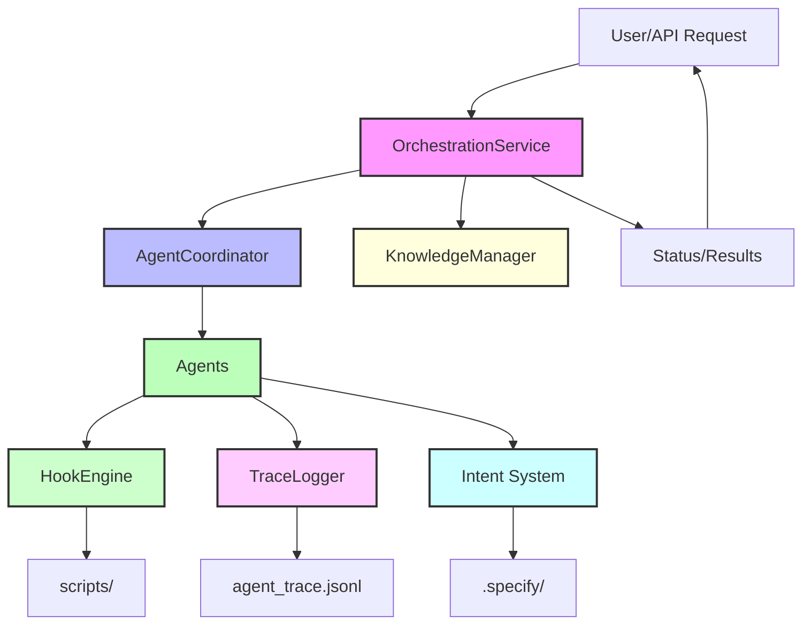

# Roo-Code: Sophisticated Orchestration Architecture

## Overview

Roo-Code is a modular, extensible platform for orchestrating multi-agent AI workflows, deterministic code generation, and traceable automation. The architecture is designed for reliability, auditability, and extensibility, with a strong focus on custom orchestration, intent management, hooks, and traceability.

---

## High-Level System Diagram



---

## Key Folders & Their Roles

| Folder/File          | Purpose                                                                 |
| -------------------- | ----------------------------------------------------------------------- |
| `scripts/`           | Automation scripts for orchestration, trace validation, and setup       |
| `src/hooks/`         | Hook engine and lifecycle hooks for agent safety, concurrency, approval |
| `src/intent/`        | Intent system: context injection, loading, selection, and types         |
| `src/orchestration/` | Core orchestration: agent coordination, knowledge, service entrypoint   |
| `src/trace/`         | Trace logging, AST mapping, hash generation, trace types                |
| `src/types/`         | Shared types for agents, hooks, intents, and global agent integration   |
| `tests/`             | Automated tests for core modules and integration                        |

---

## scripts/

### `initOrchestration.ts`

Initializes the `.orchestration` directory and creates starter files for agent state, trace, and intent mapping. Ensures reproducibility and a clean orchestration environment.

### `validateTrace.ts`

Validates the integrity of the `agent_trace.jsonl` file, ensuring all lines are valid JSON. Prevents trace corruption and supports auditability.

---

## src/hooks/

| File                  | Description                                                                |
| --------------------- | -------------------------------------------------------------------------- |
| `hookEngine.ts`       | Central engine for running pre/post tool hooks, scope/concurrency guards   |
| `preToolUse.ts`       | Validates tool commands for safety before execution                        |
| `postToolUse.ts`      | Runs formatters/linters after tool use, feeds errors back to agent context |
| `approvalGuard.ts`    | Human-in-the-loop approval for destructive commands                        |
| `concurrencyGuard.ts` | Prevents race conditions by checking file hashes before writes             |
| `scopeValidator.ts`   | Ensures agents operate only within allowed directories                     |

---

## src/intent/

| File                 | Description                                                               |
| -------------------- | ------------------------------------------------------------------------- |
| `contextInjector.ts` | Injects current requirement into agent context for deterministic behavior |
| `intentLoader.ts`    | Loads and parses requirements/specs from `.specify/` folder               |
| `intentSelector.ts`  | Selects and navigates between requirements for agent focus                |
| `intentType.ts`      | Defines enums and interfaces for requirements and intent metadata         |

### Example: Requirement Type

```typescript
export enum RequirementType {
	FEATURE = "feature",
	BUGFIX = "bugfix",
	REFACTOR = "refactor",
	TEST = "test",
	DOCUMENTATION = "documentation",
}
```

---

## src/orchestration/

| File                      | Description                                                            |
| ------------------------- | ---------------------------------------------------------------------- |
| `agentCoordinator.ts`     | Registers agents, delegates tasks, tracks execution status             |
| `knowledgeManager.ts`     | Loads and provides access to specification context and requirements    |
| `orchestrationService.ts` | Main entrypoint: session management, task dispatch, status aggregation |

---

## src/trace/

| File               | Description                                                               |
| ------------------ | ------------------------------------------------------------------------- |
| `traceLogger.ts`   | Appends trace records to `agent_trace.jsonl` for every agent action       |
| `traceTypes.ts`    | Defines types for trace records, contributors, code ranges, and resources |
| `astMapper.ts`     | Maps AST/code blocks to trace ranges with content hashes                  |
| `hashGenerator.ts` | Generates SHA-256 hashes for code blocks and AST nodes                    |

---

## src/types/

| File                | Description                                                |
| ------------------- | ---------------------------------------------------------- |
| `agent.ts`          | Types for agent metadata, session, and roles               |
| `intent.ts`         | Types for intent metadata, categories, and selected intent |
| `hook.ts`           | Types for hook phases, context, and results                |
| `global-agent.d.ts` | Type declarations for global HTTP/HTTPS agent proxy        |

---

## tests/

Automated tests for core modules:

- `hookEngine.test.ts`: Tests hook registration and engine instantiation
- `intentSystem.test.ts`: Tests intent loading and error handling
- `traceLogger.test.ts`: Tests trace logging and file output

---

## Data & Traceability Flow

1. **Initialization**: `initOrchestration.ts` sets up `.orchestration/` and trace files.
2. **Intent Loading**: `intentLoader.ts` parses requirements/specs for agent focus.
3. **Session Start**: `OrchestrationService` loads context, prepares agents.
4. **Task Dispatch**: Agents receive tasks, context injected by `contextInjector.ts`.
5. **Hooks**: All agent actions pass through `hookEngine.ts` for validation, approval, and post-processing.
6. **Trace Logging**: Every action is logged by `traceLogger.ts` with hashes from `hashGenerator.ts` and AST mapping from `astMapper.ts`.
7. **Validation**: `validateTrace.ts` ensures trace file integrity.

---

## Example: Trace Record Schema

```typescript
export interface TraceRecord {
	id: string // unique trace ID
	timestamp: string // RFC 3339
	vcsId: string // Git commit SHA
	files: FileTrace[]
	version: string // Agent Trace spec version
}
```

---

## Extensibility & Best Practices

- Add new hooks in `src/hooks/` for custom validation or post-processing
- Extend agent types and session logic in `src/types/agent.ts`
- Add new intent categories/types in `src/intent/intentType.ts`
- Use `astMapper.ts` and `hashGenerator.ts` for fine-grained traceability
- Write tests in `tests/` for all new modules

---

## Future Directions

- Distributed agent orchestration
- Real-time trace dashboards
- Pluggable knowledge and intent sources
- Advanced error recovery and self-healing workflows

---

For further details, see the code in each folder and the provided type definitions.
