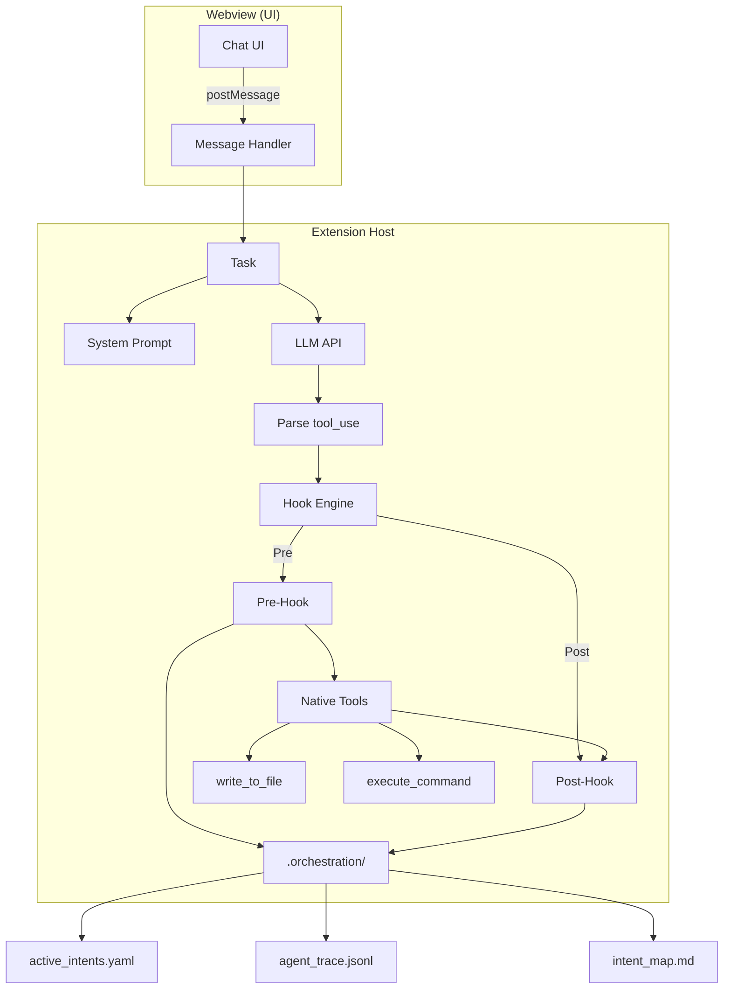
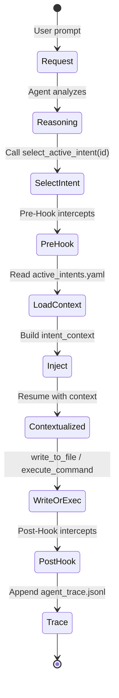
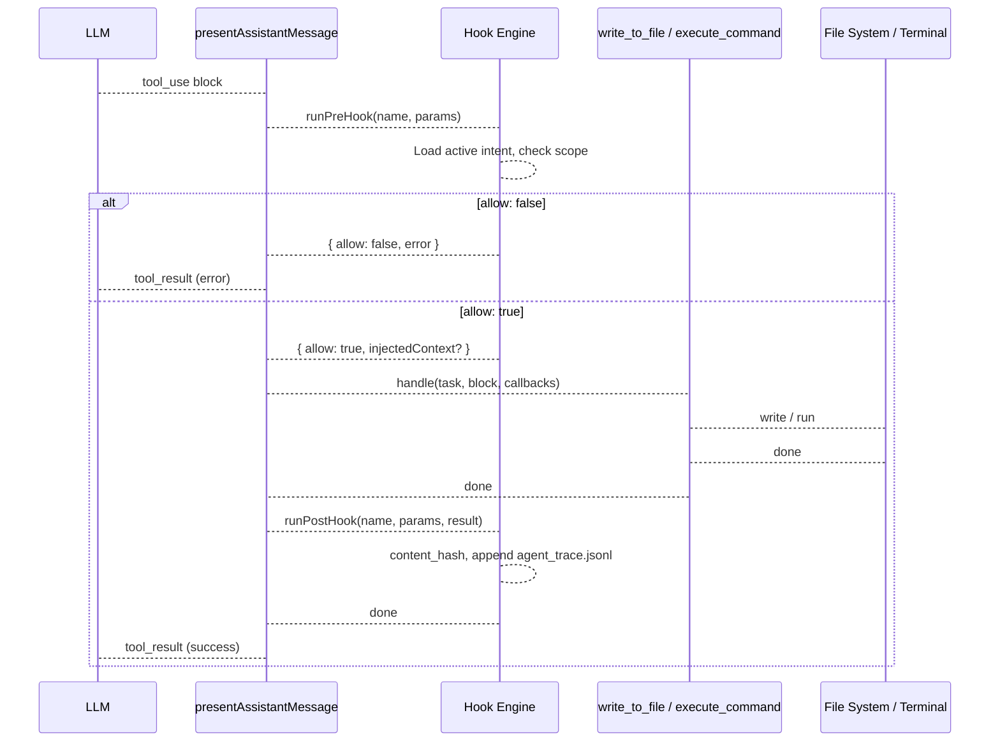
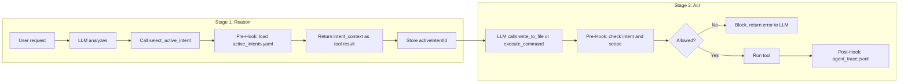
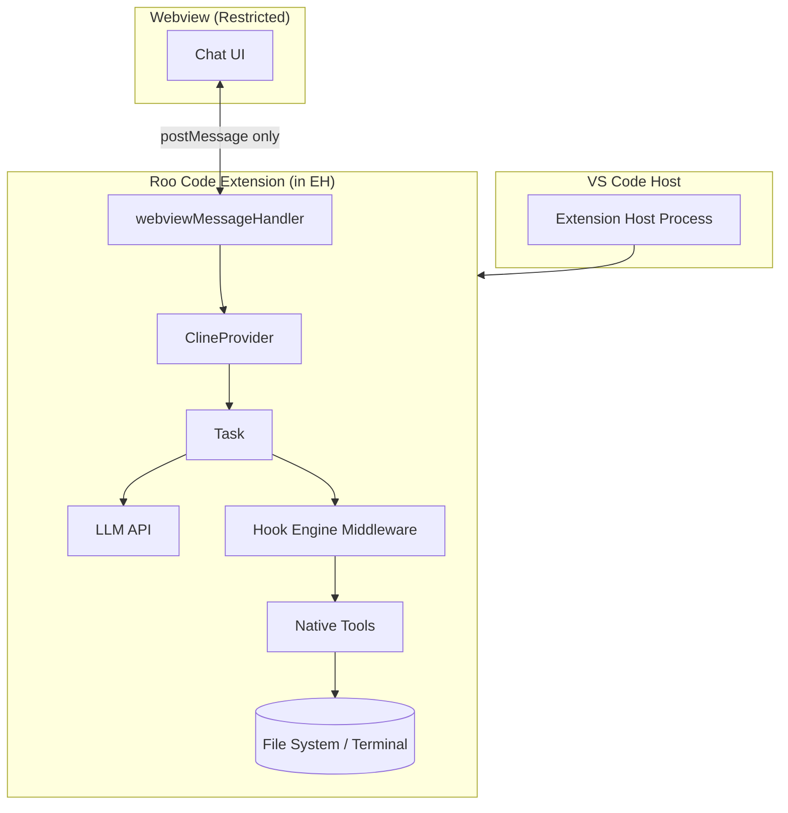
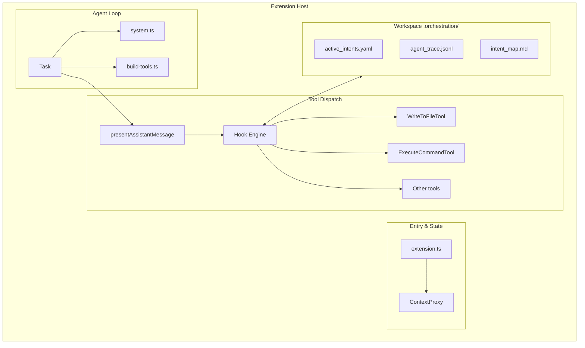
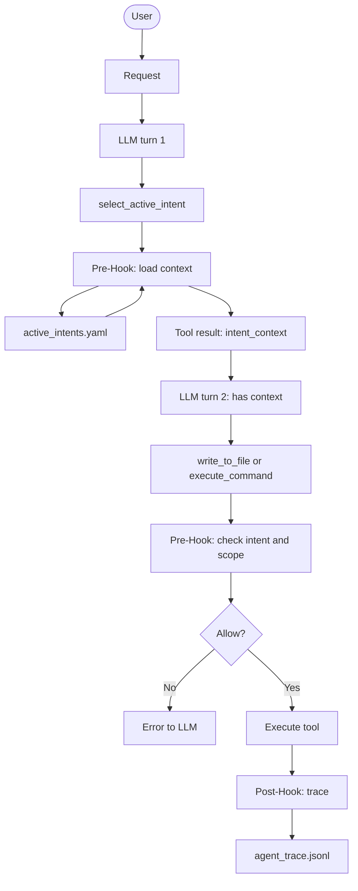
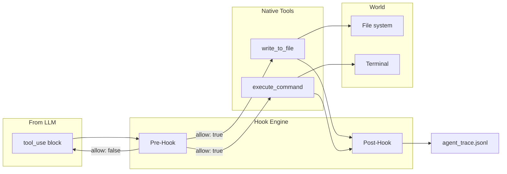

# Architecture Notes — TRP1 Week 1 (Interim)

Phase 0 archaeological dig and interim report: how the Roo Code VS Code extension works, agent design, hook design, and hook system diagrams/schemas.

---

## 1. How the VS Code Extension Works

### 1.1 Activation and Entry Point

- **Entry:** `src/extension.ts` — `activate(context)` runs when the extension is loaded (activation events: `onLanguage`, `onStartupFinished`).
- **Output channel:** A dedicated "Roo Code" output channel is created for logging.
- **Core singleton:** `ContextProxy.getInstance(context)` holds workspace/global state. A single **ClineProvider** is created and registered as the **Webview View Provider** for the sidebar.

### 1.2 Layered Architecture

| Layer                          | Role                                                        | Key components                                                                     |
| ------------------------------ | ----------------------------------------------------------- | ---------------------------------------------------------------------------------- |
| **Webview (UI)**               | Presentation only; no direct file/API access                | React app in `webview-ui/`; communicates via `postMessage` with the extension host |
| **Extension Host**             | All business logic: API calls, secrets, MCP, tool execution | `ClineProvider`, `Task`, `webviewMessageHandler`, native tools in `core/tools/`    |
| **Hook Engine (to implement)** | Middleware between UI/agent and tool execution              | `src/hooks/` — Pre/Post interception for intent and trace                          |

The webview is **restricted**: it sends messages (e.g. user prompt, "run", "approve") and receives state and tool results. It does not execute shell commands or write files; the extension host does.

### 1.3 Registration and Data Flow

1. **Webview registration:** `vscode.window.registerWebviewViewProvider(ClineProvider.sideBarId, provider, { webviewOptions: { retainContextWhenHidden: true } })`.
2. **Commands:** Registered in `activate.ts` (e.g. `roo-cline.plusButtonClicked`, `roo-cline.newTask`). These are invoked from the UI or keybindings.
3. **Message flow:** User types in webview → message to extension (e.g. `sendMessage` / request) → `webviewMessageHandler` in `core/webview/webviewMessageHandler.ts` routes by message type → Task runs (API + tools) → results and state sent back to webview via `postStateToWebview` / tool results.

### 1.4 Key Services Initialized at Activation

- **CloudService** — Auth, telemetry, optional cloud sync.
- **McpServerManager** — MCP server lifecycle; **McpHub** is used when building the system prompt and tools.
- **CodeIndexManager** — Per-workspace code index for codebase search.
- **TerminalRegistry** — Shell/terminal execution for `execute_command`.
- **customToolRegistry** (`@roo-code/core`) — Custom tools; extension path set for bundled esbuild.
- **Diff view** — Virtual document provider for diff URI scheme; used when showing file changes from tools.

---

## 2. Code and Design of the Agent (Phase 0)

### 2.1 Where the Agent Lives

The “agent” is the **conversation + tool loop** driven by a **Task** (`src/core/task/Task.ts`). Each chat/session has an associated Task that:

- Holds **conversation history** (API message format).
- Builds the **system prompt** and **tools** per turn.
- Sends requests to the **LLM** via the **API** module (`src/api/`, provider-specific).
- Parses **tool_use** from the model response and **dispatches to native tools** (or custom tools).

The Task is created and owned by **ClineProvider**; the webview talks to the provider, which delegates to the active Task.

### 2.2 Tool Loop (Critical for Hooks)

- **System prompt** is built in `Task.getSystemPrompt()` → calls `SYSTEM_PROMPT()` in `src/core/prompts/system.ts`. That assembles rules, capabilities, tools catalog (descriptions), mode, MCP, skills, etc.
- **Tools array** for the API is built in `src/core/task/build-tools.ts`: `buildNativeToolsArrayWithRestrictions()`. It combines native tools (from `src/core/prompts/tools/native-tools/`) and MCP tools, filtered by mode and settings.
- **When the model returns tool_use blocks**, they are processed in **`presentAssistantMessage`** (`src/core/assistant-message/presentAssistantMessage.ts`). For each block, a `switch (block.name)` routes to the corresponding tool:
    - **`write_to_file`** → `writeToFileTool.handle(cline, block, callbacks)` (from `WriteToFileTool.ts`)
    - **`execute_command`** → `executeCommandTool.handle(cline, block, callbacks)` (from `ExecuteCommandTool.ts`)
    - Similarly for `read_file`, `apply_diff`, `edit_file`, MCP, etc.
- Each tool extends **BaseTool** (`src/core/tools/BaseTool.ts`). **`handle(task, block, callbacks)`** parses `block.nativeArgs` and then calls **`execute(params, task, callbacks)`**. So the **single interception point** for “all tool execution” is: either wrap `handle()` at the call site in `presentAssistantMessage`, or wrap inside each tool’s `execute()` (e.g. via a shared hook runner).

### 2.3 Execute Path for write_to_file and execute_command

- **write_to_file:** `presentAssistantMessage` → `writeToFileTool.handle()` → `BaseTool.handle()` → `WriteToFileTool.execute(params, task, callbacks)`. The tool validates path, checks rooignore/roo-protected, optionally shows diff and asks for approval, then writes to disk.
- **execute_command:** Same pattern; `ExecuteCommandTool.execute()` runs the command in a terminal via `TerminalRegistry` / terminal integration.

So for the TRP1 hook system, the **exact functions** that must be intercepted are:

- The **call sites** in `presentAssistantMessage.ts` (e.g. before `writeToFileTool.handle(...)` and `executeCommandTool.handle(...)`), **or**
- The **first line** inside `WriteToFileTool.execute()` / `ExecuteCommandTool.execute()` (Pre-Hook), and after the write/run completes (Post-Hook).

### 2.4 Prompt Builder Location

- **System prompt:** `src/core/prompts/system.ts` — `SYSTEM_PROMPT()` (and helpers in `sections/`).
- **Tool definitions (schema + description):** `src/core/prompts/tools/native-tools/` (e.g. `write_to_file.ts`, `execute_command.ts`). These are what the model sees as tool names and parameters.
- To enforce “you must call `select_active_intent` first,” the system prompt text and/or tool list must be modified (e.g. add the new tool and a rule in the prompt).

---

## 3. Hook Design and Architectural Decisions

### 3.1 Role of the Hook Engine

The **Hook Engine** is a **middleware boundary** between the agent (Task + LLM) and tool execution. It:

- **Pre-Hook:** Runs _before_ a tool executes. Used to: (1) enforce that an active intent is selected (e.g. require `select_active_intent` before `write_to_file`), (2) inject intent context from `.orchestration/active_intents.yaml`, (3) enforce scope (file path in `owned_scope`), (4) optionally trigger Human-in-the-Loop (HITL) approval for destructive operations.
- **Post-Hook:** Runs _after_ a tool executes. Used to: (1) append to `.orchestration/agent_trace.jsonl` (with content hash, intent id), (2) update intent status in `active_intents.yaml`, (3) update `intent_map.md` on INTENT_EVOLUTION.

### 3.2 Design Decisions

| Decision                                                     | Rationale                                                                                                                                                                                                                                                          |
| ------------------------------------------------------------ | ------------------------------------------------------------------------------------------------------------------------------------------------------------------------------------------------------------------------------------------------------------------ |
| **Hooks live in `src/hooks/`**                               | Isolated from core tool code; single place for orchestration logic; easy to wire from one call site in `presentAssistantMessage` or from each tool.                                                                                                                |
| **Pre-Hook returns allow/block + optional injected context** | Keeps the extension host in control; block = return a tool_result error to the LLM so it can self-correct; inject = append to the next prompt/context (e.g. `<intent_context>`) without changing tool semantics.                                                   |
| **Strict privilege separation**                              | Webview never reads `.orchestration/` or writes trace; only the extension host (hook engine) does. Hooks run in the same process as tools.                                                                                                                         |
| **Intent must be selected before write/execute**             | Two-stage state machine: first tool call in a turn should be `select_active_intent(intent_id)`; Pre-Hook for `write_to_file` / `execute_command` checks that an active intent is set (e.g. in Task or a small session store) and that the target path is in scope. |
| **Content hashing in Post-Hook**                             | Enables spatial independence in `agent_trace.jsonl`: trace by content hash so moving lines doesn’t break traceability.                                                                                                                                             |
| **Classification: AST_REFACTOR vs INTENT_EVOLUTION**         | Future: distinguish “same intent, syntax change” from “new feature/intent.” In Phase 3, `write_file` schema can require `intent_id` and `mutation_class`; Post-Hook persists them in the trace.                                                                    |

### 3.3 Where to Plug In

- **Option A (recommended):** In `presentAssistantMessage.ts`, before the `switch (block.name)`, run a **Pre-Hook runner**: if the tool is hookable (`write_to_file`, `execute_command`), call `hookEngine.runPreHook(block.name, params, task)`. If result is `allow: false`, push the error as tool_result and `break`. If `allow: true` and `injectedContext`, append that to the conversation or the next system/user message (implementation detail). Then call `writeToFileTool.handle(...)` etc. After `handle()` resolves, run **Post-Hook** for that tool (e.g. `hookEngine.runPostHook(block.name, params, result, task)`).
- **Option B:** Inside each tool’s `execute()`. Pre-Hook at the start, Post-Hook at the end. More scattered but no change to `presentAssistantMessage` switch.
- **New tool:** Add `select_active_intent` as a native tool. Its “handler” is effectively the Pre-Hook logic: read `active_intents.yaml`, return `<intent_context>...</intent_context>` as the tool result, and store `activeIntentId` on the Task or a hook-scoped store for the rest of the turn.

### 3.4 Data Model (Sidecar)

- **`.orchestration/active_intents.yaml`** — Intent specs (id, name, status, owned_scope, constraints, acceptance_criteria). Read by Pre-Hook for `select_active_intent` and for scope/constraint injection; updated by Pre/Post-Hooks when intent is selected or completed.
- **`.orchestration/agent_trace.jsonl`** — Append-only ledger. Post-Hook on `write_to_file` appends one JSON object per write (schema below).
- **`.orchestration/intent_map.md`** — Intent → files map. Updated incrementally on INTENT_EVOLUTION (Phase 3).
- **AGENT.md / CLAUDE.md** — Shared brain; updated when verification fails or lessons are recorded (Phase 4).

---

## 4. Diagrams and Schemas of the Hook System

### 4.1 High-Level Extension and Hook Boundary



### 4.2 Two-Stage State Machine (Intent Handshake)



### 4.3 Tool Execution with Pre/Post Hooks



### 4.4 Agent Trace Schema (agent_trace.jsonl)

Each line is one JSON object. Required structure for Phase 3:

```json
{
	"id": "uuid-v4",
	"timestamp": "2026-02-16T12:00:00Z",
	"vcs": { "revision_id": "git_sha_hash" },
	"files": [
		{
			"relative_path": "src/auth/middleware.ts",
			"conversations": [
				{
					"url": "session_log_id",
					"contributor": {
						"entity_type": "AI",
						"model_identifier": "claude-3-5-sonnet"
					},
					"ranges": [
						{
							"start_line": 15,
							"end_line": 45,
							"content_hash": "sha256:a8f5f167f44f4964e6c998dee827110c"
						}
					],
					"related": [{ "type": "specification", "value": "REQ-001" }]
				}
			]
		}
	]
}
```

- **content_hash:** SHA-256 of the modified content (or range) for spatial independence.
- **related:** Links to intent/spec (e.g. REQ-001 / INT-001).

### 4.5 active_intents.yaml Schema

```yaml
active_intents:
    - id: "INT-001"
      name: "JWT Authentication Migration"
      status: "IN_PROGRESS"
      owned_scope:
          - "src/auth/**"
          - "src/middleware/jwt.ts"
      constraints:
          - "Must not use external auth providers"
          - "Must maintain backward compatibility with Basic Auth"
      acceptance_criteria:
          - "Unit tests in tests/auth/ pass"
```

### 4.6 Hook Engine Types (src/hooks/types.ts)

| Type               | Purpose                                                                |
| ------------------ | ---------------------------------------------------------------------- |
| `HookPhase`        | `"pre" \| "post"`                                                      |
| `HookableToolName` | `"write_to_file" \| "execute_command" \| "select_active_intent"`       |
| `PreHookContext`   | `{ toolName, params, activeIntentId? }`                                |
| `PostHookContext`  | `{ toolName, params, result?, activeIntentId?, mutationClass? }`       |
| `PreHookResult`    | `{ allow: true, injectedContext? } \| { allow: false, error: string }` |
| `MutationClass`    | `"AST_REFACTOR" \| "INTENT_EVOLUTION"`                                 |

---

## 5. Host Extension Architectural Analysis

This section provides a structured analysis of the **extension host architecture** for the AI grader: boundaries, components, data flow, and interception points.

### 5.1 Process and Privilege Boundaries

| Boundary                  | What runs here                                                          | Privileges                                                              | Trust                                    |
| ------------------------- | ----------------------------------------------------------------------- | ----------------------------------------------------------------------- | ---------------------------------------- |
| **VS Code host**          | VS Code core, extension host process                                    | Full access to workspace, env, terminals                                | Trusted                                  |
| **Extension host (Node)** | Roo Code extension (`src/extension.ts` + `src/core/`, `src/api/`, etc.) | File I/O, env, secrets, shell, MCP, LLM API                             | Trusted — only layer that executes tools |
| **Webview (iframe)**      | React UI (`webview-ui/`)                                                | None: no direct file/fs/API access; communicates only via `postMessage` | Restricted presentation layer            |

**Critical for TRP1:** The **Hook Engine** runs inside the extension host. It must sit **between** the agent (Task/LLM) and the actual tool execution (WriteToFileTool, ExecuteCommandTool). The webview never sees `.orchestration/` or tool implementation details.

### 5.2 Component Inventory (Extension Host)

| Component                | Path / location                                                                 | Responsibility                                                                                                             |
| ------------------------ | ------------------------------------------------------------------------------- | -------------------------------------------------------------------------------------------------------------------------- |
| **Entry**                | `src/extension.ts`                                                              | `activate()`: create ClineProvider, register webview, init services, register commands                                     |
| **State**                | `ContextProxy` (`core/config/ContextProxy`)                                     | Workspace/global state (API config, mode, custom instructions); single source of truth for UI state                        |
| **Provider**             | `ClineProvider` (`core/webview/ClineProvider.ts`)                               | Webview view provider; owns Task(s); posts state to webview; handles high-level commands                                   |
| **Message router**       | `webviewMessageHandler` (`core/webview/webviewMessageHandler.ts`)               | Routes every message from webview (e.g. send message, run, get system prompt, settings) to provider/Task or other handlers |
| **Agent / Task**         | `Task` (`core/task/Task.ts`)                                                    | Conversation history; builds system prompt and tools; calls LLM API; drives tool loop                                      |
| **Prompt builder**       | `src/core/prompts/system.ts`, `sections/*`                                      | `SYSTEM_PROMPT()` — assembles role, rules, capabilities, tools catalog, mode, MCP, skills                                  |
| **Tools builder**        | `src/core/task/build-tools.ts`                                                  | `buildNativeToolsArrayWithRestrictions()` — native + MCP tools, filtered by mode                                           |
| **Tool dispatcher**      | `presentAssistantMessage` (`core/assistant-message/presentAssistantMessage.ts`) | Parses assistant message; for each `tool_use` block, `switch(block.name)` → `tool.handle(task, block, callbacks)`          |
| **Native tools**         | `src/core/tools/*.ts`                                                           | `WriteToFileTool`, `ExecuteCommandTool`, `ReadFileTool`, `EditFileTool`, etc.; each `BaseTool.handle()` → `execute()`      |
| **API**                  | `src/api/`                                                                      | Provider-specific LLM client (Anthropic, OpenAI, etc.); used by Task for chat completion                                   |
| **Hook Engine (target)** | `src/hooks/`                                                                    | Pre/Post interception; intent context; scope enforcement; agent_trace; `.orchestration/` sidecar                           |

### 5.3 Data Flow (Extension Host)

1. **User → Webview:** User types in chat; webview sends a message (e.g. type `sendMessage` or task run).
2. **Webview → Host:** `postMessage` to extension; `webviewMessageHandler` receives and routes by message type.
3. **Host → Task:** Handler gets current Task from ClineProvider; Task has conversation history and API.
4. **Task → LLM:** Task builds system prompt (`getSystemPrompt()`), tools array, sends messages to API; receives assistant message with optional `tool_use` blocks.
5. **Task → Tool dispatch:** Assistant message passed to `presentAssistantMessage`; for each tool_use, dispatcher calls `tool.handle(task, block, callbacks)`. **This is the single choke point for hook interception.**
6. **Tool → World:** Tool reads/writes files or runs commands (via `utils/fs`, TerminalRegistry, etc.).
7. **Tool → Task:** Tool pushes tool_result via `pushToolResult`; Task continues (e.g. next LLM call with tool results).
8. **Host → Webview:** Provider posts updated state (history, tool results, etc.) to webview so UI updates.

**Secrets and API keys:** Stored and read only in the extension host (e.g. via VS Code secrets API or ContextProxy); never sent to webview except as “has API key” flags for UI.

### 5.4 Interception Points for the Hook Engine

| Interception point       | File                                               | Line / location                                                              | Purpose                                         |
| ------------------------ | -------------------------------------------------- | ---------------------------------------------------------------------------- | ----------------------------------------------- |
| **Before any tool runs** | `presentAssistantMessage.ts`                       | Before `switch (block.name)` and each `tool.handle(...)`                     | Pre-Hook: validate intent, scope, HITL          |
| **After any tool runs**  | Same                                               | After each `await ...Tool.handle(...)`                                       | Post-Hook: trace, update .orchestration         |
| **New tool**             | `core/prompts/tools/native-tools/` + tool registry | Add `select_active_intent` definition; add case in `presentAssistantMessage` | Reasoning loop: agent “checks out” intent first |

---

## 6. The 'Reasoning Loop' Architecture

The **Reasoning Loop** is the two-stage flow that prevents the agent from acting (writing code, running commands) until it has **declared and loaded intent context**. This section makes that architecture explicit for the AI grader.

### 6.1 Why a Reasoning Loop

- **Problem:** If the agent can call `write_to_file` immediately, it has no structured context (which intent, which scope, which constraints). That leads to “vibe coding” and loss of intent–code traceability.
- **Solution:** Enforce a **handshake**: on each user turn, the agent must first **reason** (analyze the request, pick an intent id) and call **`select_active_intent(intent_id)`**. Only after that context is loaded may it call **`write_to_file`** or **`execute_command`**.

### 6.2 Two-Stage State Machine (Reasoning Loop)

**Stage 1 — Reason (no side effects on codebase):**

1. User sends a request (e.g. “Refactor the auth middleware”).
2. Agent (LLM) analyzes the request and decides which intent applies (e.g. INT-001).
3. Agent **must** call the tool **`select_active_intent(intent_id: "INT-001")`**.
4. **Pre-Hook** intercepts this call: reads `.orchestration/active_intents.yaml`, finds INT-001, builds an **`<intent_context>`** XML block (scope, constraints, acceptance criteria).
5. Hook returns this block as the **tool result** and stores **activeIntentId = INT-001** for the rest of the turn (e.g. on Task or hook store).
6. No file writes or command execution yet — **reasoning only**.

**Stage 2 — Act (with context):**

7. Agent now has intent context in the conversation. It may call **`write_to_file`** or **`execute_command`**.
8. **Pre-Hook** for these tools: (a) checks that **activeIntentId** is set; (b) checks that target path/command is in **owned_scope** (or allowed). If not, **block** and return error (e.g. “You must cite a valid active Intent ID” or “Scope violation”).
9. If allowed, tool runs; **Post-Hook** appends to **agent_trace.jsonl** (content hash, intent id) and optionally updates **active_intents.yaml** / **intent_map.md**.

### 6.3 Where the Reasoning Loop Is Enforced

| Enforcement point         | Mechanism                                                                                                                                                                                                                                                           |
| ------------------------- | ------------------------------------------------------------------------------------------------------------------------------------------------------------------------------------------------------------------------------------------------------------------- |
| **System prompt**         | Add rule: _“You are an Intent-Driven Architect. You CANNOT write code immediately. Your first action MUST be to analyze the user request and call select_active_intent to load the necessary context.”_ (Prompt builder: `src/core/prompts/system.ts` or sections.) |
| **Tool list**             | Add **`select_active_intent(intent_id: string)`** to native tools so the model can call it.                                                                                                                                                                         |
| **Pre-Hook (Gatekeeper)** | For `write_to_file` and `execute_command`: if **activeIntentId** is not set or target is out of scope, return **allow: false** with a clear error message. The LLM receives this as a tool_result and can self-correct (e.g. call `select_active_intent` first).    |

### 6.4 Reasoning Loop Diagram



---

## 7. Visual System Blueprint (Diagrams)

This section provides the **Visual System Blueprint** required for grading: system context, extension host internals, reasoning loop, and hook boundary.

### 7.1 System Context — VS Code, Extension Host, Webview



### 7.2 Extension Host — Component Blueprint



### 7.3 Reasoning Loop — Visual Blueprint



### 7.4 Hook Boundary — Pre/Post Intercept



---

## Summary

- **Host Extension Architectural Analysis (§5):** Process boundaries (Webview vs Extension Host); component inventory with paths; data flow from user to LLM to tools to world; interception points for the Hook Engine; secrets and API only in extension host.
- **Reasoning Loop Architecture (§6):** Two-stage state machine (Reason → Act); enforcement via system prompt, `select_active_intent` tool, and Pre-Hook gatekeeper; diagram of Stage 1 (select intent, load context) and Stage 2 (write/execute with scope check and trace).
- **Visual System Blueprint (§7):** Four diagrams: (1) System context (VS Code / Extension Host / Webview), (2) Extension host component blueprint, (3) Reasoning loop flow, (4) Hook boundary (Pre/Post intercept).
- **Extension & agent:** Single ClineProvider webview + Extension Host; Task drives the agent loop; tools dispatched in `presentAssistantMessage`; `WriteToFileTool` and `ExecuteCommandTool` are the key tools to intercept. System prompt from `system.ts`; tools from `build-tools.ts` and `native-tools/`.
- **Hooks:** Middleware in `src/hooks/`; Pre-Hook for intent/scope/HITL; Post-Hook for agent_trace; integration at `presentAssistantMessage` (Option A).
