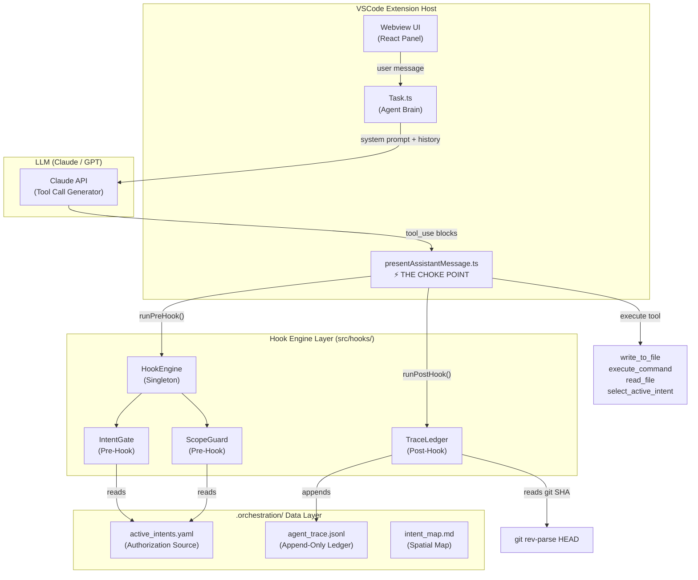
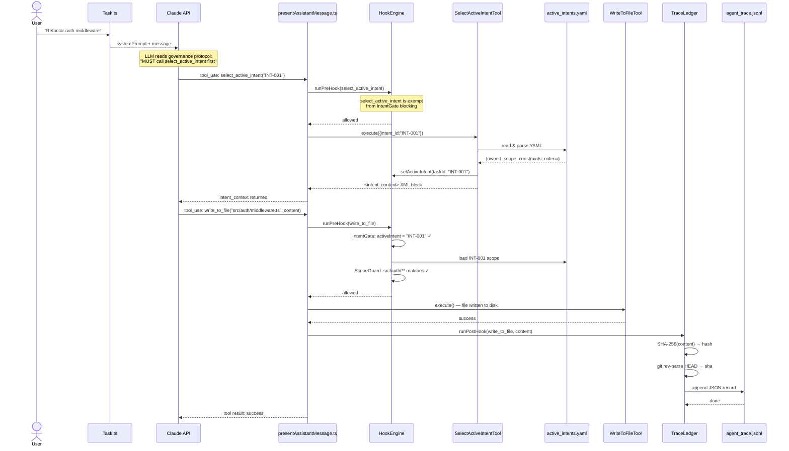
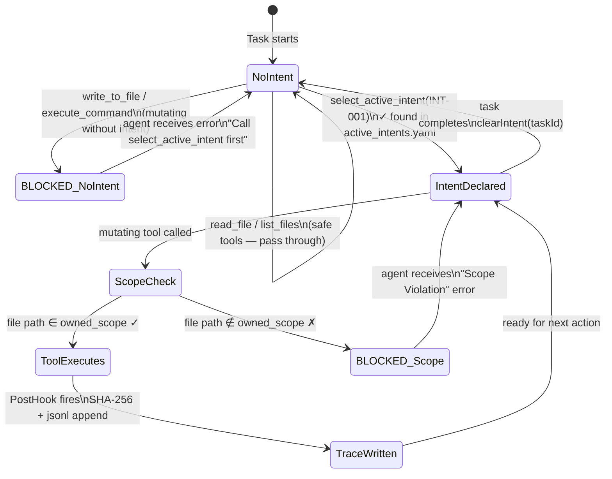
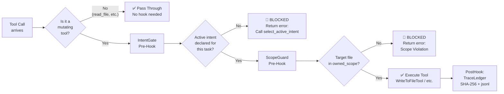
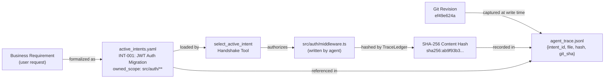
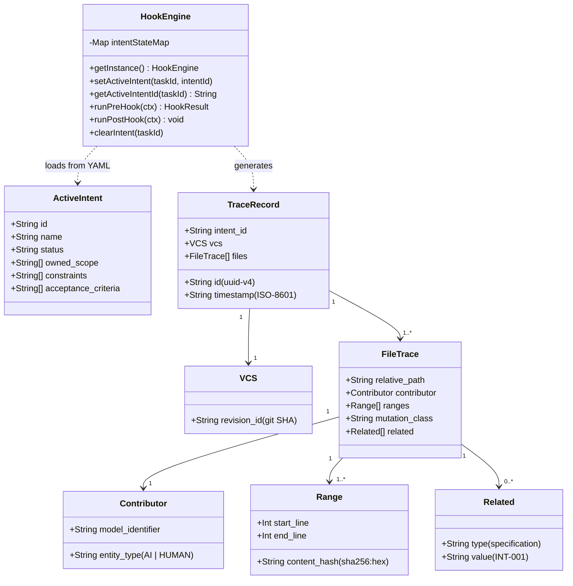

# ARCHITECTURE_NOTES.md

## Phase 0 — The Archaeological Dig into Roo Code (Exploring the codebase)

---

## 1. What Is Roo Code?

Roo Code is a VSCode extension that runs an AI coding agent inside the editor. It is a **monorepo** built with TypeScript, structured as:

```
Roo-Code/
├── src/                        ← VSCode Extension Host (the main agent logic)
│   ├── extension.ts            ← Entry point: activates the extension
│   ├── core/
│   │   ├── task/Task.ts        ← THE agent brain. Manages the entire conversation loop.
│   │   ├── tools/              ← Every tool the agent can call (read, write, execute...)
│   │   ├── prompts/system.ts   ← Builds the system prompt sent to the LLM
│   │   ├── assistant-message/  ← Processes what the LLM returns (tool calls, text)
│   │   └── webview/            ← Bridge to the UI panel
│   └── services/               ← MCP, checkpoints, skills
├── packages/
│   └── types/src/tool.ts       ← Canonical list of all tool names (ToolName type)
└── apps/                       ← Web app, CLI
```

---

## 2. How the Agent Loop Works (The Nervous System)

The agent is a **request-response loop** between the LLM and the IDE. Here is the complete flow:

```
User types a message
        ↓
Task.ts → getSystemPrompt() → SYSTEM_PROMPT() in src/core/prompts/system.ts
        ↓
Task.ts → makeApiRequest() → sends [systemPrompt + conversation history] to Claude/OpenAI
        ↓
LLM responds with content blocks:
  - "text" block  → displayed to user
  - "tool_use" block → intercepted for execution
        ↓
presentAssistantMessage() in src/core/assistant-message/presentAssistantMessage.ts
        ↓
switch (block.name) {
  case "write_to_file" → WriteToFileTool.execute()
  case "execute_command" → ExecuteCommandTool.execute()
  case "read_file" → ReadFileTool.execute()
  ...each tool handles its own askApproval + result
}
        ↓
Tool result pushed back → next LLM turn
```

---

## 3. The Three Critical Files (Hook Insertion Points)

### 3.1 Tool Dispatch — `src/core/assistant-message/presentAssistantMessage.ts`

**Line 678 — The switch(block.name) block**

This is the single most important location in the entire codebase. Every tool call from the LLM passes through this switch statement. There is **no other path**. This is where:

- **Pre-Hooks go**: BEFORE the switch executes (before any tool runs)
- **Post-Hooks go**: AFTER the tool case completes (after the file is written / command is run)

```typescript
// LINE 678 in presentAssistantMessage.ts
switch (block.name) {
  case "write_to_file":   ← mutating: needs Pre-Hook + Post-Hook
    await writeToFileTool.handle(...)
    break
  case "execute_command": ← destructive: needs Pre-Hook (HITL approval)
    await executeCommandTool.handle(...)
    break
  case "read_file":       ← safe: no hook needed
    ...
}
```

### 3.2 System Prompt — `src/core/task/Task.ts` line 3792 → `src/core/prompts/system.ts`

The system prompt is built by `getSystemPrompt()` (private method on Task, line 3745), which calls `SYSTEM_PROMPT()` in `system.ts`. This function assembles modular sections from `src/core/prompts/sections/`.

**This is where we inject the intent enforcement instruction:**

> "You CANNOT write code immediately. Your FIRST action MUST be `select_active_intent`."

### 3.3 Tool Definitions — `packages/types/src/tool.ts`

The array `toolNames` (line 24) is the canonical registry of all valid tool names. Adding `"select_active_intent"` here makes it a first-class tool recognized by the parser and type system.

---

## 4. The Hook Architecture We Are Building

### 4.1 The Two-Stage State Machine

```
User: "Refactor the auth middleware"
              │
              ▼
  ┌─────────────────────────┐
  │   LLM analyzes request  │
  │  (State 1: The Request) │
  └───────────┬─────────────┘
              │  LLM calls: select_active_intent("INT-001")
              ▼
  ┌─────────────────────────────────────────────────┐
  │   PRE-HOOK fires on select_active_intent        │
  │   → Reads .orchestration/active_intents.yaml    │
  │   → Finds INT-001: constraints + owned_scope    │
  │   → Returns <intent_context> XML block to LLM   │
  │   (State 2: The Handshake)                      │
  └───────────┬─────────────────────────────────────┘
              │  LLM now has context, calls: write_to_file("src/auth/middleware.ts", ...)
              ▼
  ┌─────────────────────────────────────────────────┐
  │   PRE-HOOK fires on write_to_file               │
  │   → Checks: active intent declared? ✓           │
  │   → Checks: src/auth/middleware.ts in scope? ✓  │
  │   → Allows execution to proceed                 │
  └───────────┬─────────────────────────────────────┘
              │  WriteToFileTool.execute() runs — file is saved
              ▼
  ┌─────────────────────────────────────────────────┐
  │   POST-HOOK fires after write_to_file           │
  │   → Computes SHA-256 of written content         │
  │   → Appends JSON record to agent_trace.jsonl    │
  │   → Links: INT-001 → src/auth/middleware.ts     │
  │   (State 3: Contextualized Action + Trace)      │
  └─────────────────────────────────────────────────┘
```

### 4.2 What Gets Blocked

```
Agent tries write_to_file WITHOUT calling select_active_intent first:
  → PRE-HOOK: IntentGate fires → BLOCKED
  → Returns: "Error: You must call select_active_intent before writing files."

Agent tries to write src/billing/invoice.ts but INT-001 only owns src/auth/**:
  → PRE-HOOK: ScopeGuard fires → BLOCKED
  → Returns: "Scope Violation: INT-001 is not authorized to edit src/billing/invoice.ts"
```

---

## 5. The src/hooks/ Directory Structure

```
src/hooks/
├── types.ts                      ← Shared types: HookContext, HookResult, IntentState
├── HookEngine.ts                 ← The singleton middleware engine
│                                    Manages per-task intent state
│                                    Runs pre/post hook chains
├── preHooks/
│   ├── intentGate.ts             ← Blocks mutating tools if no intent is declared
│   └── scopeGuard.ts             ← Blocks writes outside the intent's owned_scope
├── postHooks/
│   └── traceLedger.ts            ← SHA-256 hash + append to agent_trace.jsonl
└── utils/
    ├── contentHash.ts            ← SHA-256 helper (crypto built-in)
    ├── intentLoader.ts           ← Parses .orchestration/active_intents.yaml
    └── orchestrationPaths.ts     ← Centralized .orchestration/ path resolution
```

---

## 6. The Data Model (.orchestration/)

```
.orchestration/
├── active_intents.yaml   ← What work is authorized (the "why")
├── agent_trace.jsonl     ← Append-only ledger of every action (the "proof")
└── intent_map.md         ← Which files belong to which intent (the "map")
```

### active_intents.yaml schema:

```yaml
active_intents:
    - id: "INT-001"
      name: "JWT Authentication Migration"
      status: "IN_PROGRESS"
      owned_scope:
          - "src/auth/**"
          - "src/middleware/jwt.ts"
      constraints:
          - "Must not use external auth providers"
      acceptance_criteria:
          - "Unit tests in tests/auth/ pass"
```

### agent_trace.jsonl record schema (spatial independence via content hash):

```json
{
	"id": "uuid-v4",
	"timestamp": "ISO-8601",
	"intent_id": "INT-001",
	"vcs": { "revision_id": "git_sha" },
	"files": [
		{
			"relative_path": "src/auth/middleware.ts",
			"contributor": { "entity_type": "AI", "model_identifier": "claude-3-5-sonnet" },
			"ranges": [
				{
					"start_line": 1,
					"end_line": 45,
					"content_hash": "sha256:a8f5f167..."
				}
			],
			"mutation_class": "AST_REFACTOR",
			"related": [{ "type": "specification", "value": "INT-001" }]
		}
	]
}
```

---

## 7. The select_active_intent Tool

A new first-class tool added to the agent's toolset. The LLM MUST call this before any mutating action.

**Input:** `{ intent_id: string }`

**What happens when called:**

1. HookEngine reads `active_intents.yaml` and finds the intent
2. Extracts constraints, owned_scope, acceptance_criteria
3. Returns an `<intent_context>` XML block back to the LLM
4. Marks the intent as active in per-task state (Map<taskId, activeIntentId>)

**What the LLM receives:**

```xml
<intent_context>
  <intent id="INT-001" name="JWT Authentication Migration">
    <owned_scope>
      <path>src/auth/**</path>
      <path>src/middleware/jwt.ts</path>
    </owned_scope>
    <constraints>
      <constraint>Must not use external auth providers</constraint>
    </constraints>
    <acceptance_criteria>
      <criterion>Unit tests in tests/auth/ pass</criterion>
    </acceptance_criteria>
  </intent>
</intent_context>
```

---

## 8. System Prompt Modification

The following instruction is injected into the system prompt (in `src/core/prompts/system.ts`):

```
# Intent-Driven Governance Protocol

You are operating under a strict governance system. You CANNOT write, edit, or delete
files immediately. Your FIRST action for any code modification task MUST be:

1. Analyze the user's request
2. Call `select_active_intent(intent_id)` with the appropriate intent ID from
   .orchestration/active_intents.yaml
3. Wait for the <intent_context> block to be returned
4. Only THEN proceed with code modifications — and only within the declared scope

If you attempt to call write_to_file, apply_diff, edit, or execute_command
without first calling select_active_intent, the system will BLOCK your action
and return an error.
```

---

## 9. Key Architectural Decisions

| Decision                          | Choice                                                 | Reason                                               |
| --------------------------------- | ------------------------------------------------------ | ---------------------------------------------------- |
| Hook insertion point              | `presentAssistantMessage.ts` before switch(block.name) | Single choke point — ALL tools pass through here     |
| Intent state storage              | `Map<taskId, string>` in HookEngine singleton          | No Task.ts modification needed; isolated             |
| Content hashing                   | Node.js `crypto.createHash('sha256')`                  | Zero dependency, always available in Extension Host  |
| YAML parsing                      | `yaml` package (already in src/package.json)           | Already a project dependency                         |
| Scope matching                    | Simple prefix/glob matching                            | Sufficient for the demo; expandable to minimatch     |
| Trace format                      | Append-only JSONL                                      | Machine-readable, spatially independent, append-safe |
| select_active_intent registration | Added to `toolNames` in `packages/types/src/tool.ts`   | Cleanest: makes it first-class, recognized by parser |

---

## 10. Files Modified / Created

### Modified:

- `packages/types/src/tool.ts` — Added `"select_active_intent"` to toolNames
- `src/core/assistant-message/presentAssistantMessage.ts` — Wired pre/post hooks + select_active_intent case
- `src/core/prompts/system.ts` — Injected intent enforcement instruction

### Created:

- `src/hooks/` — Entire hooks directory (new)
- `src/core/tools/SelectActiveIntentTool.ts` — The new tool
- `.orchestration/active_intents.yaml` — Sample intent definitions
- `.orchestration/agent_trace.jsonl` — Append-only trace ledger (machine-managed)
- `.orchestration/intent_map.md` — Intent-to-file spatial map

---

## 11. Visual System Blueprints

### 11.1 — System Layer Architecture



---

### 11.2 — Agent Sequence Diagram (The Two-Stage State Machine)



---

### 11.3 — Hook Engine State Machine



---

### 11.4 — Pre-Hook Interceptor Chain



---

### 11.5 — Traceability Chain (Intent → Code → Hash → Git)



---

### 11.6 — Data Model Class Diagram


