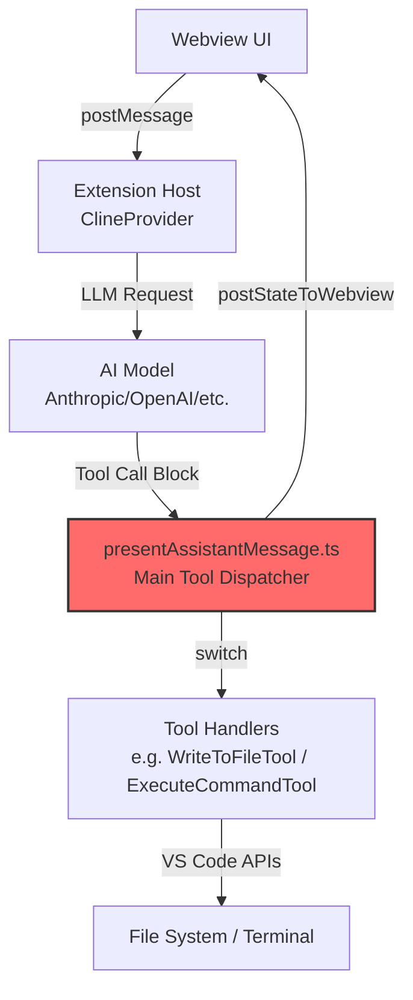

# ARCHITECTURE_NOTES.md – Phase 0: Archaeological Dig Results

**TRP1 Challenge Week 1 – Architecting the AI-Native IDE & Intent-Code Traceability**  
_Findings from Roo Code (fork: Birkity/roocode-intent-hooks)_  
_Date: February 18, 2026_

## Executive Summary – Phase 0 Status

**Objective achieved**: Successfully mapped the critical execution pathways of Roo Code (tool loop, prompt construction, Webview ↔ Extension Host communication, conversation pipeline).  
Identified precise hook injection points for Phase 1 (Handshake) and Phase 2 (Hook Engine).  
Roo Code demonstrates **production-grade architecture** — monorepo with Clean Architecture layers, strong type safety, event-driven design, and built-in approval gates — providing an excellent foundation for intent traceability and governance.

## 1. Core Extension Architecture

### Main Entry Points

- **Activation file**: `src/extension.ts`  
  Registers the sidebar provider and activation events.
- **Primary provider**: `src/core/webview/ClineProvider.ts`  
  Implements `vscode.WebviewViewProvider` — controls sidebar lifecycle and state.

### Activation Flow (simplified)

```typescript
// src/extension.ts (~line 323)
context.subscriptions.push(
	vscode.window.registerWebviewViewProvider(ClineProvider.sideBarId, provider, {
		webviewOptions: { retainContextWhenHidden: true },
	}),
)
```

## 2. Tool Execution System – Critical for Hooks

### Tool Definitions

Location: `src/shared/tools.ts`  
Defines strongly-typed tool interfaces (e.g., `write_to_file`, `execute_command`).

Example:

```typescript
export interface WriteToFileToolUse extends ToolUse<"write_to_file"> {
	name: "write_to_file"
	params: { path: string; content: string }
}
```

### Central Tool Dispatcher – MAIN HOOK TARGET

Location: `src/core/assistant-message/presentAssistantMessage.ts`  
This is **the primary tool execution loop**.

Key pattern:

```typescript
switch (block.name) {
	case "execute_command":
		await executeCommandTool.handle(cline, block, { askApproval, handleError, pushToolResult })
		break
	case "write_to_file":
		await writeToFileTool.handle(cline, block, { askApproval, handleError, pushToolResult })
		break
}
```

### Tool Handlers

- `src/core/tools/ExecuteCommandTool.ts` → runs shell commands via VS Code terminal
- `src/core/tools/WriteToFileTool.ts` → writes/modifies files (with diff preview + approval)

**Hook opportunities identified**:

- **Pre-hook**: Before `.handle()` call (validate intent, scope, HITL)
- **Post-hook**: After successful execution (log trace, compute hash, format/lint)

## 3. System Prompt Generation – Critical for Reasoning Enforcement

### Main Builder Locations

- Entry: `src/core/webview/generateSystemPrompt.ts`
- Core function: `src/core/prompts/system.ts` → `SYSTEM_PROMPT()`
- Modular sections: `src/core/prompts/sections/`

### Prompt Construction Flow

```typescript
export const generateSystemPrompt = async (provider: ClineProvider, message: WebviewMessage) => {
	const systemPrompt = await SYSTEM_PROMPT(
		provider.context,
		cwd,
		mcpEnabled ? provider.getMcpHub() : undefined,
		diffStrategy,
		mode,
		customModePrompts,
		customInstructions,
		// ... other dynamic parts
	)
}
```

**Injection points for Phase 1**:

- `customInstructions`
- `customModePrompts`
- Add new param `intentContext` → inject `<intent_context>` block

## 4. Webview ↔ Extension Host Communication

### Pattern

- **Frontend**: `webview-ui/` (React, no Node.js access)
- **Backend**: `src/core/webview/ClineProvider.ts`
- **IPC**: `postMessage` ↔ `onDidReceiveMessage`

### Central Handler

`src/core/webview/webviewMessageHandler.ts` — dispatches all incoming messages from UI.

**Phase 1 opportunity**: Add new message types (`analyzeIntent`, `selectActiveIntent`).

## 5. LLM Conversation Pipeline – Full Flow

1. User input → `webviewMessageHandler` → `Task.handleWebviewAskResponse()`
2. `Task.start()` → LLM request via provider
3. Response → `presentAssistantMessage()` → tool execution switch
4. Tool result → `postStateToWebview()` → UI update

Key class: `src/core/task/Task.ts` — manages state, history, tools.

Persistence: `.roo/tasks/{taskId}/` (we will extend to `.orchestration/`).

## 6. High-Level Execution Flow Diagram




**Highlighted**: `presentAssistantMessage.ts` — primary target for tool interception.

## 7. Key Findings Summary – Phase 0 Targets

| Requirement                                | Location Found                                                             | Notes / Hook Potential                   |
| ------------------------------------------ | -------------------------------------------------------------------------- | ---------------------------------------- |
| Tool loop (execute_command, write_to_file) | `src/core/assistant-message/presentAssistantMessage.ts`                    | Main switch → ideal Pre/Post hook points |
| Tool handlers                              | `src/core/tools/*.ts`                                                      | Individual `.handle()` methods           |
| System prompt builder                      | `src/core/webview/generateSystemPrompt.ts`<br>`src/core/prompts/system.ts` | Inject intent rules here                 |
| Webview ↔ Host communication              | `src/core/webview/webviewMessageHandler.ts`                                | Add intent selection messages            |
| Conversation / task management             | `src/core/task/Task.ts`                                                    | Extend with intent metadata              |

## 8. Strategic Observations

- Roo Code already has approval gates (`askApproval`) → perfect for HITL enforcement
- Existing event-driven design (EventEmitter) → ideal for HookEngine
- Strong type system (`@roo-code/types`) → extend for `IntentMetadata`
- Production-grade patterns → easy to add clean, maintainable hooks

```

```
