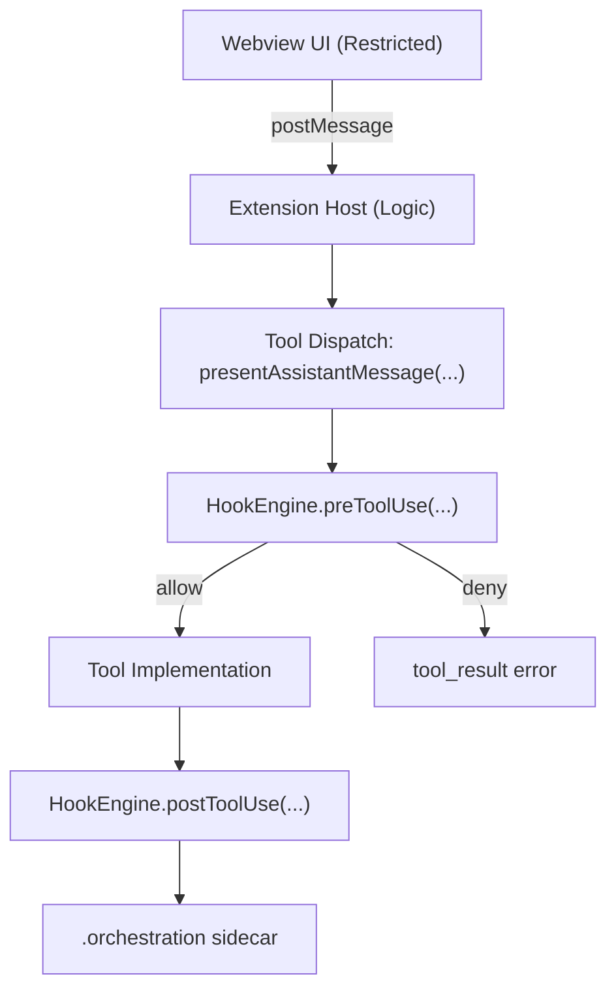
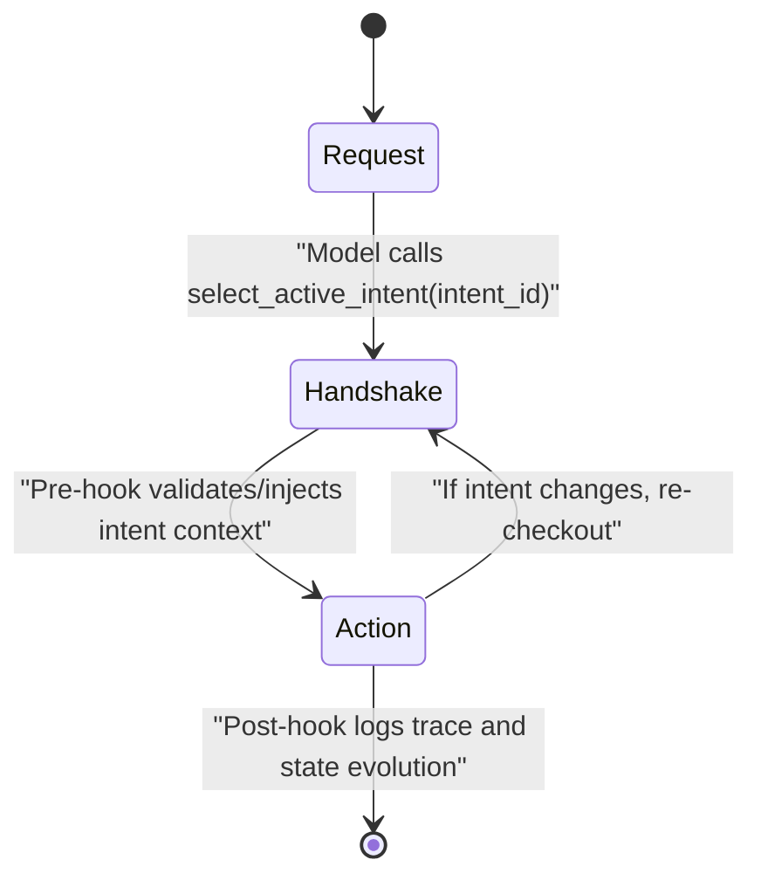
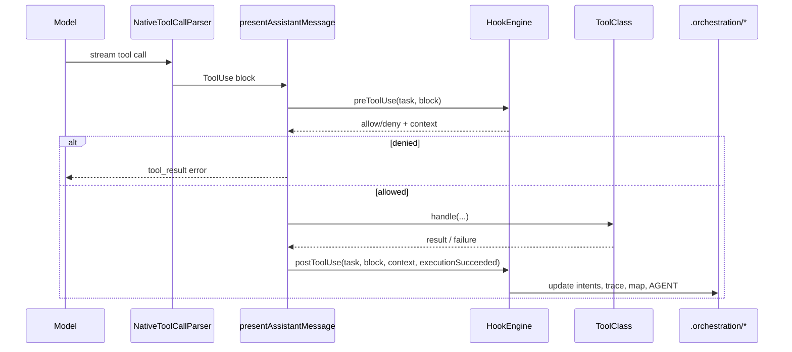
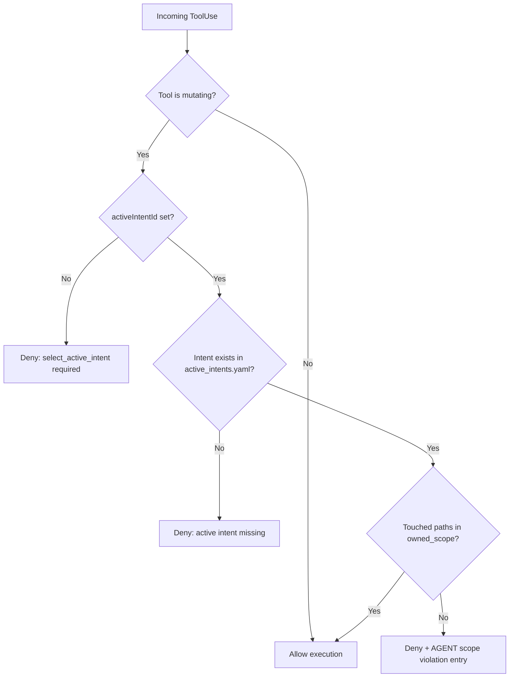

# Hook System Spec

Date: 2026-02-17
Repository: `/Users/gersumasfaw/Roo-Code-10x`

## Purpose

Define the Hook Engine middleware boundary for tool execution in the VS Code extension host, including:

1. Two-stage intent handshake before mutating actions.
2. Pre/Post hook contracts.
3. Sidecar storage schemas under `.orchestration/`.
4. Traceability requirements linking intent -> code changes.

## Architecture Boundary



Separation of concerns:

- Webview UI: presentation only, emits events.
- Extension Host: API polling, secret management, MCP execution, task loop.
- Hook Engine: middleware guardrail for tool execution.

Implementation anchors:

- `/Users/gersumasfaw/Roo-Code-10x/src/core/assistant-message/presentAssistantMessage.ts:63`
- `/Users/gersumasfaw/Roo-Code-10x/src/hooks/HookEngine.ts:73`

## Two-Stage Turn State Machine



Handshake rule:

- Before mutating tools, model must call `select_active_intent`.
- Mutating tools are blocked until active intent is valid.

Prompt-level enforcement anchor:

- `/Users/gersumasfaw/Roo-Code-10x/src/core/prompts/system.ts:30`

## Hook Lifecycle



## Pre-Hook Decision Logic



## Sidecar Data Model

### 1) `.orchestration/active_intents.yaml`

Canonical schema:

```yaml
active_intents:
    - id: "INT-001"
      name: "JWT Authentication Migration"
      status: "IN_PROGRESS"
      owned_scope:
          - "src/auth/**"
          - "src/middleware/jwt.ts"
      constraints:
          - "Must not use external auth providers"
          - "Must maintain backward compatibility with Basic Auth"
      acceptance_criteria:
          - "Unit tests in tests/auth/ pass"
      related_files:
          - "src/auth/middleware.ts"
      recent_history:
          - "PRE_HOOK write_to_file"
```

Compatibility behavior:

- Loader accepts legacy `intents` and normalizes:
  `intent_id -> id`, `title -> name`.

Implementation anchor:

- `/Users/gersumasfaw/Roo-Code-10x/src/hooks/OrchestrationStore.ts:133`

### 2) `.orchestration/agent_trace.jsonl` (append-only)

Record schema (one JSON object per line):

```json
{
	"id": "uuid-v4",
	"timestamp": "2026-02-16T12:00:00Z",
	"vcs": { "revision_id": "git_sha_hash" },
	"files": [
		{
			"relative_path": "src/auth/middleware.ts",
			"conversations": [
				{
					"url": "task_or_session_id",
					"contributor": {
						"entity_type": "AI",
						"model_identifier": "model-id"
					},
					"ranges": [
						{
							"start_line": 1,
							"end_line": 45,
							"content_hash": "sha256:..."
						}
					],
					"related": [
						{
							"type": "specification",
							"value": "INT-001"
						}
					]
				}
			]
		}
	]
}
```

Current behavior:

- SHA-256 is computed from each touched file content.
- One range entry is emitted per touched file.

Implementation anchors:

- `/Users/gersumasfaw/Roo-Code-10x/src/hooks/HookEngine.ts:281`
- `/Users/gersumasfaw/Roo-Code-10x/src/hooks/OrchestrationStore.ts:226`

### 3) `.orchestration/intent_map.md`

Purpose:

- Incremental spatial mapping from intent ID to touched file paths.

Update trigger:

- Post-hook on successful mutating tool execution.

### 4) `AGENT.md` (workspace root shared brain)

Purpose:

- Capture persistent lessons/failures/architectural decisions.

Update triggers:

- Scope violations, failed mutating actions, completion evolution.

## Hook Runtime Contracts

Pre-hook result:

```json
{
	"allowExecution": true,
	"errorMessage": "optional string",
	"context": {
		"toolName": "write_to_file",
		"isMutatingTool": true,
		"intentId": "INT-001",
		"touchedPaths": ["src/auth/middleware.ts"],
		"hadToolFailureBefore": false
	}
}
```

Post-hook inputs:

- `task`
- `block` (`ToolUse`)
- `context` (pre-hook context)
- `executionSucceeded` (boolean)

Post-hook side effects:

1. Append recent history to active intent.
2. For mutating success: append `agent_trace.jsonl` and `intent_map.md`.
3. For failures/scope issues/completion transitions: append `AGENT.md`.

## Required Tooling for Handshake

Mandatory tool:

- `select_active_intent(intent_id: string)`

Implementation anchors:

- `/Users/gersumasfaw/Roo-Code-10x/src/core/tools/SelectActiveIntentTool.ts:12`
- `/Users/gersumasfaw/Roo-Code-10x/src/core/prompts/tools/native-tools/select_active_intent.ts:10`
- `/Users/gersumasfaw/Roo-Code-10x/src/core/assistant-message/NativeToolCallParser.ts:457`
- `/Users/gersumasfaw/Roo-Code-10x/src/core/assistant-message/presentAssistantMessage.ts:821`

## Current Limitations

1. Trace ranges are file-level, not AST/subrange-level.
2. Dedicated automated tests for hook policy and ledger output should be added.
3. Optional future backend: SQLite/Zvec if sidecar file scale becomes a bottleneck.
