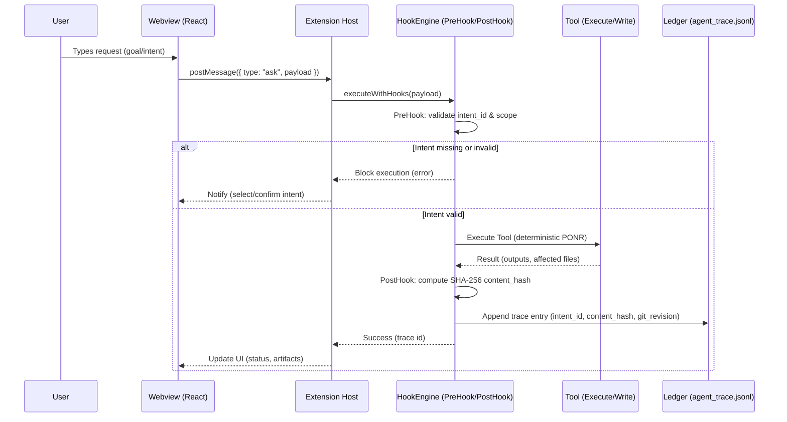

# Roo-Code (Governed AI‑Native IDE) — TRP1 Interim Submission

This fork presents Roo‑Code as a Governed AI‑Native IDE that implements strict Middleware Hooks for silicon workers. It upgrades the system from probabilistic assistants to determined agentic orchestration with formal intent governance, traceability, and auditability.

## 1. Vision & Executive Summary

- **From probabilistic assistants to governed orchestration:** The IDE now operates under Deterministic Lifecycle Hooks that constrain tool execution by validated intent and produce immutable audit trails.
- **Eliminates “Vibe Coding” and repays Cognitive Debt:** We formalize intent‑to‑code traceability via a Two‑Stage State Machine and append‑only ledger. Every side effect is explicitly authorized (intent handshake) and recorded (content hashing + git revision).

## 2. The Governance Layer 

- **Middleware/Interceptor Pattern:** Governance is implemented in [src/hooks](src/hooks), wrapping tools without invasive modifications:
	- [HookEngine](src/hooks/engines/HookEngine.ts): Deterministic IoC wrapper around tool calls.
	- [PreHook](src/hooks/engines/PreHook.ts): Gatekeeper validates `intent_id`, enforces scope (glob), and blocks out‑of‑bounds changes.
	- [PostHook](src/hooks/engines/PostHook.ts): Auditor computes normalized SHA‑256 `content_hash`, captures `git_revision`, and appends to `.orchestration/agent_trace.jsonl`.
	- [IntentLockManager](src/hooks/engines/IntentLockManager.ts): TTL‑based file locks prevent parallel collisions (optimistic locking).
- **Inversion of Control (IoC) & Privilege Separation:** Hooks remain isolated from tool logic in [src/core/tools](src/core/tools), enabling non‑destructive integration and uniform policy enforcement across write and execute paths.

## 3. The Intent Handshake 

- **Two‑Stage State Machine:** User Prompt → Intent Check (PreHook) → Action (Tool).
	- Execution is blocked until a valid `intent_id` is selected and confirmed; the Gatekeeper enforces owned scope and preconditions.
- **Curated Context Injection:** The system reads `active_intents.yaml` (the project’s shared brain) and injects a minimal `<intent_context>` into the LLM to prevent Context Rot. See [generateSystemPrompt.ts](src/core/webview/generateSystemPrompt.ts).

## 4. Mathematical Traceability 

- **Spatial Independence:** We compute SHA‑256 hashes over normalized content (whitespace collapsed) — not line diffs — so identity remains stable across reformatting.
- **AST correlation:** Optional `ast_node_type` is detected via the compiler API for semantic linkage. See [astCapture.ts](src/hooks/utilities/astCapture.ts).
- **Classification:**
	- `AST_REFACTOR` — structural adjustments within existing intent envelope.
	- `INTENT_EVOLUTION` — features that evolve scope under an explicit intent.

## 5. The Archaeological Dig (Interim Specifics)

- **Points of No Return (PONR):**
	- [WriteToFileTool.ts](src/core/tools/WriteToFileTool.ts) — durable workspace edits.
	- [ExecuteCommandTool.ts](src/core/tools/ExecuteCommandTool.ts) — shell actions mutating environment/artifacts.
- **Prompt injection point:** Minimal `<intent_context>` is assembled and injected in [generateSystemPrompt.ts](src/core/webview/generateSystemPrompt.ts), binding execution to the user‑approved intent.

## 6. Data Model & .orchestration/ Sidecar

- **Ledger file:** `.orchestration/agent_trace.jsonl`
- **Types:** [AgentTrace.ts](src/hooks/models/AgentTrace.ts)
- **Schema (excerpt):

```json
{
	"id": "uuid",
	"timestamp": "2026-02-18T17:05:26.123Z",
	"git_revision": {
		"commit": "558dfb194...",
		"branch": "main",
		"status": "clean"
	},
	"files": [
		{
			"relative_path": "src/core/tools/WriteToFileTool.ts",
			"conversations": [
				{
					"contributor": { "entity_type": "AI", "model_identifier": "GPT-5" },
					"classification": "REFACTOR",
					"ast_node_type": "MethodDeclaration",
					"intent_id": "INT-2026-02-18-0012",
					"ranges": [
						{
							"start_line": 0,
							"end_line": 167,
							"content_hash": "sha256:...64-hex..."
						}
					],
					"related": [{ "type": "specification", "value": "INT-2026-02-18-0012" }]
				}
			]
		}
	]
}
```

- **Shared Brain:** `active_intents.yaml` holds current intent selection, owned scope globs, and acceptance criteria, consumed by PreHook and prompt assembly.

## 7. Visual Workflow (Mermaid.js)



---

### Engineering Principles 

- **Deterministic Lifecycle Hooks:** PreHook and PostHook wrap all mutating operations; execution only proceeds under validated intent and produces verifiable artifacts.
- **Autonomous Recovery:** Invalid or missing intent blocks execution and prompts the UI to select/confirm — restoring a safe operating envelope.
- **Privilege Separation:** Governance code lives in [src/hooks](src/hooks); tools in [src/core/tools](src/core/tools); webview orchestration in [src/core/webview](src/core/webview).
- **Formal Intent Formalization:** `intent_id`, owned scope, and acceptance criteria steer the LLM through curated context and constrain tool side effects.

### Key References

- Governance runtime: [HookEngine.ts](src/hooks/engines/HookEngine.ts), [PreHook.ts](src/hooks/engines/PreHook.ts), [PostHook.ts](src/hooks/engines/PostHook.ts), [IntentLockManager.ts](src/hooks/engines/IntentLockManager.ts)
- AST detection: [astCapture.ts](src/hooks/utilities/astCapture.ts)
- PONR tools: [WriteToFileTool.ts](src/core/tools/WriteToFileTool.ts), [ExecuteCommandTool.ts](src/core/tools/ExecuteCommandTool.ts)
- Prompt assembly: [generateSystemPrompt.ts](src/core/webview/generateSystemPrompt.ts)
- Ledger schema docs: [docs/LedgerSchema.md](docs/LedgerSchema.md)
- Diagrams: [diagrams/sequence.mmd](diagrams/sequence.mmd), [diagrams/ledger-schema.mmd](diagrams/ledger-schema.mmd)

