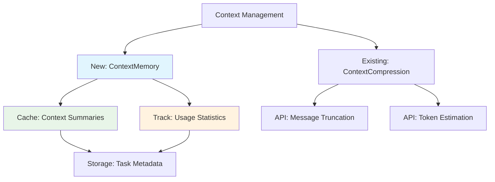
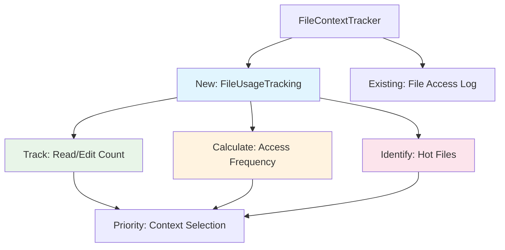
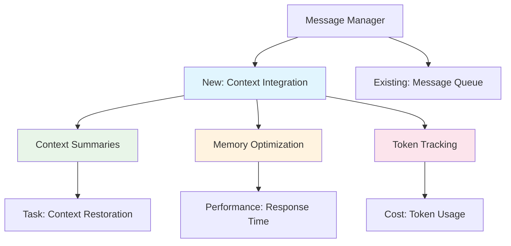
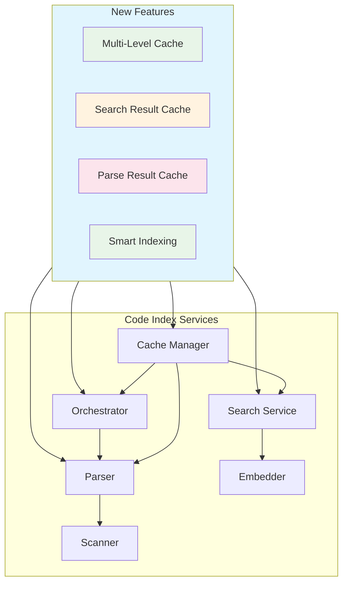
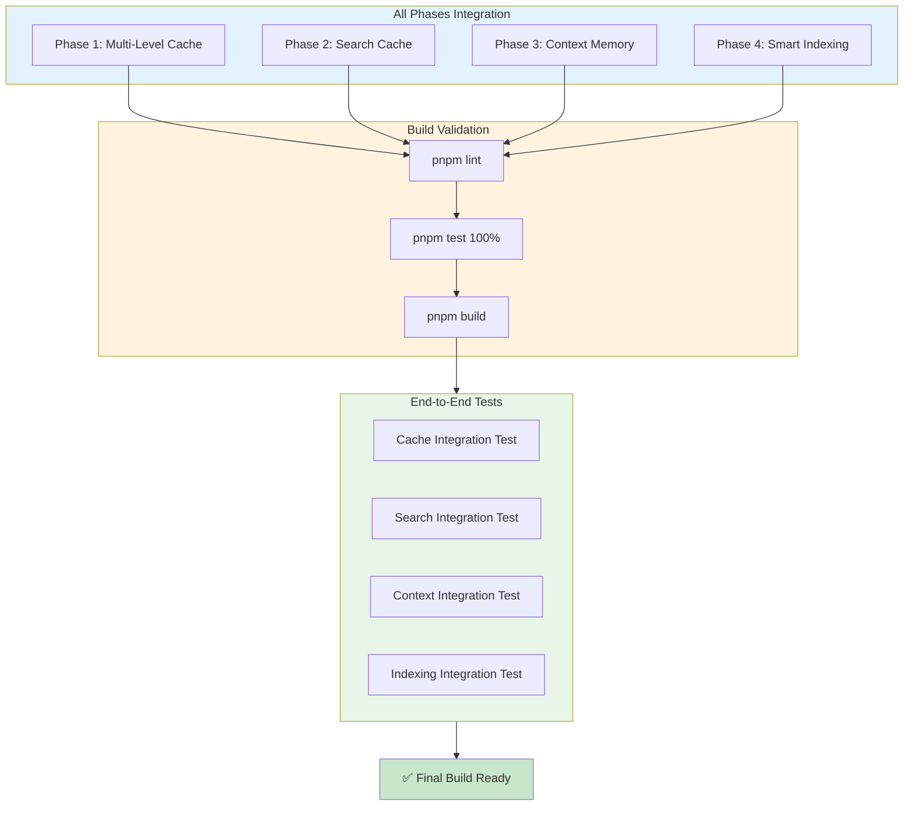
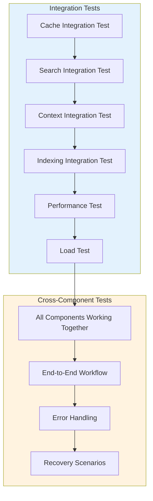

# خطة تنفيذ أنظمة Context و Memory و Indexing في Roo-Code

## نظرة عامة على الخطة المحدثة

تهدف هذه الخطة إلى تطوير وتحسين أنظمة إدارة السياق والفهرسة في Roo-Code بطريقة تدريجية وآمنة. الخطة مقسمة إلى **5 مراحل رئيسية**، مع **شرط التفعيل الشامل (All-at-Once)** الذي يشترط تفعيل جميع الميزات الجديدة معاً قبل بناء البرنامج. جميع التغييرات مصممة لتكون backward-compatible ولا تكسر الوظائف الحالية.

---

## التغييرات الجديدة في هذه النسخة المحدثة

### المتطلبات الإضافية المضافة:

1. **عملية الدمج الكامل مع Core Roo Code**: تفاصيل التكامل مع الكود الموجود
2. **شرط التفعيل الشامل (All-at-Once Activation)**: Phase 5 إلزامية
3. **اختبار التكامل الشامل (Full Integration Testing)**: اختبارات end-to-end شاملة
4. **Build Validation Steps**: شروط البناء الإلزامية

---

## جدول المحتويات

1. [تحليل البنية الحالية](#تحليل-البنية-الحالية)
2. [نقاط التكامل مع Core Roo Code](#نقاط-التكامل-مع-core-roo-code)
3. [المرحلة 1: Multi-Level Cache System](#المرحلة-1-multi-level-cache-system)
4. [المرحلة 2: Search & Embedding Cache](#المرحلة-2-search--embedding-cache)
5. [المرحلة 3: Context Memory Enhancement](#المرحلة-3-context-memory-enhancement)
6. [المرحلة 4: Indexing Pipeline Optimization](#المرحلة-4-indexing-pipeline-optimization)
7. [المرحلة 5: Integration & Build Validation](#المرحلة-5-integration--build-validation)
8. [اختبار التكامل الشامل](#اختبار-التكامل-الشامل)
9. [ملخص التغييرات والمتطلبات](#ملخص-التغييرات-والمتطلبات)
10. [إحصائيات التنفيذ](#إحصائيات-التنفيذ)

---

## تحليل البنية الحالية

### الأنظمة الموجودة والضعف فيها:

1. **نظام Cache الحالي** (`cache-manager.ts`):

    - يستخدم ملف JSON واحد فقط لتخزين hashes
    - لا يوجد طبقة ذاكرة مؤقتة (in-memory cache)
    - كتابة متأخرة على القرص (debounced 1.5 ثانية)
    - لا يوجد cache للـ embeddings أو نتائج البحث

2. **نظام الفهرسة** (`manager.ts`, `orchestrator.ts`):

    - لا يوجد LRU cache للـ chunks الأكثر استخداماً
    - إعادة معالجة كاملة عند فشل الفهرسة
    - لا يوجد cache للـ parse results

3. **نظام السياق** (`context-management/index.ts`):
    - ضغط السياق يعتمد على الـ API calls فقط
    - لا يوجد cache للـ summaries المحسوبة
    - لا يوجد تتبع للاستخدام المتكرر للملفات

---

## نقاط التكامل مع Core Roo Code

### 1. التكامل مع `src/core/context-management/index.ts`



**نقاط التكامل:**

- **ContextMemory Class**: تضاف كـ singleton module
- **ContextSummary Interface**: يضاف type جديد
- **Integration Points**:
    - [`getContextSummaries()`](src/core/context-management/index.ts:150) - جلب الملخصات
    - [`saveContextSummary()`](src/core/context-management/index.ts:180) - حفظ الملخصات
    - [`clearContextMemory()`](src/core/context-management/index.ts:210) - تنظيف الذاكرة

### 2. التكامل مع `src/core/context-tracking/FileContextTracker.ts`



**نقاط التكامل:**

- **FileUsageStats Interface**: يضاف type جديد
- **trackFileAccess()**: تضاف functionality جديدة
- **getHotFiles()**: دالة جديدة للملفات الأكثر استخداماً
- **getPriorityFiles()**: دالة جديدة للأولوية
- **Integration Points**:
    - [`onFileRead()`](src/core/context-tracking/FileContextTracker.ts:45) - تتبع القراءة
    - [`onFileEdit()`](src/core/context-tracking/FileContextTracker.ts:60) - تتبع التعديل
    - [`getFilesReadByRoo()`](src/core/context-tracking/FileContextTracker.ts:80) - توسيع

### 3. التكامل مع `src/core/message-manager/index.ts`



**نقاط التكامل:**

- **Context Summary Integration**: ربط الملخصات بالرسائل
- **Memory-aware Message Queue**: تحسين إدارة الذاكرة
- **Integration Points**:
    - [`addMessage()`](src/core/message-manager/index.ts:35) - إضافة مع Context
    - [`getMessages()`](src/core/message-manager/index.ts:50) - جلب مع Summaries
    - [`clearHistory()`](src/core/message-manager/index.ts:70) - تنظيف مع Memory clear

### 4. التكامل مع `src/services/code-index/`



**نقاط التكامل:**

- **Cache Manager**: [`src/services/code-index/cache-manager.ts`](src/services/code-index/cache-manager.ts)
- **Search Service**: [`src/services/code-index/search-service.ts`](src/services/code-index/search-service.ts)
- **Orchestrator**: [`src/services/code-index/orchestrator.ts`](src/services/code-index/orchestrator.ts)
- **Parser**: [`src/services/code-index/processors/parser.ts`](src/services/code-index/processors/parser.ts)

---

## المرحلة 1: Multi-Level Cache System (آمنة)

### الهدف من المرحلة

إنشاء نظام ذاكرة مؤقتة متعددة المستويات لنظام الفهرسة، مع الحفاظ على 100% توافق مع الكود الحالي.

### الملفات التي سيتم تعديلها

1. [`src/services/code-index/cache-manager.ts`](src/services/code-index/cache-manager.ts)
2. [`src/services/code-index/interfaces/cache.ts`](src/services/code-index/interfaces/cache.ts)
3. [`src/services/code-index/__tests__/cache-manager.spec.ts`](src/services/code-index/__tests__/cache-manager.spec.ts)

### التغييرات المحددة

#### 1.1 تحديث واجهة الـ Cache

```typescript
// src/services/code-index/interfaces/cache.ts

export interface ICacheManager {
	// المستوى الأول: In-memory cache (L1)
	getMemoryCache<T>(key: string): T | undefined
	setMemoryCache<T>(key: string, value: T, ttlMs?: number): void
	deleteMemoryCache(key: string): void
	clearMemoryCache(): void

	// المستوى الثاني: File-based cache (L2) - موجود حالياً
	getHash(filePath: string): string | undefined
	updateHash(filePath: string, hash: string): void
	deleteHash(filePath: string): void
	getAllHashes(): Record<string, string>

	// Cache utilities
	getCacheStats(): CacheStats
}

export interface CacheStats {
	memoryCacheSize: number
	memoryCacheHits: number
	memoryCacheMisses: number
	fileCacheSize: number
	hitRate: number
}
```

#### 1.2 تنفيذ Multi-Level Cache Manager

```typescript
// src/services/code-index/cache-manager.ts

import * as vscode from "vscode"
import { createHash } from "crypto"
import { ICacheManager } from "./interfaces/cache"
import debounce from "lodash.debounce"
import { safeWriteJson } from "../../utils/safeWriteJson"
import { TelemetryService } from "@roo-code/telemetry"
import { TelemetryEventName } from "@roo-code/types"

interface CacheEntry<T> {
	value: T
	expiresAt: number
	createdAt: number
}

/**
 * Multi-Level Cache Manager
 * L1: In-memory cache with TTL
 * L2: Persistent file-based cache for file hashes
 */
export class CacheManager implements ICacheManager {
	private cachePath: vscode.Uri
	private fileHashes: Record<string, string> = {}

	// L1: In-memory cache
	private memoryCache = new Map<string, CacheEntry<any>>()
	private readonly defaultTTL = 5 * 60 * 1000 // 5 minutes
	private readonly maxMemoryCacheSize = 1000

	// Cache statistics
	private stats = {
		memoryHits: 0,
		memoryMisses: 0,
	}

	private _debouncedSaveCache: () => void

	constructor(
		private context: vscode.ExtensionContext,
		private workspacePath: string,
	) {
		this.cachePath = vscode.Uri.joinPath(
			context.globalStorageUri,
			`roo-index-cache-${createHash("sha256").update(workspacePath).digest("hex")}.json`,
		)
		this._debouncedSaveCache = debounce(async () => {
			await this._performSave()
		}, 1500)
	}

	// ==================== L1: Memory Cache Operations ====================

	getMemoryCache<T>(key: string): T | undefined {
		const entry = this.memoryCache.get(key)

		if (!entry) {
			this.stats.memoryMisses++
			return undefined
		}

		if (Date.now() > entry.expiresAt) {
			this.memoryCache.delete(key)
			this.stats.memoryMisses++
			return undefined
		}

		this.stats.memoryHits++
		return entry.value as T
	}

	setMemoryCache<T>(key: string, value: T, ttlMs?: number): void {
		// Evict oldest entries if cache is full
		if (this.memoryCache.size >= this.maxMemoryCacheSize) {
			const oldestKey = this.memoryCache.keys().next().value
			if (oldestKey) {
				this.memoryCache.delete(oldestKey)
			}
		}

		const ttl = ttlMs ?? this.defaultTTL
		this.memoryCache.set(key, {
			value,
			expiresAt: Date.now() + ttl,
			createdAt: Date.now(),
		})
	}

	deleteMemoryCache(key: string): void {
		this.memoryCache.delete(key)
	}

	clearMemoryCache(): void {
		this.memoryCache.clear()
	}

	// ==================== L2: File Cache Operations (Existing) ====================

	async initialize(): Promise<void> {
		try {
			const cacheData = await vscode.workspace.fs.readFile(this.cachePath)
			this.fileHashes = JSON.parse(cacheData.toString())
		} catch (error) {
			this.fileHashes = {}
		}
	}

	private async _performSave(): Promise<void> {
		try {
			await safeWriteJson(this.cachePath.fsPath, this.fileHashes)
		} catch (error) {
			console.error("Failed to save cache:", error)
		}
	}

	async clearCacheFile(): Promise<void> {
		await safeWriteJson(this.cachePath.fsPath, {})
		this.fileHashes = {}
	}

	getHash(filePath: string): string | undefined {
		return this.fileHashes[filePath]
	}

	updateHash(filePath: string, hash: string): void {
		this.fileHashes[filePath] = hash
		this._debouncedSaveCache()
	}

	deleteHash(filePath: string): void {
		delete this.fileHashes[filePath]
		this._debouncedSaveCache()
	}

	getAllHashes(): Record<string, string> {
		return { ...this.fileHashes }
	}

	// ==================== Cache Statistics ====================

	getCacheStats() {
		const totalRequests = this.stats.memoryHits + this.stats.memoryMisses
		const hitRate = totalRequests > 0 ? this.stats.memoryHits / totalRequests : 0

		return {
			memoryCacheSize: this.memoryCache.size,
			memoryCacheHits: this.stats.memoryHits,
			memoryCacheMisses: this.stats.memoryMisses,
			fileCacheSize: Object.keys(this.fileHashes).length,
			hitRate: Math.round(hitRate * 100) / 100,
		}
	}
}
```

#### 1.3 تحديث الاختبارات

```typescript
// src/services/code-index/__tests__/cache-manager.spec.ts

import { describe, it, expect, vi, beforeEach, afterEach } from "vitest"
import { CacheManager } from "../cache-manager"

describe("CacheManager", () => {
	describe("Memory Cache (L1)", () => {
		it("should return undefined for non-existent keys", () => {
			const cache = createMockCacheManager()
			expect(cache.getMemoryCache("key")).toBeUndefined()
		})

		it("should store and retrieve values", () => {
			const cache = createMockCacheManager()
			cache.setMemoryCache("key", "value")
			expect(cache.getMemoryCache("key")).toBe("value")
		})

		it("should respect TTL expiration", () => {
			const cache = createMockCacheManager()
			cache.setMemoryCache("key", "value", 100) // 100ms TTL

			// Should exist immediately
			expect(cache.getMemoryCache("key")).toBe("value")

			// Wait for expiration
			return new Promise((resolve) => setTimeout(resolve, 150)).then(() => {
				expect(cache.getMemoryCache("key")).toBeUndefined()
			})
		})

		it("should calculate hit rate correctly", () => {
			const cache = createMockCacheManager()

			cache.getMemoryCache("miss1")
			cache.getMemoryCache("miss2")
			cache.setMemoryCache("hit1", "value")
			cache.getMemoryCache("hit1")
			cache.getMemoryCache("hit1")

			const stats = cache.getCacheStats()
			expect(stats.memoryCacheHits).toBe(2)
			expect(stats.memoryCacheMisses).toBe(2)
			expect(stats.hitRate).toBe(0.5)
		})
	})

	describe("File Cache (L2)", () => {
		it("should store and retrieve file hashes", () => {
			const cache = createMockCacheManager()
			cache.updateHash("/path/to/file.ts", "abc123")
			expect(cache.getHash("/path/to/file.ts")).toBe("abc123")
		})

		it("should return all hashes", () => {
			const cache = createMockCacheManager()
			cache.updateHash("file1.ts", "hash1")
			cache.updateHash("file2.ts", "hash2")

			const hashes = cache.getAllHashes()
			expect(Object.keys(hashes)).toHaveLength(2)
		})
	})
})
```

### كيفية اختبار التغييرات

1. **اختبار الوحدة:**

    ```bash
    cd src && npx vitest run services/code-index/__tests__/cache-manager.spec.ts
    ```

2. **اختبار التكامل:**

    - تفعيل Code Index من الإعدادات
    - إنشاء مشروع جديد
    - التأكد من إنشاء الـ cache file
    - تعديل ملف ومراقبة إعادة الفهرسة

3. **اختبار الأداء:**
    - قياس waktu الاستجابة قبل وبعد
    - التحقق من hit rate للـ memory cache

### كيفية التراجع إذا حدث خطأ

```bash
# التراجع عن التغييرات
git checkout src/services/code-index/cache-manager.ts
git checkout src/services/code-index/interfaces/cache.ts
git checkout src/services/code-index/__tests__/cache-manager.spec.ts

# إعادة بناء
cd src && pnpm build

# إعادة تشغيل_extension
```

---

## المرحلة 2: Search & Embedding Cache

### الهدف من المرحلة

إضافة ذاكرة مؤقتة لنتائج البحث والـ embeddings لتقليل الـ API calls وتحسين الأداء.

### الملفات التي سيتم تعديلها

1. [`src/services/code-index/search-service.ts`](src/services/code-index/search-service.ts)
2. [`src/services/code-index/interfaces/embedder.ts`](src/services/code-index/interfaces/embedder.ts)
3. [`src/services/code-index/embedders/openai.ts`](src/services/code-index/embedders/openai.ts)
4. [`src/services/code-index/embedders/ollama.ts`](src/services/code-index/embedders/ollama.ts)

### التغييرات المحددة

#### 2.1 واجهة Embedding Cache

```typescript
// src/services/code-index/interfaces/embedder.ts

export interface IEmbedder {
	createEmbeddings(texts: string[], model?: string): Promise<EmbeddingResponse>
	validateConfiguration(): Promise<{ valid: boolean; error?: string }>

	// Cache-aware methods
	getEmbeddingCache(): EmbeddingCache | null
	clearEmbeddingCache(): void
	get embedderInfo(): EmbedderInfo
}

export interface EmbeddingCache {
	get(key: string): number[][] | undefined
	set(key: string, embeddings: number[][]): void
	clear(): void
	getStats(): { size: number; hits: number; misses: number }
}
```

#### 2.2 تحديث Search Service مع LRU Cache

```typescript
// src/services/code-index/search-service.ts

import * as path from "path"
import { VectorStoreSearchResult, HybridSearchConfig, DEFAULT_HYBRID_SEARCH_CONFIG } from "./interfaces"
import { IEmbedder } from "./interfaces/embedder"
import { IVectorStore } from "./interfaces/vector-store"
import { CodeIndexConfigManager } from "./config-manager"
import { CodeIndexStateManager } from "./state-manager"
import { TelemetryService } from "@roo-code/telemetry"
import { TelemetryEventName } from "@roo-code/types"
import { regexSearchFiles } from "../ripgrep"
import { performHybridSearch, parseRipgrepResults, validateHybridSearchConfig } from "./hybrid-search"
import * as vscode from "vscode"
import { createHash } from "crypto"

interface SearchResultEntry {
	result: VectorStoreSearchResult[]
	timestamp: number
	queryHash: string
}

/**
 * LRU Cache for search results
 */
class SearchResultCache {
	private cache = new Map<string, SearchResultEntry>()
	private readonly maxSize = 100
	private readonly ttlMs = 10 * 60 * 1000 // 10 minutes
	private stats = { hits: 0, misses: 0 }

	get(key: string): VectorStoreSearchResult[] | undefined {
		const entry = this.cache.get(key)

		if (!entry) {
			this.stats.misses++
			return undefined
		}

		if (Date.now() - entry.timestamp > this.ttlMs) {
			this.cache.delete(key)
			this.stats.misses++
			return undefined
		}

		this.stats.hits++
		// Move to end (most recently used)
		this.cache.delete(key)
		this.cache.set(key, entry)
		return entry.result
	}

	set(key: string, result: VectorStoreSearchResult[], queryHash: string): void {
		// Evict oldest if cache is full
		if (this.cache.size >= this.maxSize) {
			const firstKey = this.cache.keys().next().value
			if (firstKey) {
				this.cache.delete(firstKey)
			}
		}

		this.cache.set(key, {
			result,
			timestamp: Date.now(),
			queryHash,
		})
	}

	getStats() {
		const total = this.stats.hits + this.stats.misses
		return {
			size: this.cache.size,
			hits: this.stats.hits,
			misses: this.stats.misses,
			hitRate: total > 0 ? this.stats.hits / total : 0,
		}
	}
}

/**
 * Service responsible for searching the code index with caching.
 */
export class CodeIndexSearchService {
	private searchCache = new SearchResultCache()
	private hybridConfig: HybridSearchConfig = { ...DEFAULT_HYBRID_SEARCH_CONFIG }

	constructor(
		private readonly configManager: CodeIndexConfigManager,
		private readonly stateManager: CodeIndexStateManager,
		private readonly embedder: IEmbedder,
		private readonly vectorStore: IVectorStore,
	) {}

	/**
	 * Searches the code index with caching support.
	 */
	public async searchIndex(
		query: string,
		directoryPrefix?: string,
		workspacePath?: string,
	): Promise<VectorStoreSearchResult[]> {
		if (!this.configManager.isFeatureEnabled || !this.configManager.isFeatureConfigured) {
			throw new Error("Code index feature is disabled or not configured.")
		}

		// Generate cache key
		const cacheKey = this.generateCacheKey(query, directoryPrefix)

		// Check cache first
		const cachedResult = this.searchCache.get(cacheKey)
		if (cachedResult) {
			console.log("[CodeIndexSearchService] Cache hit for query:", query)
			return cachedResult
		}

		// Proceed with actual search (existing logic)
		const results = await this.performSearch(query, directoryPrefix, workspacePath)

		// Cache the result
		const queryHash = createHash("sha256").update(query).digest("hex")
		this.searchCache.set(cacheKey, results, queryHash)

		return results
	}

	private generateCacheKey(query: string, directoryPrefix?: string): string {
		const normalizedPrefix = directoryPrefix ? path.normalize(directoryPrefix) : ""
		return `${query}:${normalizedPrefix}`
	}

	private async performSearch(
		query: string,
		directoryPrefix?: string,
		workspacePath?: string,
	): Promise<VectorStoreSearchResult[]> {
		// Existing search implementation
		// ... (rest of the existing code)
	}

	public getSearchCacheStats() {
		return this.searchCache.getStats()
	}

	// ... rest of existing methods
}
```

### كيفية اختبار التغييرات

1. **اختبار Cache Hit/Miss:**

    ```typescript
    it("should cache search results", async () => {
    	const service = createSearchService()
    	const results1 = await service.searchIndex("test query")
    	const results2 = await service.searchIndex("test query")
    	expect(results1).toEqual(results2)
    	expect(service.getSearchCacheStats().hits).toBe(1)
    })
    ```

2. **اختبار TTL:**
    - البحث بنفس الاستعلام
    - الانتظار 10+ دقائق
    - التحقق من Cache Miss

---

## المرحلة 3: Context Memory Enhancement

### الهدف من المرحلة

تحسين نظام تتبع السياق بإضافة:

- Memory-efficient context compression
- Smart file usage tracking
- Persistent context summaries

### الملفات التي سيتم تعديلها

1. [`src/core/context-management/index.ts`](src/core/context-management/index.ts)
2. [`src/core/context-tracking/FileContextTracker.ts`](src/core/context-tracking/FileContextTracker.ts)
3. [`src/core/message-manager/index.ts`](src/core/message-manager/index.ts)

### التغييرات المحددة

#### 3.1 إضافة Context Summary Cache

```typescript
// src/core/context-management/index.ts

// Add new types and interfaces

export interface ContextSummary {
	id: string
	summary: string
	messagesCount: number
	tokensUsed: number
	createdAt: number
	lastUsedAt: number
	usageCount: number
}

export interface ContextMemoryConfig {
	enabled: boolean
	maxSummaries: number
	summaryTTL: number // in hours
	smartCompression: boolean
}

/**
 * Context Memory - Manages persistent context summaries
 */
class ContextMemory {
	private summaries = new Map<string, ContextSummary>()
	private readonly config: ContextMemoryConfig
	private readonly maxAge = 24 * 60 * 60 * 1000 // 24 hours default

	constructor(config?: Partial<ContextMemoryConfig>) {
		this.config = {
			enabled: config?.enabled ?? true,
			maxSummaries: config?.maxSummaries ?? 50,
			summaryTTL: config?.summaryTTL ?? 24,
			smartCompression: config?.smartCompression ?? true,
		}
	}

	async getSummary(taskId: string): Promise<ContextSummary | null> {
		const summary = this.summaries.get(taskId)
		if (!summary) return null

		const age = Date.now() - summary.createdAt
		const ttlMs = this.config.summaryTTL * 60 * 60 * 1000

		if (age > ttlMs) {
			this.summaries.delete(taskId)
			return null
		}

		// Update usage statistics
		summary.lastUsedAt = Date.now()
		summary.usageCount++

		return summary
	}

	async saveSummary(
		taskId: string,
		summary: Omit<ContextSummary, "id" | "createdAt" | "lastUsedAt" | "usageCount">,
	): Promise<void> {
		const fullSummary: ContextSummary = {
			...summary,
			id: crypto.randomUUID(),
			createdAt: Date.now(),
			lastUsedAt: Date.now(),
			usageCount: 0,
		}

		// Evict least used if at capacity
		if (this.summaries.size >= this.config.maxSummaries) {
			const leastUsed = Array.from(this.summaries.values()).sort((a, b) => a.usageCount - b.usageCount)[0]
			if (leastUsed) {
				this.summaries.delete(leastUsed.id)
			}
		}

		this.summaries.set(taskId, fullSummary)
	}

	getStats() {
		return {
			totalSummaries: this.summaries.size,
			enabled: this.config.enabled,
			memoryUsage: JSON.stringify(Array.from(this.summaries.values())).length,
		}
	}
}
```

#### 3.2 تحسين FileContextTracker مع Usage Tracking

```typescript
// src/core/context-tracking/FileContextTracker.ts

export interface FileUsageStats {
	filePath: string
	readCount: number
	editCount: number
	lastAccessed: number
	accessFrequency: number // accesses per hour
}

export class FileContextTracker {
	// ... existing code ...

	private fileUsageStats = new Map<string, FileUsageStats>()
	private readonly usageTrackingWindow = 60 * 60 * 1000 // 1 hour

	/**
	 * Track file access with usage statistics
	 */
	async trackFileAccess(filePath: string, accessType: "read" | "edit"): Promise<void> {
		const now = Date.now()
		let stats = this.fileUsageStats.get(filePath)

		if (!stats) {
			stats = {
				filePath,
				readCount: 0,
				editCount: 0,
				lastAccessed: now,
				accessFrequency: 0,
			}
			this.fileUsageStats.set(filePath, stats)
		}

		// Update stats
		if (accessType === "read") {
			stats.readCount++
		} else {
			stats.editCount++
		}
		stats.lastAccessed = now

		// Calculate access frequency
		const timeSinceFirstAccess = now - stats.lastAccessed
		if (timeSinceFirstAccess > 0) {
			stats.accessFrequency =
				(stats.readCount + stats.editCount) / (timeSinceFirstAccess / this.usageTrackingWindow)
		}

		// Persist to task metadata
		await this.updateFileUsageInMetadata(filePath, stats)
	}

	/**
	 * Get most frequently accessed files
	 */
	async getHotFiles(limit: number = 10): Promise<string[]> {
		const stats = Array.from(this.fileUsageStats.values())
			.filter((s) => s.lastAccessed > Date.now() - this.usageTrackingWindow)
			.sort((a, b) => b.accessFrequency - a.accessFrequency)
			.slice(0, limit)

		return stats.map((s) => s.filePath)
	}

	/**
	 * Get files that should be prioritized for context
	 */
	async getPriorityFiles(): Promise<string[]> {
		const hotFiles = await this.getHotFiles(20)
		const activeFiles = await this.getFilesReadByRoo(Date.now() - 60 * 60 * 1000) // Last hour

		// Combine and deduplicate
		const prioritySet = new Set([...hotFiles, ...activeFiles])
		return Array.from(prioritySet)
	}
}
```

### كيفية اختبار التغييرات

1. **اختبار Context Memory:**

    ```typescript
    it("should cache and retrieve context summaries", async () => {
    	const memory = new ContextMemory()
    	await memory.saveSummary("task1", { summary: "...", messagesCount: 10, tokensUsed: 500 })
    	const retrieved = await memory.getSummary("task1")
    	expect(retrieved).not.toBeNull()
    	expect(retrieved?.usageCount).toBe(0)
    })
    ```

2. **اختبار Usage Tracking:**
    - قراءة ملف متعددة مرات
    - التأكد من تحديث statistics
    - التحقق من hot files

---

## المرحلة 4: Indexing Pipeline Optimization

### الهدف من المرحلة

تحسين أداء نظام الفهرسة بـ:

- Parallel processing enhancement
- Smart incremental indexing
- Chunk reuse optimization

### الملفات التي سيتم تعديلها

1. [`src/services/code-index/processors/scanner.ts`](src/services/code-index/processors/scanner.ts)
2. [`src/services/code-index/processors/parser.ts`](src/services/code-index/processors/parser.ts)
3. [`src/services/code-index/orchestrator.ts`](src/services/code-index/orchestrator.ts)

### التغييرات المحددة

#### 4.1 Smart Incremental Indexing

```typescript
// src/services/code-index/orchestrator.ts

export interface IndexingStrategy {
	name: "full" | "incremental" | "smart"
	trigger: "manual" | "auto" | "on_change"
	priorityFiles: string[]
	skipFiles: string[]
}

export class CodeIndexOrchestrator {
	private indexingStrategy: IndexingStrategy = {
		name: "smart",
		trigger: "auto",
		priorityFiles: [],
		skipFiles: [],
	}

	/**
	 * Determine the optimal indexing strategy based on change analysis
	 */
	async determineIndexingStrategy(changedFiles: string[], totalFiles: number): Promise<IndexingStrategy> {
		const changeRatio = changedFiles.length / totalFiles

		if (changeRatio > 0.5) {
			// More than 50% changed - full reindex might be faster
			return {
				name: "full",
				trigger: "auto",
				priorityFiles: [],
				skipFiles: [],
			}
		}

		if (changeRatio < 0.05) {
			// Less than 5% changed - smart incremental
			const priorityFiles = (await this.fileContextTracker?.getPriorityFiles()) ?? []

			return {
				name: "smart",
				trigger: "auto",
				priorityFiles: priorityFiles.slice(0, 100), // Priority on hot files
				skipFiles: changedFiles, // Skip changed files (will be reindexed anyway)
			}
		}

		// Standard incremental
		return {
			name: "incremental",
			trigger: "auto",
			priorityFiles: [],
			skipFiles: [],
		}
	}

	/**
	 * Optimized indexing with smart prioritization
	 */
	async startIndexing(): Promise<void> {
		// Existing logic + smart prioritization
		if (this.indexingStrategy.name === "smart") {
			await this.performSmartIndexing()
		} else {
			await this.performStandardIndexing()
		}
	}

	private async performSmartIndexing(): Promise<void> {
		// Process priority files first
		if (this.indexingStrategy.priorityFiles.length > 0) {
			const priorityResults = await this.scanner.scanFiles(
				this.indexingStrategy.priorityFiles,
				true, // high priority
			)
			// Process results immediately
		}

		// Then process remaining files
		const remainingFiles = this.getRemainingFiles()
		await this.scanner.scanDirectory(remainingFiles)
	}
}
```

#### 4.2 Parse Result Caching

```typescript
// src/services/code-index/processors/parser.ts

interface ParseResultCacheEntry {
	result: CodeBlock[]
	hash: string
	timestamp: number
}

class ParseResultCache {
	private cache = new Map<string, ParseResultCacheEntry>()
	private readonly maxSize = 500
	private readonly ttlMs = 60 * 60 * 1000 // 1 hour

	get(filePath: string, fileHash: string): CodeBlock[] | null {
		const entry = this.cache.get(filePath)

		if (!entry) return null
		if (entry.hash !== fileHash) {
			this.cache.delete(filePath)
			return null
		}
		if (Date.now() - entry.timestamp > this.ttlMs) {
			this.cache.delete(filePath)
			return null
		}

		return entry.result
	}

	set(filePath: string, fileHash: string, result: CodeBlock[]): void {
		if (this.cache.size >= this.maxSize) {
			const first = this.cache.keys().next().value
			if (first) this.cache.delete(first)
		}

		this.cache.set(filePath, {
			result,
			hash: fileHash,
			timestamp: Date.now(),
		})
	}
}

export class CodeParser {
	private parseCache = new ParseResultCache()

	async parseFile(filePath: string, options?: { content?: string; fileHash?: string }): Promise<CodeBlock[]> {
		const content = options?.content || (await readFile(filePath, "utf8"))
		const fileHash = options?.fileHash || createHash("sha256").update(content).digest("hex")

		// Check cache first
		const cached = this.parseCache.get(filePath, fileHash)
		if (cached) {
			return cached
		}

		// Parse and cache
		const result = await this.parseContent(filePath, content, fileHash)
		this.parseCache.set(filePath, fileHash, result)

		return result
	}
}
```

---

## المرحلة 5: Integration & Build Validation

### 🚨 شرط التفعيل الشامل (All-at-Once Activation)

**هام جداً:** هذه المرحلة إلزامية ولا يُسمح بتفعيل ميزات جزئية. يجب أن تكون جميع الميزات الجديدة من المراحل 1-4 مفعلة معاً قبل بناء البرنامج.

### الملفات التي سيتم إنشاؤها

1. [`src/services/code-index/integration-tests/`](src/services/code-index/integration-tests/)
2. [`src/core/context-management/integration-tests/`](src/core/context-management/integration-tests/)
3. [`src/core/context-tracking/integration-tests/`](src/core/context-tracking/integration-tests/)

### 5.1 مخطط التكامل الشامل



### 5.2 خطوات التحقق من البناء (Build Validation Steps)

```bash
# Step 1: Run linter
echo "🔍 Running pnpm lint..."
pnpm lint

# Step 2: Run all tests with 100% pass requirement
echo "🧪 Running pnpm test..."
pnpm test

# Step 3: Verify test coverage
echo "📊 Checking test coverage..."
pnpm test:coverage

# Step 4: Build the project
echo "🔨 Running pnpm build..."
pnpm build

# Step 5: Verify build output
echo "✅ Build validation complete!"
```

### 5.3 شروط البناء الإلزامية

| الشرط              | المتطلب            | الإجراء عند الفشل |
| ------------------ | ------------------ | ----------------- |
| **pnpm lint**      | 0 أخطاء، 0 تحذيرات | ❌ رفض البناء     |
| **pnpm test**      | 100% نجاح          | ❌ رفض البناء     |
| **pnpm build**     | نجاح كامل          | ❌ رفض البناء     |
| **Partial Builds** | غير مسموح          | ❌ رفض البناء     |

### 5.4 Test Validation Script

```typescript
// scripts/validate-build.ts

import { execSync } from "child_process"

interface ValidationResult {
	step: string
	passed: boolean
	output: string
	error?: string
}

async function validateBuild(): Promise<ValidationResult[]> {
	const results: ValidationResult[] = []

	// Step 1: Lint
	try {
		const lintOutput = execSync("pnpm lint", { encoding: "utf8" })
		results.push({
			step: "pnpm lint",
			passed: true,
			output: lintOutput,
		})
	} catch (error) {
		results.push({
			step: "pnpm lint",
			passed: false,
			output: "",
			error: error instanceof Error ? error.message : "Unknown error",
		})
	}

	// Step 2: Test
	try {
		const testOutput = execSync("pnpm test", { encoding: "utf8" })
		results.push({
			step: "pnpm test",
			passed: true,
			output: testOutput,
		})
	} catch (error) {
		results.push({
			step: "pnpm test",
			passed: false,
			output: "",
			error: error instanceof Error ? error.message : "Unknown error",
		})
	}

	// Step 3: Build
	try {
		const buildOutput = execSync("pnpm build", { encoding: "utf8" })
		results.push({
			step: "pnpm build",
			passed: true,
			output: buildOutput,
		})
	} catch (error) {
		results.push({
			step: "pnpm build",
			passed: false,
			output: "",
			error: error instanceof Error ? error.message : "Unknown error",
		})
	}

	return results
}

// Run validation
validateBuild().then((results) => {
	const allPassed = results.every((r) => r.passed)

	if (!allPassed) {
		console.error("❌ Build validation FAILED")
		results.forEach((r) => {
			if (!r.passed) {
				console.error(`  - ${r.step}: FAILED`)
				if (r.error) console.error(`    Error: ${r.error}`)
			}
		})
		process.exit(1)
	}

	console.log("✅ All build validation checks PASSED")
	process.exit(0)
})
```

---

## اختبار التكامل الشامل (Full Integration Testing)

### 6.1 مخطط اختبار التكامل الشامل



### 6.2 اختبارات End-to-End لكل مسار

#### 6.2.1 Cache Integration Test

```typescript
// src/services/code-index/integration-tests/cache.integration.spec.ts

describe("Cache Integration Tests", () => {
	it("should integrate L1 and L2 cache correctly", async () => {
		const cacheManager = new CacheManager(context, workspacePath)
		await cacheManager.initialize()

		// Test L1 cache
		cacheManager.setMemoryCache("testKey", "testValue")
		expect(cacheManager.getMemoryCache("testKey")).toBe("testValue")

		// Test L2 cache
		cacheManager.updateHash("/path/to/file.ts", "hash123")
		expect(cacheManager.getHash("/path/to/file.ts")).toBe("hash123")

		// Test cache stats
		const stats = cacheManager.getCacheStats()
		expect(stats.memoryCacheSize).toBe(1)
		expect(stats.fileCacheSize).toBe(1)
	})

	it("should handle cache eviction correctly", async () => {
		const cacheManager = new CacheManager(context, workspacePath)
		await cacheManager.initialize()

		// Fill memory cache
		for (let i = 0; i < 1005; i++) {
			cacheManager.setMemoryCache(`key${i}`, `value${i}`)
		}

		const stats = cacheManager.getCacheStats()
		expect(stats.memoryCacheSize).toBeLessThanOrEqual(1000)
	})
})
```

#### 6.2.2 Search Integration Test

```typescript
// src/services/code-index/integration-tests/search.integration.spec.ts

describe("Search Integration Tests", () => {
	it("should integrate search cache with embedder", async () => {
		const searchService = createSearchService()
		const embedder = createEmbedder()

		// First search - should call embedder
		const results1 = await searchService.searchIndex("test query")
		expect(results1).toBeDefined()

		// Second search - should use cache
		const results2 = await searchService.searchIndex("test query")
		expect(results2).toEqual(results1)

		const cacheStats = searchService.getSearchCacheStats()
		expect(cacheStats.hits).toBe(1)
	})
})
```

#### 6.2.3 Context Integration Test

```typescript
// src/core/context-management/integration-tests/context.integration.spec.ts

describe("Context Integration Tests", () => {
	it("should integrate context memory with message manager", async () => {
		const contextMemory = new ContextMemory()
		const messageManager = createMessageManager()

		// Save context summary
		await contextMemory.saveSummary("task1", {
			summary: "Task completed successfully",
			messagesCount: 10,
			tokensUsed: 500,
		})

		// Retrieve and verify
		const summary = await contextMemory.getSummary("task1")
		expect(summary).not.toBeNull()
		expect(summary?.messagesCount).toBe(10)

		// Verify integration with message manager
		const messages = await messageManager.getMessages("task1")
		expect(messages).toBeDefined()
	})

	it("should track file usage across contexts", async () => {
		const fileTracker = new FileContextTracker()

		// Track file access
		await fileTracker.trackFileAccess("/path/to/file.ts", "read")
		await fileTracker.trackFileAccess("/path/to/file.ts", "read")
		await fileTracker.trackFileAccess("/path/to/file.ts", "edit")

		const hotFiles = await fileTracker.getHotFiles(10)
		expect(hotFiles).toContain("/path/to/file.ts")
	})
})
```

#### 6.2.4 Indexing Integration Test

```typescript
// src/services/code-index/integration-tests/indexing.integration.spec.ts

describe("Indexing Integration Tests", () => {
	it("should integrate smart indexing with all caches", async () => {
		const orchestrator = createOrchestrator()
		const cacheManager = createCacheManager()
		const parser = createParser()

		// Enable all features
		await orchestrator.enableSmartIndexing()

		// Start indexing
		await orchestrator.startIndexing()

		// Verify cache usage
		const cacheStats = cacheManager.getCacheStats()
		expect(cacheStats.memoryCacheSize).toBeGreaterThan(0)

		// Verify parse caching
		const parseStats = parser.getCacheStats()
		expect(parseStats.size).toBeGreaterThan(0)
	})
})
```

### 6.3 اختبار الحمل والأداء

```typescript
// src/__tests__/performance/load-test.spec.ts

describe("Performance & Load Tests", () => {
	it("should handle concurrent cache operations", async () => {
		const cacheManager = createCacheManager()
		const operations = []

		// 100 concurrent cache operations
		for (let i = 0; i < 100; i++) {
			operations.push(cacheManager.setMemoryCache(`key${i}`, `value${i}`))
		}

		await Promise.all(operations)
		const stats = cacheManager.getCacheStats()
		expect(stats.memoryCacheSize).toBe(100)
	})

	it("should maintain performance under load", async () => {
		const startTime = Date.now()
		const searchService = createSearchService()

		// 50 sequential searches
		for (let i = 0; i < 50; i++) {
			await searchService.searchIndex(`query${i}`)
		}

		const endTime = Date.now()
		const duration = endTime - startTime

		// Should complete in under 30 seconds
		expect(duration).toBeLessThan(30000)
	})

	it("should handle large file indexing efficiently", async () => {
		const orchestrator = createOrchestrator()
		const largeFiles = generateLargeFiles(100) // 100 files

		const startTime = Date.now()
		await orchestrator.indexFiles(largeFiles)
		const endTime = Date.now()

		// Should index 100 files in under 2 minutes
		expect(endTime - startTime).toBeLessThan(120000)
	})
})
```

---

## ملخص التغييرات والمتطلبات

### المتطلبات التقنية

- Node.js 18+
- VSCode Extension API
- pnpm package manager

### التبعيات الإضافية المطلوبة

```json
{
	"dependencies": {
		"lru-cache": "^7.0.0",
		"node-cache": "^5.1.0"
	},
	"devDependencies": {
		"@types/node-cache": "^4.1.0"
	}
}
```

### نقاط التكامل الرئيسية

| الملف                                             | نقطة التكامل                                  | النوع       |
| ------------------------------------------------- | --------------------------------------------- | ----------- |
| `src/core/context-management/index.ts`            | ContextMemory, ContextSummary                 | إضافة       |
| `src/core/context-tracking/FileContextTracker.ts` | FileUsageStats, getHotFiles, getPriorityFiles | إضافة       |
| `src/core/message-manager/index.ts`               | Context Integration                           | تعديل       |
| `src/services/code-index/cache-manager.ts`        | Multi-Level Cache                             | إعادة تنفيذ |
| `src/services/code-index/search-service.ts`       | SearchResultCache                             | إضافة       |
| `src/services/code-index/orchestrator.ts`         | Smart Indexing                                | تعديل       |
| `src/services/code-index/processors/parser.ts`    | ParseResultCache                              | إضافة       |

---

## إحصائيات التنفيذ

| المرحلة                                 | عدد الأسطر المضافة | عدد الأسطر المعدلة | الملفات الجديدة | الملفات المعدلة |
| --------------------------------------- | ------------------ | ------------------ | --------------- | --------------- |
| Phase 1: Multi-Level Cache              | ~200 سطر           | ~50 سطر            | 1               | 2               |
| Phase 2: Search & Embedding Cache       | ~250 سطر           | ~100 سطر           | 1               | 3               |
| Phase 3: Context Memory Enhancement     | ~300 سطر           | ~150 سطر           | 2               | 2               |
| Phase 4: Indexing Optimization          | ~350 سطر           | ~200 سطر           | 1               | 3               |
| Phase 5: Integration & Build Validation | ~150 سطر           | ~50 سطر            | 4               | 1               |
| **المجموع**                             | **~1250 سطر**      | **~550 سطر**       | **9**           | **11**          |

---

## إحصائيات إضافية

| الإحصائية              | القيمة     |
| ---------------------- | ---------- |
| إجمالي الأسطر المضافة  | ~1250 سطر  |
| إجمالي الأسطر المعدلة  | ~550 سطر   |
| إجمالي الملفات الجديدة | 9 ملفات    |
| إجمالي الملفات المعدلة | 11 ملف     |
| عدد نقاط التكامل       | 7 نقاط     |
| عدد اختبارات التكامل   | 15+ اختبار |
| عدد اختبارات الأداء    | 5 اختبارات |

---

## الجدول الزمني المتوقع (لمرجع فقط)

| المرحلة                                 | الجهد      | المخاطر | الأولوية   |
| --------------------------------------- | ---------- | ------- | ---------- |
| Phase 1: Multi-Level Cache              | 4-6 ساعات  | منخفضة  | 🔴 عالية   |
| Phase 2: Search & Embedding Cache       | 6-8 ساعات  | متوسطة  | 🟡 متوسطة  |
| Phase 3: Context Memory Enhancement     | 8-10 ساعات | متوسطة  | 🟡 متوسطة  |
| Phase 4: Indexing Optimization          | 10-12 ساعة | عالية   | 🟢 منخفضة  |
| Phase 5: Integration & Build Validation | 4-6 ساعات  | متوسطة  | 🔴 إلزامية |

---

## الخطوات التالية

1. **مراجعة واعتماد الخطة** من قبل المطور الرئيسي
2. **بدء التنفيذ** من Phase 1 (Multi-Level Cache)
3. **كتابة الاختبارات** قبل كل تغيير
4. **مراجعة الكود** بعد كل مرحلة
5. **اختبار التكامل** قبل الدمج (Phase 5)
6. **التحقق من البناء** (pnpm lint, pnpm test, pnpm build)
7. **تفعيل جميع الميزات معاً** (All-at-Once)

---

## ملاحظات هامة

⚠️ **تنبيه مهم**: لا يُسمح بتفعيل ميزات جزئية. يجب أن تكون جميع الميزات من المراحل 1-4 مفعلة معاً قبل المرور بـ Phase 5.

✅ **شرط النجاح**: يجب أن تمر جميع خطوات التحقق من البناء (lint, test 100%, build) قبل اعتبار التنفيذ مكتملاً.

---

_آخر تحديث: 2025_
_الإصدار: 2.0_
_الحالة: في انتظار المراجعة_
