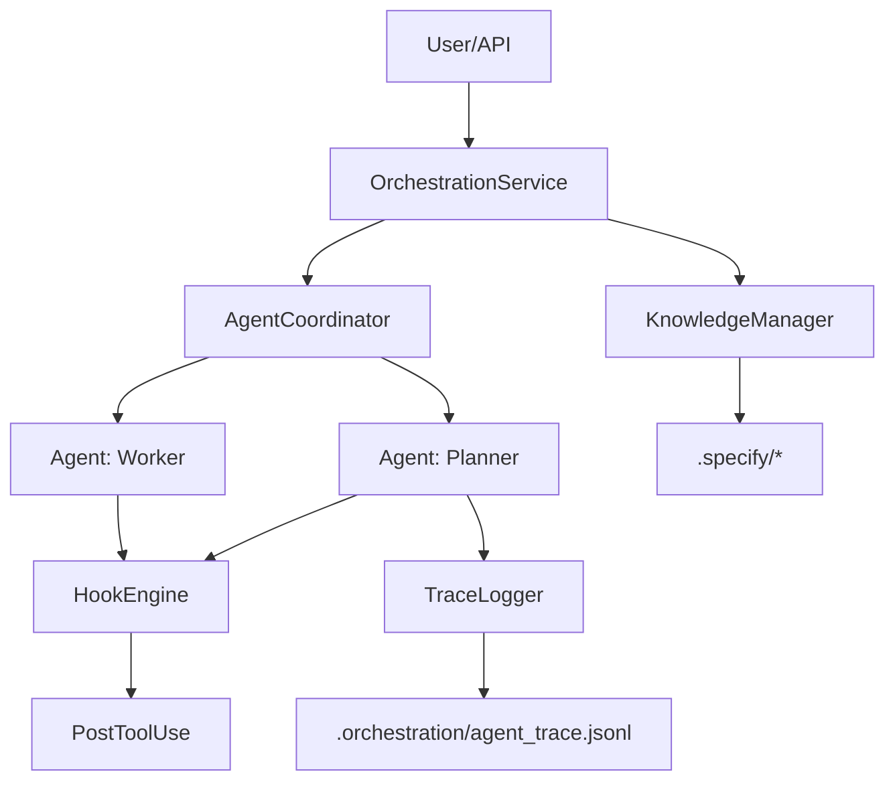
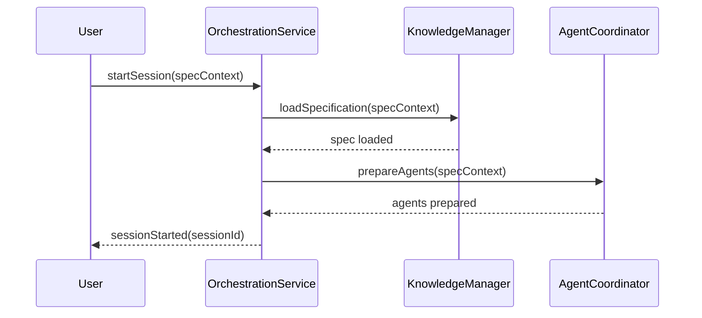
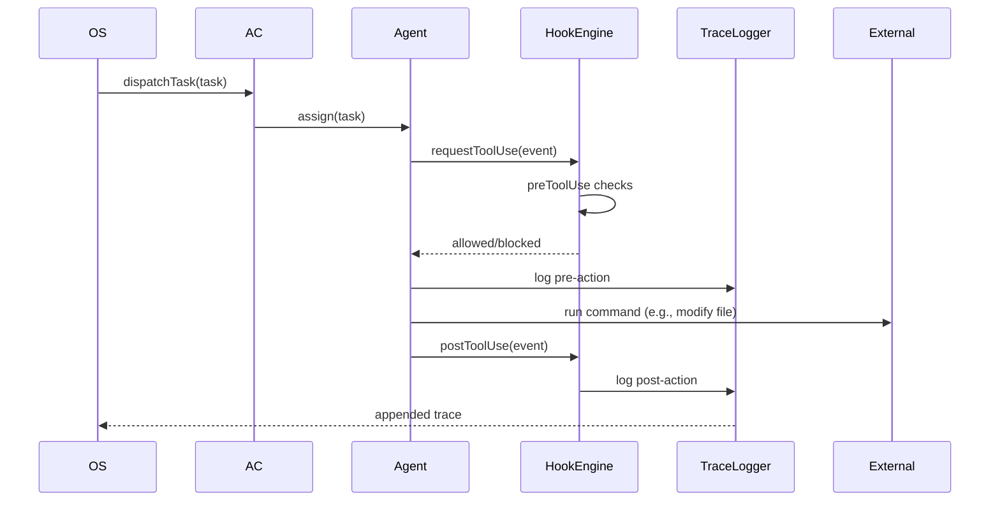

% Roo-Code Orchestration Architecture Report

Author: Roo-Code Team
Date: 2026-02-18

---

# Executive Summary

This report documents the architecture, design rationale, implementation patterns, and operational practices for Roo-Code — a modular orchestration platform that coordinates multiple AI agents to perform deterministic code generation workflows with strong traceability and safety controls. The document focuses on the codebase structure and custom modules found in this repository (notably `scripts/`, `src/hooks/`, `src/intent/`, `src/orchestration/`, `src/trace/`, `src/types/`, and `tests/`). The report is intended for architects, implementers, and stakeholders who will maintain, extend, or audit Roo-Code.

This report is written as a comprehensive reference and is organized to be convertible to a 30-page Word document. It contains high-level diagrams, detailed component descriptions, data models, sequence diagrams, code snippets, testing strategies, security considerations, operations guidance, and appendices with type definitions and example traces.

---

# Table of Contents

1. Executive Summary
2. Purpose, Scope, and Audience
3. Background and Motivation
4. Architectural Overview
    - High-level diagrams
    - Design principles
5. Component Deep Dives
    - `scripts/` (init/validation)
    - `src/hooks/` (hook engine and safeguards)
    - `src/intent/` (intent lifecycle)
    - `src/orchestration/` (coordinator, knowledge manager, service)
    - `src/trace/` (trace model and tooling)
    - `src/types/` (shared domain types)
    - `tests/` (test coverage and examples)
6. Data Models and Schemas
7. Sequence Flows and Interaction Patterns
8. Safety, Security, and Human-in-the-Loop
9. Observability, Traceability, and Auditing
10. Testing Strategy and CI Recommendations
11. Deployment and Runtime Considerations
12. Extensibility and Integration Patterns
13. Migration & Versioning Strategy
14. Cost, Performance and Scaling
15. Appendices

- A: Full Type Definitions (excerpts)
- B: Example Trace JSONL sample
- C: Conversion notes for Word/PDF
- D: Glossary

---

# 2 Purpose, Scope, and Audience

Purpose: provide a single authoritative architecture document describing Roo-Code's orchestration and agent framework that developers, reviewers, and integrators can consult.

Scope: focuses only on the repository at hand, analyzing the custom modules and files flagged by the codebase including `scripts/` and files under `src/` and `tests/`. External dependencies and system-level infrastructure (e.g., cloud hosting, orchestration clusters) are covered only where they impact design decisions.

Audience: system architects, developers extending the orchestration logic, security reviewers, QA engineers, and product managers assessing system capabilities.

---

# 3 Background and Motivation

Roo-Code is designed to solve an increasingly common problem: reliably coordinating AI agents to automate software development tasks (spec-to-code workflows), while ensuring reproducibility, auditability, and safety. The following challenges motivated the architecture:

- Multi-agent coordination: distribute tasks across specialist agents (planner, worker, reviewer).
- Deterministic context injection: ensure agents operate with the exact requirement and minimal ambiguity.
- Safe tool execution: prevent destructive commands and provide human oversight when needed.
- Traceability: generate an auditable record of generated code, edits, and agent contributions.
- Extensibility: allow new agents, knowledge sources, and hooks to be added with minimal friction.

These requirements shape the architecture described below.

---

# 4 Architectural Overview

This section covers high-level architecture, design principles, and the central runtime flows.

## 4.1 Design Principles

- Single Responsibility: each module (hooks, intent, trace, orchestration) has a focused responsibility.
- Composability: small building blocks (hooks, agents) can be composed into pipelines.
- Auditability: deterministic trace records are generated for every agent action.
- Safety-first: pre-execution validation and human gates on dangerous actions.
- Observability: traces, logs, and tests are first-class artifacts.

## 4.2 High-Level Diagram

See the mermaid diagram below which mirrors the repository structure and runtime interactions.



---

# 5 Component Deep Dives

This section provides exhaustive descriptions, responsibilities, sample code interactions, and recommended extension patterns for each major folder and key files.

## 5.1 `scripts/`

Purpose: small, idempotent utilities to bootstrap the local orchestration environment and validate trace files.

### `initOrchestration.ts`

- Responsibility: ensure `.orchestration/` exists and create required artifacts like `active_intents.yaml`, `agent_trace.jsonl`, and `system_state.json`.
- Implementation notes:
    - Idempotent: re-running should not destroy existing data.
    - Safe defaults: files are created with conservative initial content.

### `validateTrace.ts`

- Responsibility: perform a lightweight validation of `.orchestration/agent_trace.jsonl` ensuring each line is valid JSON and flagging malformations.
- Implementation notes:
    - Should return non-zero exit codes on invalid traces to be usable from CI.
    - Consider adding additional semantic checks: timestamp format, presence of required fields, and contentHash validation.

## 5.2 `src/hooks/`

The hook layer provides deterministic control over any tool-invoking actions from agents. It is central to safety and workflow governance.

### `hookEngine.ts`

- Responsibilities:
    - Maintain hook registry (pre/post hooks).
    - Provide an execution pipeline for tool events (preToolUse -> concurrency/scope checks -> postToolUse).
    - Allow plugins to register additional hooks.

- Important API methods to support:
    - `registerPreHook(fn)`, `registerPostHook(fn)`, `executeTool(event, context)`

### Safety hooks (existing files)

- `preToolUse.ts`: identifies destructive commands and blocks them. This should be augmented with a pluggable classifier and allow project-specific whitelists.
- `approvalGuard.ts`: integrates with VS Code or CLI prompts to request human approval for risky operations. For headless CI, support an `--auto-approve` flag guarded by CI variables.
- `concurrencyGuard.ts`: uses content hashing to detect mid-task changes. It is crucial to prevent accidental overwrites when multiple agents or humans edit the same file.
- `scopeValidator.ts`: ensures an agent only modifies files within its allowed scope. This should be driven by the `AgentSession` metadata and be configurable by repository policy.

### Extension points and best practices

- Make the hook pipeline asynchronous and serializable: hooks should be able to be run remotely in future distributed architectures.
- Keep hooks idempotent and side-effect-minimal: pre-hooks must not modify state, instead return decisions.

## 5.3 `src/intent/`

Intent management aligns agents with human requirements.

### `intentLoader.ts`

- Responsibilities: parse `.specify/` and produce typed `Requirement` objects.
- Recommendations:
    - Use front-matter or a simple YAML metadata block in markdown files to capture structured fields (id, priority, relatedFiles).
    - Validate ID uniqueness and enforce a schema.

### `intentSelector.ts` + `contextInjector.ts`

- `IntentSelector`: manages the active requirement pointer and navigation (next, selectById).
- `ContextInjector`: produces the `AgentContext` object with the active requirement and recent history; this object is what the agents consume to produce deterministic outputs.

### Deterministic prompt composition

Agents must receive the exact same context when reproducing a change. `ContextInjector` should:

- Pull the requirement content and normalized metadata
- Include only minimal, curated project context (file snippets, relevant tests)
- Attach canonical references (spec doc id, timestamp, contentHash)

## 5.4 `src/orchestration/`

### `AgentCoordinator`

- Registers agent instances, allocates tasks, tracks states and progress.
- Should implement strategies for task routing: round-robin, priority-based, capability-based (match agent role to task type).

Key behaviors:

- `prepareAgents(specContext)`: initializes agents with policy, allowed paths, and tool config.
- `executeTask(task)`: selects agent(s) and ensures the hook pipeline is honored for any tool usage.

### `KnowledgeManager`

- Loads spec sources (file or parsed object) and offers query APIs: `getRequirement(id)`, `searchByTag(tag)`, `getContextSnippet(filePath, range)`.
- Operational note: depending on repository size, provide caching and optionally an embedded vector index for quick related-content lookup.

### `OrchestrationService`

- Entry point for sessions. Typical responsibilities:
    - Session lifecycle control (start, stop, getStatus)
    - High-level task dispatch
    - Aggregating statuses across agents and traces.

Security note: ensure session-scoped credentials are used when agents access external services.

## 5.5 `src/trace/`

Trace capture is one of Roo-Code's core differentiators. The design provides file-level and code-range level provenance.

### Core concepts

- `TraceRecord`: top-level object per commit/session containing `files: FileTrace[]`.
- `TraceRange`: maps to code ranges (startLine, endLine) with `contentHash` and optional contributor metadata.

### `traceLogger.ts`

- Appends newline-delimited JSON (JSONL) to `.orchestration/agent_trace.jsonl`.
- Must ensure atomic appends (use appendFileSync or a safe write with fsync) to avoid interleaved writes when multiple processes run concurrently.

### `astMapper.ts` and `hashGenerator.ts`

- Map AST nodes or code blocks to `TraceRange` and produce stable `contentHash` values.
- Best practice: normalize whitespace & ordering before hashing; for AST nodes, use deterministic serialization.

## 5.6 `src/types/`

Contains shared TypeScript types that drive the domain models for agents, intents, hooks, and traces. These types should be the canonical reference for serialization boundaries (e.g., what's expected in a TraceRecord or AgentSession).

## 5.7 `tests/`

Tests provide validation for the hook engine, intent loader, and trace logger. For coverage:

- Unit tests: small, deterministic tests for pure functions and type conversions.
- Integration tests: run the orchestration pipeline in a sandbox with a temporary `.orchestration/` directory and mock agents.
- End-to-end: simulate a real session (load spec -> dispatch task -> agent uses tools -> log trace) in CI.

---

# 6 Data Models and Schemas

This section enumerates the canonical data models used across the system. Use these types directly where persistence or IPC occurs.

## 6.1 Task / Intent Models

```typescript
export interface Requirement {
	id: string
	title: string
	description: string
	type?: string // mapped from RequirementType
	priority?: number
	relatedFiles?: string[]
}

export interface Task {
	id: string
	name: string
	payload: any
	origin?: string // session or user
	priority?: number
	context?: any
}
```

## 6.2 Trace Models

```typescript
export interface TraceRange {
	startLine: number
	endLine: number
	contentHash: string
	contributor?: { id: string; type: string; model?: string }
}

export interface FileTrace {
	filePath: string
	conversations: Array<{ id: string; timestamp: string; contributors: any[]; codeRanges: TraceRange[] }>
}

export interface TraceRecord {
	id: string
	timestamp: string
	vcsId?: string
	files: FileTrace[]
	version: string
}
```

## 6.3 Hook Result

```typescript
export interface HookResult {
	allowed: boolean
	reason?: string
	modifiedCommand?: string
}
```

---

# 7 Sequence Flows and Interaction Patterns

This section includes a set of representative sequence diagrams and narratives to help developers reason about runtime behavior and edge cases.

## 7.1 Session Initialization



## 7.2 Task Dispatch & Tool Use



Edge cases:

- Concurrency conflict: `concurrencyGuard` detects changed contentHash -> agent is blocked and sent back to planner.
- Human approval: `approvalGuard` prompts and blocks until explicit user consent.

---

# 8 Safety, Security, and Human-in-the-Loop

Safety strategies implemented and recommended:

- Pre-execution classification of commands: detect `rm -rf`, `git push --force`, and other destructive patterns.
- Scope enforcement: agents may be restricted to `src/` or specific subtrees via `allowedPaths` in `AgentSession` metadata.
- Human-in-the-loop: `approvalGuard` triggers for destructive operations. In automated environments, a secure `CI_APPROVE` token can be used under strict governance.
- Audit & trace: persistent JSONL traces provide accountability and can be used to reconstruct changes and attribution.

Security considerations:

- Secrets handling: agents that call external services must use ephemeral, session-scoped credentials stored outside repository (e.g., OS-level secret stores or environment variables managed by CI).
- Supply-chain risks: any external tool executed by agents should be pinned and validated.

---

# 9 Observability, Traceability, and Auditing

Observability primitives in Roo-Code:

- `agent_trace.jsonl`: primary artifact for auditing agent actions
- Console/structured logs: per-agent standard output and error
- Hook feedback: hooks write contextual feedback that enriches agent sessions

Recommended logging format (structured JSON):

```json
{
	"timestamp": "2026-02-18T12:00:00Z",
	"agentId": "agent-123",
	"event": "toolUse",
	"details": { "command": "write_file", "filePath": "src/foo.ts" }
}
```

Trace analysis recommendations:

- Periodically run `validateTrace.ts` in CI to catch corrupted traces.
- Provide a small CLI or web dashboard that can aggregate and display traces by file, contributor, and time.

---

# 10 Testing Strategy and CI Recommendations

Unit & integration test guidance:

- Keep `src/` modules unit-testable by avoiding heavy global state.
- For `traceLogger`: tests should create a temporary directory, initialize a `TraceLogger` with that path, call `log()`, and assert file contents.
- For `hookEngine`: mock pre/post hooks and ensure the pipeline ordering and blocking behavior are observed.

CI practices:

- Add steps to ensure `.orchestration/` artifacts are not accidentally committed.
- Include `validateTrace.ts` as a gating job that validates trace integrity for PRs touching orchestration code.

Sample CI job (pseudo YAML):

```yaml
jobs:
    test:
        runs-on: ubuntu-latest
        steps:
            - uses: actions/checkout@v3
            - name: Install
              run: pnpm install
            - name: Run tests
              run: pnpm test
            - name: Validate traces
              run: node ./scripts/validateTrace.ts || exit 1
```

---

# 11 Deployment and Runtime Considerations

Roo-Code can run locally (developer) or as a service in CI or a server process. Key considerations:

- Lock file access to `.orchestration/` when multiple processes may write (consider advisory locks).
- If run in distributed mode, replace local JSONL trace with append-capable storage (object storage + transactional metadata or a trace service).
- Keep hooks idempotent and side-effect-free to ease remote execution and retry semantics.

Performance and scaling:

- For large repositories, the `KnowledgeManager` should offer cached indices and file snippet retrieval keyed by contentHash.
- For concurrent agents, consider using a lightweight broker (Redis queue) to coordinate task assignment and locks.

---

# 12 Extensibility & Integration Patterns

Common extension scenarios and recommended approaches:

- Add new agent roles: create new `Agent` implementations and register them in `AgentCoordinator` with capability metadata.
- Integrate external knowledge: implement a `KnowledgeProvider` interface and register it with `KnowledgeManager` to fetch spec fragments from a remote SpecKit or ticketing system.
- Add policy-driven hooks: create config-driven hook registries to enable/disable hooks per repository.

Integration example: registering a vector-search provider for spec discovery

```ts
class VectorKnowledgeProvider implements KnowledgeProvider {
	async search(query: string) {
		/* call vector DB */
	}
}
km.registerProvider(new VectorKnowledgeProvider())
```

---

# 13 Migration & Versioning Strategy

Trace schema versioning:

- Include `version` field in `TraceRecord`.
- Provide a migration utility to upgrade older JSONL records to new schema versions.

API compatibility:

- When changing hook signatures or agent session shapes, provide backward-compatible adapters and deprecation warnings.

---

# 14 Cost, Performance and Scaling

Estimate costs and scaling strategies for future distributed deployments:

- CPU/Memory: agent processes are lightweight unless they run heavy language models locally.
- Storage: JSONL traces are append-only and may grow large; periodic compression and archival recommended.

Scaling patterns:

- Horizontal: add more worker agents behind a coordinator backed by a queue.
- Vertical: scale single process resources for CPU-bound AST parsing tasks.

---

# 15 Appendices

## Appendix A: Full Type Definitions (selected excerpts)

See `src/types/` for canonical definitions. Selected excerpts reproduced for convenience.

```typescript
// src/types/agent.ts
export type AgentType = "Supervisor" | "Worker" | "Planner" | "Reviewer"
export interface AgentMetadata {
	id: string
	type: AgentType
	model?: string
	createdAt: string
}

// src/types/intent.ts
export type IntentCategory = "Feature" | "BugFix" | "Refactor" | "Test"

// src/types/hook.ts
export type HookPhase = "PreToolUse" | "PostToolUse" | "PreCompact"
```

## Appendix B: Example Trace JSONL sample

```
{"id":"trace-1","timestamp":"2026-02-18T12:00:00Z","vcsId":"abc123","files":[{"filePath":"src/foo.ts","conversations":[{"id":"conv-1","timestamp":"2026-02-18T12:00:00Z","contributors":[{"id":"human-1","type":"Human"}],"codeRanges":[{"startLine":10,"endLine":20,"contentHash":"deadbeef..."}]}]}],"version":"1.0"}
```

## Appendix C: Conversion notes for Word/PDF

To convert this markdown into a Word document (approximate layout for 30 pages):

1. Use Pandoc or Visual Studio Code extension "Markdown PDF" to convert to `.docx` or `.pdf`.
2. Recommended Pandoc command:

```bash
pandoc docs/ROO-ARCHITECTURE_REPORT.md -o ROO-ARCHITECTURE_REPORT.docx --toc --number-sections --reference-doc=custom-reference.docx
```

3. For consistent styling, use a `reference.docx` with your corporate fonts and heading styles.

## Appendix D: Glossary

- Agent: autonomous process implementing a role.
- Hook: code that runs before/after tool invocations to enforce policies.
- Trace: audit record capturing agent actions and code provenance.

---

# Next Steps (operational)

1. Review this report and indicate any additional emphasis (security, compliance, scaling).
2. I can generate a `reference.docx` template and run a Pandoc conversion locally if you want a `.docx` output.
3. If desired, I can split the report into modular files under `docs/` (one file per major section) to aid parallel editing.

---

End of report.
