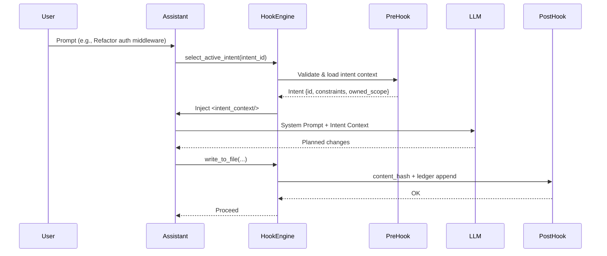

# Reasoning Intercept (Handshake)

```mermaid
sequenceDiagram
  participant User
  participant Assistant
  participant HookEngine
  participant PreHook
  participant LLM
  participant PostHook

  User->>Assistant: Prompt (e.g., Refactor auth middleware)
  Assistant->>HookEngine: select_active_intent(intent_id)
  HookEngine->>PreHook: Validate & load intent context
  PreHook-->>HookEngine: Intent {id, constraints, owned_scope}
  HookEngine->>Assistant: Inject <intent_context/>
  Assistant->>LLM: System Prompt + Intent Context
  LLM-->>Assistant: Planned changes
  Assistant->>HookEngine: write_to_file(...)
  HookEngine->>PostHook: content_hash + ledger append
  PostHook-->>HookEngine: OK
  HookEngine-->>Assistant: Proceed
```
