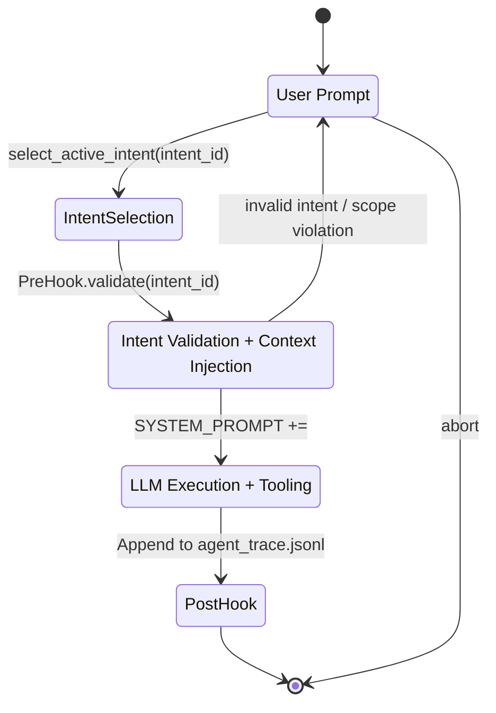

# Two-Stage Deterministic Workflow (Three Phases)

This audit proposes a deterministic workflow ensuring no action proceeds without a checked-out intent and that prompt context is governed by an explicit handshake.



## Storage Schema

- In-memory store: associate checked-out intents with session lifecycle.

```ts
// IntentManager.ts
type Intent = { id: string; owned_scope?: string[]; acceptance_criteria?: string[] }
export class IntentManager {
  private static memoryStore = new Map<string, Intent>()
  static checkout(intentId: string, intent: Intent) {
    this.memoryStore.set(intentId, intent)
    return intent
  }
  static get(intentId: string) {
    return this.memoryStore.get(intentId)
  }
  static clear(intentId: string) {
    this.memoryStore.delete(intentId)
  }
}
```

- Disk (active_intents.yaml): single source-of-truth for active intents; synced at boundaries.
  - Read on `PreHook.validate()`.
  - Write only via explicit governance operations (e.g., `intent_status: IN_PROGRESS → DONE`).

## Determinism & Spatial Independence
- Deterministic: `PreHook.validate()` must succeed before any tool runs; otherwise abort.
- Spatial Independence: Intents referenced by `id`, not by file paths. All ledger entries link `related.intent_id` to content hashes.

## Integration Points
- Preview prompt: [src/core/webview/generateSystemPrompt.ts](src/core/webview/generateSystemPrompt.ts)
- Runtime prompt: [src/core/task/Task.ts](src/core/task/Task.ts)
- Tools: [src/core/tools/WriteToFileTool.ts](src/core/tools/WriteToFileTool.ts), [src/core/tools/ExecuteCommandTool.ts](src/core/tools/ExecuteCommandTool.ts)
