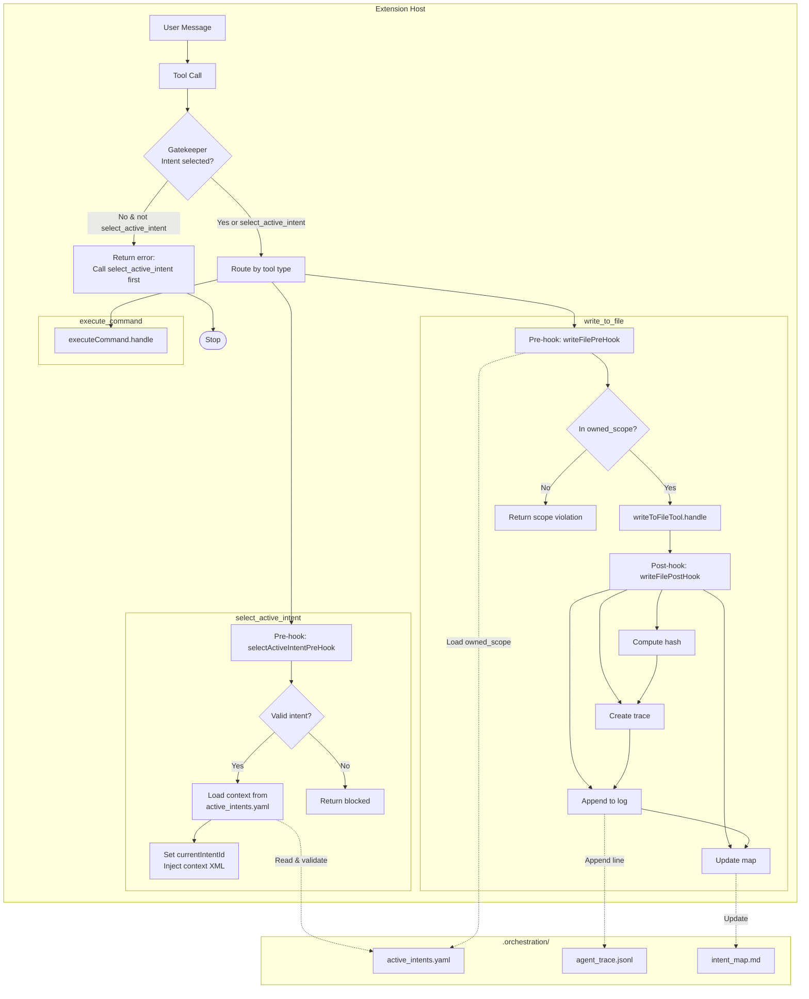

# Hook Flow Architecture

## Decision points

| Node                                | Condition                                             | Outcomes                                                                                                                           |
| ----------------------------------- | ----------------------------------------------------- | ---------------------------------------------------------------------------------------------------------------------------------- |
| **Gatekeeper**                      | Is an intent already selected for this turn?          | If **no** and tool ≠ `select_active_intent` → return error and stop. If **yes** or tool is `select_active_intent` → route to tool. |
| **Pre-hook (select_active_intent)** | Is the intent ID valid in `active_intents.yaml`?      | **No** → return blocked. **Yes** → load context, set `currentIntentId`, inject XML.                                                |
| **Pre-hook (write_file)**           | Is the target path within the intent’s `owned_scope`? | **No** → return scope violation. **Yes** → run `writeToFileTool.handle`.                                                           |

## Flow summary

1. **Extension host**  
   User message leads to a tool call. The **gatekeeper** enforces that every tool except `select_active_intent` runs only after an intent is selected (`currentIntentId` set by a prior `select_active_intent` call).

2. **Tool types**

    - **select_active_intent**  
      Pre-hook only. Reads and validates from `.orchestration/active_intents.yaml`, then sets intent and injects context; no tool implementation “execute” step.
    - **write_to_file**  
      Pre-hook (scope check using `.orchestration/active_intents.yaml`) → tool execution → post-hook (hash, trace, append to `.orchestration/agent_trace.jsonl`, update `.orchestration/intent_map.md`).
    - **execute_command**  
      No pre/post hooks; only passes the gatekeeper, then runs the command tool.

3. **.orchestration/**
    - **active_intents.yaml**  
      Used by the gatekeeper (via `currentIntentId`) and by both pre-hooks (intent list + `owned_scope`).
    - **agent_trace.jsonl**  
      Written by the write_file post-hook (append trace lines).
    - **intent_map.md**  
      Updated by the write_file post-hook (intent → path mapping).
