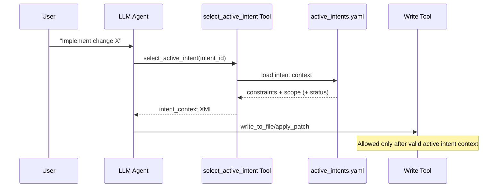
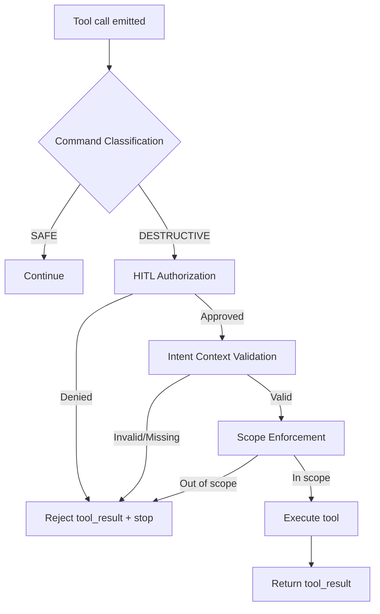
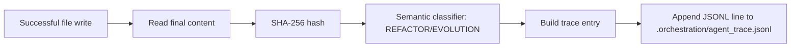
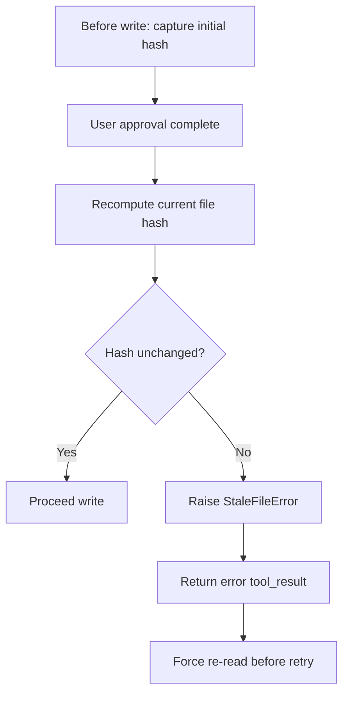
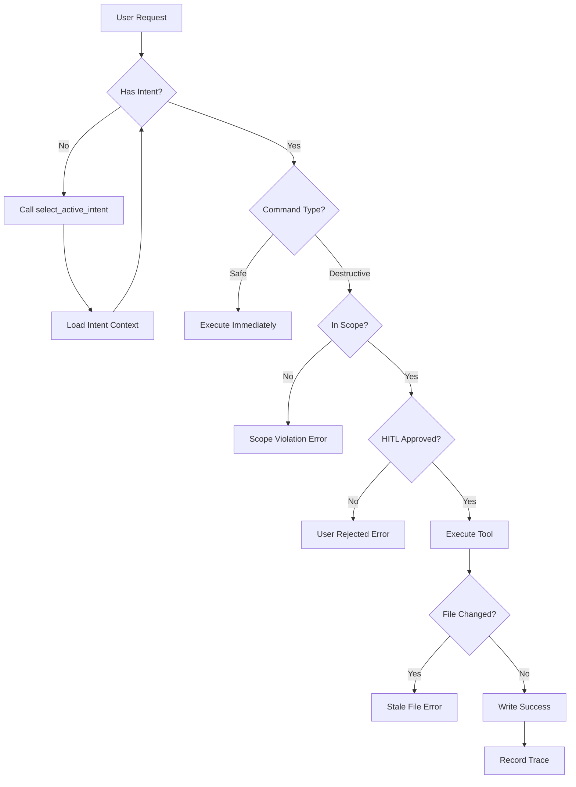

# Master Thinker Orchestration Architecture Report

## Submission Draft (Markdown → PDF)

**Project:** Roo Code Master Thinker  
**Date:** February 21, 2026  
**Prepared by:** Yakob

---

## 1) Architecture Overview

This implementation evolves the extension into an intent-governed orchestration system across four phases:

1. **Phase 1 — Handshake:** force intent selection before destructive actions.
2. **Phase 2 — Hook Middleware:** add classification + human authorization + scope checks in the execution path.
3. **Phase 3 — Traceability:** persist intent-linked file-change traces with deterministic content hashing.
4. **Phase 4 — Concurrency:** prevent stale writes using optimistic locking and conflict feedback.

The guiding principle is: **no destructive write without validated intent context**, and **no untraceable mutation**.

---

### Diagram A — Two-Stage Handshake



---

### Diagram B — Hook Middleware Flow



---

### Diagram C — Traceability Pipeline



---

### Diagram D — Concurrency Control



---

## 2) Phase 0: Architecture Notes (Archaeological Dig)

### Key Findings

- **Tool execution choke-point:** assistant tool execution is centralized in [src/core/assistant-message/presentAssistantMessage.ts](../src/core/assistant-message/presentAssistantMessage.ts).
- **Prompt assembly and request orchestration:** handled in [src/core/task/Task.ts](../src/core/task/Task.ts), including pre-hook context injection flow.
- **Intent sidecar source-of-truth:** [.orchestration/active_intents.yaml](../.orchestration/active_intents.yaml).
- **Webview runtime orchestration:** [src/core/webview/ClineProvider.ts](../src/core/webview/ClineProvider.ts).
- **Extension activation/lifecycle root:** [src/extension.ts](../src/extension.ts).

### Tool Execution Locations

- Intent selection tool implementation: [src/core/tools/SelectActiveIntentTool.ts](../src/core/tools/SelectActiveIntentTool.ts)
- Write path and post-write operations: [src/core/tools/WriteToFileTool.ts](../src/core/tools/WriteToFileTool.ts)
- Patch path: [src/core/tools/ApplyPatchTool.ts](../src/core/tools/ApplyPatchTool.ts)

### Prompt Builder Location

- System prompt composition path: [src/core/prompts/system.ts](../src/core/prompts/system.ts)
- Runtime message and request chain: [src/core/task/Task.ts](../src/core/task/Task.ts)

### Webview Communication

- Provider/webview messaging bridge: [src/core/webview/ClineProvider.ts](../src/core/webview/ClineProvider.ts)
- Activation + provider registration: [src/extension.ts](../src/extension.ts)

---

## 3) Phase 1: The Handshake

### Components Implemented

- **Intent Tool:** [src/core/tools/SelectActiveIntentTool.ts](../src/core/tools/SelectActiveIntentTool.ts)

    - Resolves intent by ID from sidecar YAML.
    - Stores active intent in provider state.
    - Returns context payload for subsequent orchestration.

- **Intent Loader:** [src/core/intent/IntentContextLoader.ts](../src/core/intent/IntentContextLoader.ts)

    - Parses [.orchestration/active_intents.yaml](../.orchestration/active_intents.yaml).
    - Normalizes and resolves intent objects.
    - Produces XML fragments for controlled injection.

- **System Prompt Integration:** [src/core/prompts/system.ts](../src/core/prompts/system.ts)

    - Includes operational behavior guiding intent-first workflow.

- **Pre-hook Injection in Task Flow:** [src/core/task/Task.ts](../src/core/task/Task.ts)
    - Injects intent context into request pipeline before model action execution.

### Gatekeeper Implementation

- **Gate enforcement location:** [src/core/assistant-message/presentAssistantMessage.ts](../src/core/assistant-message/presentAssistantMessage.ts)
- Blocking behavior returns governance error when active intent context is absent/invalid, preventing destructive tool execution.

---

## 4) Phase 2: Hook Middleware

### Command Classification

- Implemented via [src/core/governance/CommandClassifier.ts](../src/core/governance/CommandClassifier.ts)
- Categorizes actions into **SAFE** vs **DESTRUCTIVE** classes for policy routing.

### HITL Authorization

- Implemented via [src/core/governance/HITLAuthorizer.ts](../src/core/governance/HITLAuthorizer.ts)
- Prompts user confirmation on destructive actions and enforces deny-path rejection.

### Scope Enforcement

- Implemented via [src/core/governance/ScopeEnforcer.ts](../src/core/governance/ScopeEnforcer.ts)
- Extracts target paths and validates requested operations against intent-owned scope.

### Autonomous Recovery

- Denied/out-of-scope/invalid-intent cases return structured tool errors so the agent can recover by:
    1. selecting valid intent,
    2. re-reading context,
    3. producing scoped retries.

---

## 5) Phase 3: Traceability

### SHA-256 Content Hashing

- Implemented in [src/core/trace/ContentHasher.ts](../src/core/trace/ContentHasher.ts)
- Deterministic hash of final file content provides immutable change fingerprint.

### Semantic Classification

- Implemented in [src/core/trace/SemanticClassifier.ts](../src/core/trace/SemanticClassifier.ts)
- Lightweight classifier emits:
    - `REFACTOR`
    - `EVOLUTION`

### Trace Serialization

- Implemented in [src/core/trace/AgentTraceSerializer.ts](../src/core/trace/AgentTraceSerializer.ts)
- Appends JSON Lines entries to [.orchestration/agent_trace.jsonl](../.orchestration/agent_trace.jsonl).

### JSONL Schema (Operational)

```json
{
	"timestamp": "2026-02-21T21:00:00.000Z",
	"intent_id": "INTENT-001",
	"file_path": "src/core/tools/WriteToFileTool.ts",
	"content_sha256": "hex_sha256_digest",
	"semantic_change": "REFACTOR | EVOLUTION",
	"tool": "write_to_file"
}
```

---

## 6) Phase 4: Concurrency

### Optimistic Locking Primitive

- Implemented in [src/core/concurrency/OptimisticLock.ts](../src/core/concurrency/OptimisticLock.ts):
    - `getCurrentHash(filePath)`
    - `validateLock(expectedHash, filePath)`
    - `StaleFileError`

### Write-path Integration

- Integrated (minimally/safely) in [src/core/tools/WriteToFileTool.ts](../src/core/tools/WriteToFileTool.ts):
    1. Capture initial hash after file existence resolution.
    2. Revalidate hash immediately before final save.
    3. On mismatch, block write and emit stale-file error.
    4. Clear hash state on completion/failure paths.

### Stale File Detection

If file content changes between read and write windows, write is rejected and the agent is instructed to re-read current content before retry.

### Conflict Resolution

- Returns explicit stale conflict error (`StaleFileError` semantics).
- Prevents silent overwrite.
- Forces reconciliation loop (read → regenerate patch/write).

---

## 7) Evaluation Rubric Self-Assessment

| Metric                 | How I Achieve Score 5                                                                                                                                                               |
| ---------------------- | ----------------------------------------------------------------------------------------------------------------------------------------------------------------------------------- |
| Intent-AST Correlation | [.orchestration/agent_trace.jsonl](../.orchestration/agent_trace.jsonl) links `intent_id` to content hash and file path after successful writes.                                    |
| Context Engineering    | Dynamic intent context resolution from [.orchestration/active_intents.yaml](../.orchestration/active_intents.yaml), injected before execution.                                      |
| Hook Architecture      | Middleware checks in [src/core/assistant-message/presentAssistantMessage.ts](../src/core/assistant-message/presentAssistantMessage.ts) gate destructive paths with policy layering. |
| Orchestration          | Intent-first flow + traceability + optimistic locking provide safe multi-agent behavior and conflict-aware writes.                                                                  |

---

## 8) Screenshots (Submission Section)

Add these 4 screenshots with captions:

1. **Gatekeeper block without intent**

    - Show Roo response containing governance error: “You must cite a valid active Intent ID”.

2. **HITL approval dialog**

    - Show destructive action confirmation prompt before execution.

3. **Trace output with hash**

    - Show [.orchestration/agent_trace.jsonl](../.orchestration/agent_trace.jsonl) containing `intent_id`, `file_path`, and `content_sha256`.

4. **Stale-file conflict error**
    - Show rejected write with stale/optimistic-lock error forcing re-read.

---

## Appendix A — Primary Files by Phase

- **Phase 1:**  
  [src/core/tools/SelectActiveIntentTool.ts](../src/core/tools/SelectActiveIntentTool.ts)  
  [src/core/intent/IntentContextLoader.ts](../src/core/intent/IntentContextLoader.ts)  
  [src/core/prompts/system.ts](../src/core/prompts/system.ts)  
  [src/core/task/Task.ts](../src/core/task/Task.ts)

- **Phase 2:**  
  [src/core/governance/CommandClassifier.ts](../src/core/governance/CommandClassifier.ts)  
  [src/core/governance/HITLAuthorizer.ts](../src/core/governance/HITLAuthorizer.ts)  
  [src/core/governance/ScopeEnforcer.ts](../src/core/governance/ScopeEnforcer.ts)  
  [src/core/assistant-message/presentAssistantMessage.ts](../src/core/assistant-message/presentAssistantMessage.ts)

- **Phase 3:**  
  [src/core/trace/ContentHasher.ts](../src/core/trace/ContentHasher.ts)  
  [src/core/trace/SemanticClassifier.ts](../src/core/trace/SemanticClassifier.ts)  
  [src/core/trace/AgentTraceSerializer.ts](../src/core/trace/AgentTraceSerializer.ts)  
  [.orchestration/agent_trace.jsonl](../.orchestration/agent_trace.jsonl)

- **Phase 4:**  
  [src/core/concurrency/OptimisticLock.ts](../src/core/concurrency/OptimisticLock.ts)  
  [src/core/tools/WriteToFileTool.ts](../src/core/tools/WriteToFileTool.ts)

---

## Appendix B — PDF Conversion Tips

- Use VS Code Markdown Preview + “Print to PDF”, or Pandoc:
    - `pandoc report.md -o report.pdf`
- Ensure Mermaid diagrams are rendered before export (or pre-render to images if needed).


