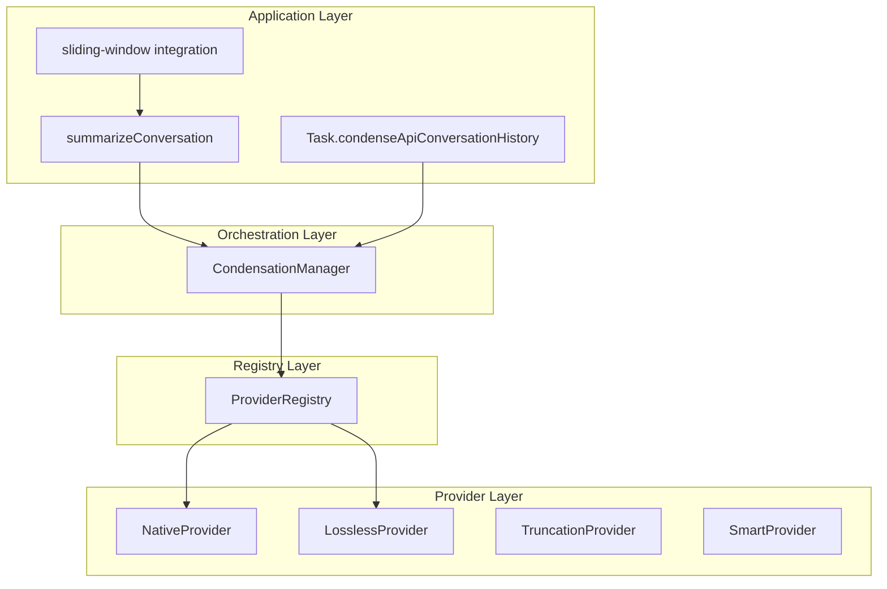
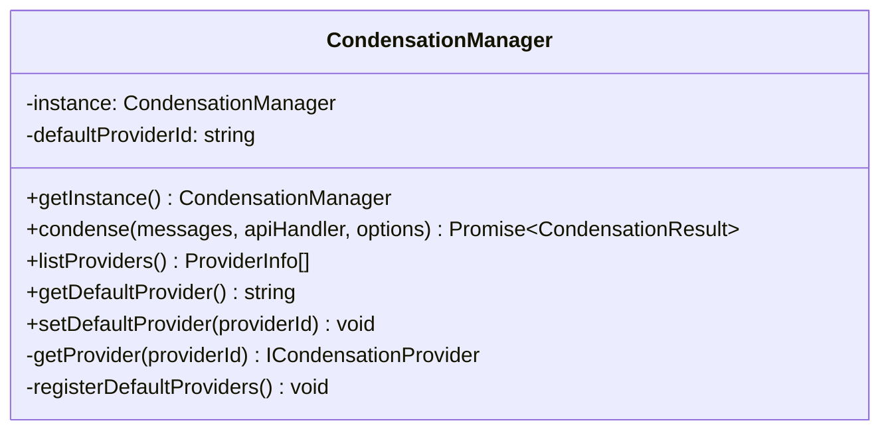
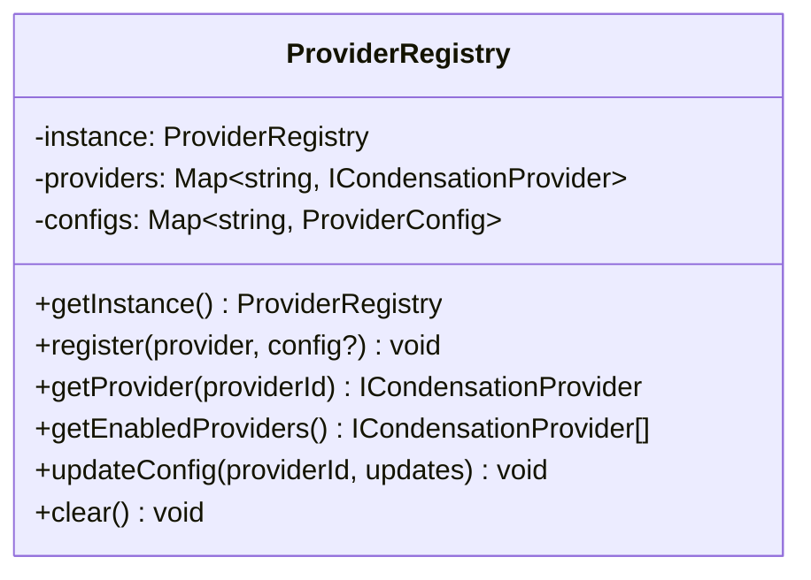
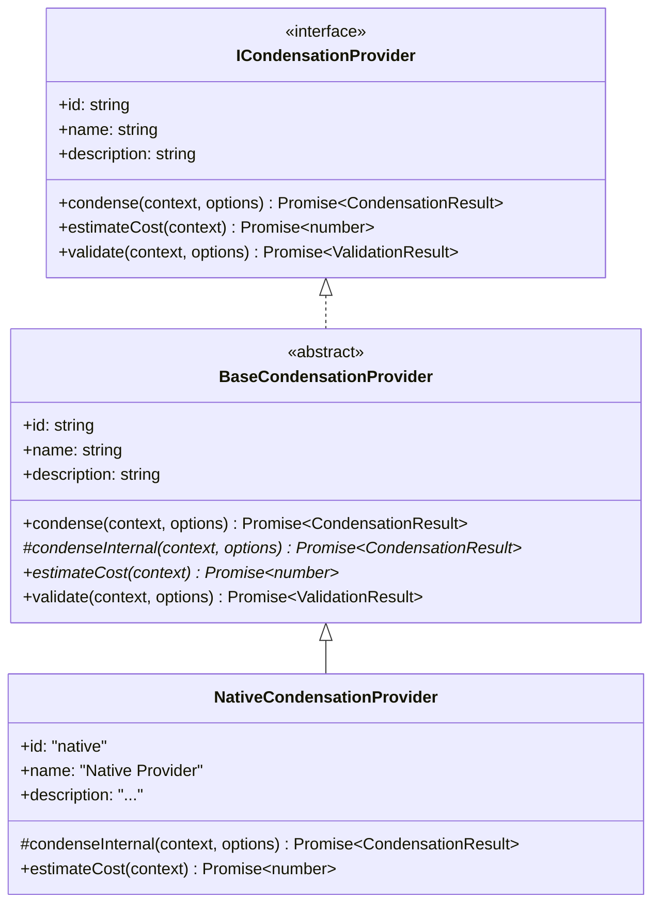
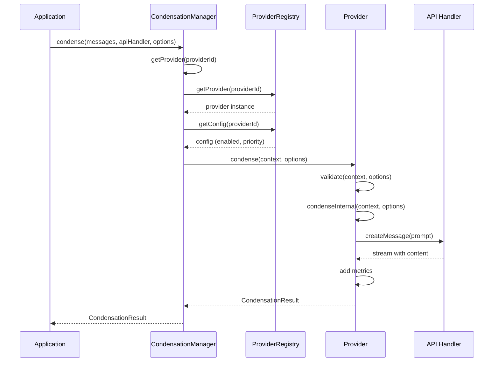
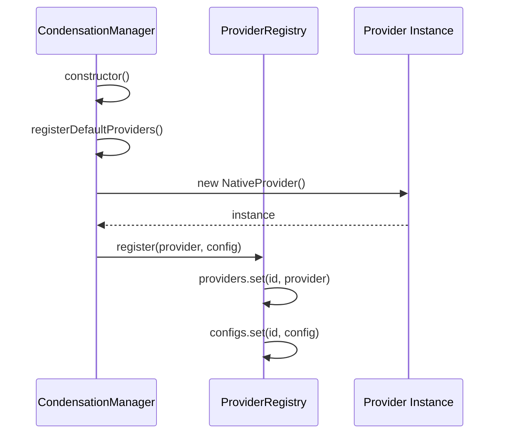

# Context Condensation Provider System - Architecture Guide

This document provides a comprehensive technical overview of the Context Condensation Provider System architecture, design patterns, and implementation details.

## Table of Contents

1. [System Overview](#system-overview)
2. [Architecture Layers](#architecture-layers)
3. [Core Components](#core-components)
4. [Design Patterns](#design-patterns)
5. [Data Flow](#data-flow)
6. [Extension Points](#extension-points)
7. [Testing Strategy](#testing-strategy)

## System Overview

The Context Condensation Provider System is a modular architecture that enables intelligent condensation of conversation context when it grows too large. The system replaces the monolithic `summarizeConversation` function with a flexible, provider-based approach.

### Key Design Goals

1. **Extensibility**: Easy to add new condensation strategies
2. **Backward Compatibility**: Existing code continues to work unchanged
3. **Type Safety**: Full TypeScript support with strict typing
4. **Testability**: Comprehensive test coverage at all levels
5. **Performance**: Efficient provider selection and execution
6. **Maintainability**: Clear separation of concerns

## Architecture Layers

The system is organized into four distinct layers:



### Layer Responsibilities

| Layer             | Responsibility                             | Components                              |
| ----------------- | ------------------------------------------ | --------------------------------------- |
| **Application**   | High-level API, backward compatibility     | `summarizeConversation()`, Task methods |
| **Orchestration** | Provider selection, execution coordination | `CondensationManager`                   |
| **Registry**      | Provider lifecycle, configuration          | `ProviderRegistry`                      |
| **Provider**      | Condensation implementation                | `NativeProvider`, custom providers      |

## Core Components

### 1. CondensationManager (Singleton)

The central orchestrator that manages provider selection and condensation execution.



**Key Responsibilities:**

- Singleton instance management
- Default provider registration (Native)
- Provider selection based on configuration
- Execution coordination
- Error handling and fallback

**Public API:**

```typescript
class CondensationManager {
	static getInstance(): CondensationManager

	condense(messages: ApiMessage[], apiHandler: ApiHandler, options?: CondensationOptions): Promise<CondensationResult>

	listProviders(): ProviderInfo[]
	getDefaultProvider(): string
	setDefaultProvider(providerId: string): void
}
```

### 2. ProviderRegistry (Singleton)

Manages provider registration, configuration, and lifecycle.



**Key Responsibilities:**

- Provider registration and storage
- Configuration management (enabled, priority)
- Provider lookup and filtering
- Priority-based sorting

**Configuration Schema:**

```typescript
interface ProviderConfig {
	id: string
	enabled: boolean
	priority: number
	config?: Record<string, unknown>
}
```

### 3. BaseCondensationProvider (Abstract Class)

Implements the Template Method pattern to provide common functionality.



**Template Method Implementation:**

```typescript
abstract class BaseCondensationProvider implements ICondensationProvider {
	async condense(context, options): Promise<CondensationResult> {
		// 1. Validate inputs
		const validation = await this.validate(context, options)
		if (!validation.valid) {
			return { messages: context.messages, cost: 0, error: validation.error }
		}

		// 2. Start metrics
		const startTime = Date.now()

		// 3. Call provider-specific implementation
		try {
			const result = await this.condenseInternal(context, options)

			// 4. Add metrics
			result.metrics = {
				providerId: this.id,
				timeElapsed: Date.now() - startTime,
				tokensSaved: context.prevContextTokens - (result.newContextTokens || 0),
			}

			return result
		} catch (error) {
			// 5. Handle errors
			return {
				messages: context.messages,
				cost: 0,
				error: error.message,
				metrics: { providerId: this.id, timeElapsed: Date.now() - startTime },
			}
		}
	}

	// Subclasses must implement
	protected abstract condenseInternal(
		context: CondensationContext,
		options: CondensationOptions,
	): Promise<CondensationResult>

	abstract estimateCost(context: CondensationContext): Promise<number>
}
```

### 4. NativeProvider

Wraps the original `summarizeConversation` logic for backward compatibility.

**Key Features:**

- Encapsulates legacy behavior perfectly
- Preserves all validation rules
- Maintains exact cost calculation
- Ensures identical error handling

## Design Patterns

### 1. Provider Pattern (Strategy)

**Intent**: Define a family of interchangeable algorithms (condensation strategies).

**Implementation**:

```typescript
interface ICondensationProvider {
  condense(context, options): Promise<CondensationResult>
}

class NativeProvider implements ICondensationProvider { ... }
class CustomProvider implements ICondensationProvider { ... }
```

**Benefits**:

- Easy to add new condensation strategies
- Algorithms can be swapped at runtime
- Each provider is independently testable

### 2. Template Method Pattern

**Intent**: Define skeleton of algorithm in base class, let subclasses override specific steps.

**Implementation**:

```typescript
abstract class BaseCondensationProvider {
  // Template method
  async condense(context, options) {
    // Fixed: validation, metrics, error handling
    const validation = await this.validate(context, options)
    // ...

    // Variable: provider-specific logic
    const result = await this.condenseInternal(context, options)

    // Fixed: add metrics
    result.metrics = { ... }
    return result
  }

  // Hook method - subclasses must implement
  protected abstract condenseInternal(context, options): Promise<Result>
}
```

**Benefits**:

- Code reuse (validation, metrics, error handling)
- Consistent behavior across providers
- Extension points clearly defined

### 3. Singleton Pattern

**Intent**: Ensure a class has only one instance with global access point.

**Implementation**:

```typescript
class CondensationManager {
	private static instance: CondensationManager | null = null

	private constructor() {
		/* initialize */
	}

	static getInstance(): CondensationManager {
		if (!CondensationManager.instance) {
			CondensationManager.instance = new CondensationManager()
		}
		return CondensationManager.instance
	}
}
```

**Benefits**:

- Single source of truth for configuration
- Consistent state across application
- Lazy initialization

### 4. Registry Pattern

**Intent**: Centralized storage and lookup for objects by identifier.

**Implementation**:

```typescript
class ProviderRegistry {
	private providers = new Map<string, ICondensationProvider>()
	private configs = new Map<string, ProviderConfig>()

	register(provider: ICondensationProvider, config?: Partial<ProviderConfig>) {
		this.providers.set(provider.id, provider)
		this.configs.set(provider.id, { ...defaultConfig, ...config })
	}

	getProvider(id: string): ICondensationProvider | undefined {
		return this.providers.get(id)
	}
}
```

**Benefits**:

- Centralized provider management
- Type-safe lookup
- Configuration alongside registration

## Data Flow

### Condensation Request Flow



### Provider Registration Flow



## Extension Points

### Adding a New Provider

**Step 1**: Implement the provider class

```typescript
import { BaseCondensationProvider } from "@/core/condense/BaseProvider"
import type { CondensationContext, CondensationOptions, CondensationResult } from "@/core/condense/types"

export class MyCustomProvider extends BaseCondensationProvider {
	readonly id = "my-custom"
	readonly name = "My Custom Provider"
	readonly description = "Custom condensation strategy"

	protected async condenseInternal(
		context: CondensationContext,
		options: CondensationOptions,
	): Promise<CondensationResult> {
		// Your custom logic here
		return {
			messages: condensedMessages,
			cost: calculatedCost,
			newContextTokens: newTokenCount,
		}
	}

	async estimateCost(context: CondensationContext): Promise<number> {
		// Your cost estimation logic
		return estimatedCost
	}
}
```

**Step 2**: Register the provider

```typescript
import { getProviderRegistry } from "@/core/condense"
import { MyCustomProvider } from "./MyCustomProvider"

const registry = getProviderRegistry()
const provider = new MyCustomProvider()

registry.register(provider, {
	enabled: true,
	priority: 50, // Higher priority than default
})
```

### Custom Validation

Override the `validate` method for custom validation logic:

```typescript
class MyProvider extends BaseCondensationProvider {
	async validate(
		context: CondensationContext,
		options: CondensationOptions,
	): Promise<{ valid: boolean; error?: string }> {
		// Custom validation
		if (context.messages.length < 10) {
			return { valid: false, error: "Need at least 10 messages" }
		}

		return { valid: true }
	}
}
```

## Testing Strategy

### Test Pyramid

```
           ┌─────────────┐
           │   E2E (10)  │  Integration with real components
           └─────────────┘
         ┌─────────────────┐
         │ Integration (15) │  Component interactions
         └─────────────────┘
    ┌───────────────────────────┐
    │    Unit Tests (100+)      │  Individual component logic
    └───────────────────────────┘
```

### Test Categories

1. **Unit Tests** (`*.test.ts`)

    - Types validation
    - BaseProvider logic
    - ProviderRegistry operations
    - CondensationManager methods
    - NativeProvider behavior

2. **Integration Tests** (`integration.test.ts`)

    - Manager + Registry interaction
    - Provider registration flow
    - Configuration updates
    - Error propagation

3. **E2E Tests** (`e2e.test.ts`)
    - Full condensation flow
    - Backward compatibility verification
    - Real API interactions (mocked)
    - Settings UI integration

### Coverage Goals

- **Line Coverage**: >90%
- **Branch Coverage**: >85%
- **Function Coverage**: 100%

## Performance Considerations

### Provider Selection

- O(1) lookup by ID via Map
- O(n log n) for priority sorting (cached)
- Lazy initialization of providers

### Memory Management

- Singleton instances prevent duplication
- Provider instances reused across calls
- Configurations stored separately

### Cost Optimization

- Cost estimation before execution
- Provider selection based on cost
- Metrics tracking for optimization

## Security Considerations

1. **Input Validation**: All inputs validated before processing
2. **Error Handling**: Errors don't expose internal state
3. **Configuration**: Only allowed fields in provider configs
4. **API Keys**: Handled by ApiHandler, not exposed to providers

## Implemented Features

### ✅ Phase 1: Foundation (Complete)

- Core provider system architecture
- Registry and Template Method patterns
- Native Provider (backward compatible)
- Complete test coverage

### ✅ Phase 2: Lossless Provider (Complete)

- Zero-cost deduplication strategy
- File content and tool result consolidation
- 40-60% token reduction
- <100ms performance

### ✅ Phase 3: Truncation Provider (Complete)

- Mechanical chronological truncation
- 70-85% reduction in <10ms
- Real-world conversation fixtures
- Test framework infrastructure

### ✅ Phase 4: Smart Provider (Complete)

- Multi-pass architecture with granular control
- 4 operations: KEEP, SUPPRESS, TRUNCATE, SUMMARIZE
- 3 presets: CONSERVATIVE, BALANCED, AGGRESSIVE
- Message-level token thresholds
- Content-type granularity (messageText, toolParameters, toolResults)
- 60-95% configurable reduction

### ✅ Phase 5: UI Integration (Complete)

- Provider selection settings component
- Smart Provider preset configuration
- Real-time validation and feedback
- Backend message handlers
- Complete internationalization (i18n)
- 45 UI tests (100% passing)

## Future Enhancements

### Phase 6: Advanced Features

- Semantic deduplication across conversations
- ML-based content importance scoring
- Adaptive threshold calibration
- Provider chaining (pipeline)

### Phase 7: Performance Optimizations

- Parallel operation execution
- Caching of decomposition results
- Smart summarization batching
- Streaming condensation for large contexts

## References

- [Contributing Guide](./CONTRIBUTING.md) - How to add a provider
- [ADR 001](./adr/001-registry-pattern.md) - Registry Pattern Decision
- [ADR 002](./adr/002-singleton-pattern.md) - Singleton Pattern Decision
- [ADR 003](./adr/003-backward-compatibility.md) - Backward Compatibility Strategy
- [ADR 004](./adr/004-template-method-pattern.md) - Template Method Pattern Decision
